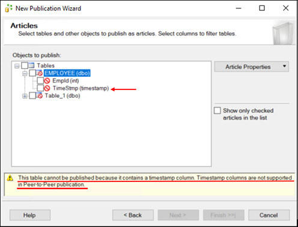

- [Contributing to the Rackspace Expert Insights Technical Blog repository](#contributing-to-the-rackspace-expert-insights-technical-blog-repository)
	- [Prepare to contribute](#prepare-to-contribute)
   - [Getting started with GitHub](#getting-started-with-github)
		- [Create a fork of this repository](#create-a-fork-of-this-repository)
		- [Keep your fork up-to-date](#keep-your-fork-up-to-date)
      - [Clone your fork](#clone-your-fork)
      - [Other housekeeping steps](#other-housekeeping-steps)
   - [Create your blog post](create-your-blog-post)
      - [Format your post](format-your-post)
        - [Front-matter](front-matter)
        - [Create an excerpt](create-an-excerpt)
        - [Include images](include-images)
     - [Add the content](add-the-content)
     - [Submit a PR](submit-a-pr)
	- [Writing guidelines](#writing-guidelines)
	- [Support and feedback](#support-and-feedback)

**Important:** You need to log in to public GitHub, not the enterprise GitHub,
to contribute. If you have questions, contact us at [infodevo@rackspace.com](mailto:infodev@rackspace.com).

## Contributing to the Rackspace Expert Insights Technical Blog repository

Authors who are informed and passionate about technology and IT write technical
blogs that range from high-level, conceptual overviews to deep dives with
code snippets. They all offer insight into solving problems and getting the most
out of applications and platforms. Many also add a personal perspective to the
conversation. These authors share their journeys, trials, and triumphs.

First, thanks for your interest in contributing and helping us craft quality
content for our official Technical Blog.

Second, to make contributing a pleasant experience while maintaining a visual and
consistent content standard, complete these steps before writing and submitting a
blog post entry for publishing.

### Getting started with GitHub

To contribute to the How-To repository, you need a GitHub account. If you do not
have a GitHub account, you can sign up for one [https://github.com/join](https://github.com/join).

#### Create a fork of this repository

Before you create a new article or make edits to an existing one, create a
*fork* of the How-To repository.

1. In the top-right corner of the page, click the **Fork** button.

2. In the pop-up box, select your personal GitHub account.

A personal copy of the Technical Blog repository is created in your GitHub account. You
can access your fork by going to the [GitHub home page](https://github.com) and
selecting **support-how-to** under **Your repositories**.

#### Keep your fork up-to-date

Because your forked copy of the repository is not live, you need to periodically
update it with changes from the live repository. A status message above the
latest commit activity informs you whether your forked repository is current
with the master How-To repository. If the status says `This branch is X commits behind rackerlabs:master`,
update your repo by clicking the **Pull request** button to the right of the message.

**Note:** If you get a message that the rackerlabs:master branch is up-to-date
with commits from your master branch, click the **switching the base** link.

**WARNING:** To avoid any merge conflicts or difficulties when making a pull
request, always check that your copy of the fork is up to date with the master
repository.

#### Clone your fork

Clone your fork on your local machine:

   ```bash
   git clone --depth 1 --shallow-submodules git@github.com:<YOUR_GITHUB_ID>/technical-blog.git
   cd technical-blog
   ```

#### Other housekeeping steps

1. Add the original repo as the `upstream` remote.

   ```bash
   git remote add upstream git@github.com:rackerlabs/technical-blog.git
   git remote update
   ```

2. Configure Git to always push to origin (your forked copy) by using the current branch name.

   ```bash
   git config remote.pushdefault origin
   git config push.default current
   ```

3. Prevent accidental commits directly to the master branch by using a pre-commit hook.
   **Note: These instructions work for the Bash shell and will overwrite an existing `pre-commit` file if present.**

   ```bash
   mkdir -p ~/.git/hooks
   # Cut and paste this command into your shell:
   cat << 'EOF' > ~/.git/hooks/pre-commit
   #!/usr/bin/env bash

   current_branch=$(git symbolic-ref -q HEAD | sed -e 's|^refs/heads/||')

   if [[ $current_branch = 'master' ]]; then
      echo 'Direct commits to the master branch are not allowed.'
      exit 1
   fi
   EOF
   ```

4. Set your local master branch to track `upstream/master`.

   ```bash
   git branch master -u upstream/master
   ```

5. Install the build tools on your local machine by using one of the following commands:

   ```make install hugo```
   
   or
   
   ```brew install hugo```
  
### Create your blog post

1. Run the following commands to refresh your local copy from upstream before starting work:

      ```bash
      git checkout master
      git fetch --all
      git rebase upstream/master
      git push origin master

2. Create a new branch for your blog.

      ```bash
      git checkout -b name-of-your-branch
      ```

3. Navigate to the root directory of your local copy of this repo by using the command line.

4. Create a new directory within ```/content/blog/YYYY/``` that contains the initial ```.index.md``` 
   file by using the following command:
  
   ```
   hugo new --kind blog-bundle blog/YYYY/YYYY-MM-DD-title-of-post
   ```
   
   For example, if you are creating a post **Take advantage of Salesforce** to be published on 1/15/2021,
   run the following command:
   
   ```
   hugo new --kind blog-bundle blog/2021/2021-01-15-take-advantage-of-salesforce
   ```

**Note:** If your post has images,  place the image files within the newly created post folder.

#### Format your post

The post should contain front-matter, an excerpt, and the actual content.

##### Front-matter

Add Jekyll front-matter (or metadata) to the top of the file you created in
the previous step. for example:

```
---
layout: post
title: "Blog entry title"
date: YYYY-MM-DD 23:59
comments: true
author: Author(s) name(s)
published: true
authorIsRacker: true
#
# The *authorAvatar* and *bio* entries are optional, but include them if you can!
# The avatar must be a hosted image, such as a gravatar.
#
authorAvatar: 'https://www.gravatar.com/avatar/<insert hash for your headshot>'
bio: "<insert a sentence or two about yourself in first or third person>"
categories:
    - This Category
    - That Category
    - Other Category
#
# Use canonical entry if you are republishing a blog from another site, such as
# your personal blog.  Do  NOT republish without the author's explicit permission.
#
canonical: https://original-url.link.com/post-name/
metaTitle:
metaDescription:
ogTitle:
ogDescription:
#
# The following properties are OPTIONAL and affect the text and image that
# appear by default in link previews when sharing blog posts.
#
ogImage:
twitterCreator: "@your_twitter_handle" # NOTE: The quotes are required!
twitterDescription:
twitterTitle:
---
```

Make sure that the dates in the file name and front-matter match.

Available categories include the following:

- Ansible
- Architecture
- Automation
- AWS
- Azure
- Chef
- Cloud Files
- Cloud Monitoring
- Cloud-networks
- Cloud Servers
- Configuration Management
- Database
- Developers
- DevOps
- Docker
- Events
- General
- Java
- Jclouds
- Jenkins
- Mailgun
- Neutron
- NodeJS
- OpenStack
- Oracle
- Orchestration
- OSAD
- Private Cloud
- Python
- Salesforce
- SDK
- Security
- SQL Server

If no category fits, use *General*.

If you'd like to use a category that is not in the list, please send an email
to infodev@rackspace.com. To avoid being flooded with categories, which might apply
to only one or two blogs, we have automated throttling. However, notify us so
that we can discuss your ideas for a new category.

##### Create an excerpt

Include an excerpt marker after your first sentence or two to separate the
preview text that appears on the blog landing page from the full article. To do
so, use the following markdown:

```
   The excerpt paragraph, which should give the reader a taste of what's to come.

   <!--more-->

   The rest of your article.
```

The marker comment ``<!--more-->`` must be on its own line, starting at
column 1, and separated from the content before and after it by blank lines above and below it.

##### Include images

To include images in your blog, place them within their respective blog
directory. For example, assuming your image is named **Picture1.png**, use
the following code in your post where you want to see the image:

```
   {{}}
```

#### Add the content

Add the content with appropriate headings and references.

#### Submit a PR

Follow these steps to submit your post for publication:

1. Create a pull request (PR). 

    a. Add your new content and image files, if any:
    
       `git add index.md`
       `git add Picture1.png`
       
    b. Commit the file:
    
       `git commit -m "Created a post about how to take advantage of Salesforce to improve sales and customer management."`
       
    c. Push the change:
    
       `git push upstream`
       
    d. In your web browser, navigate to **https://github.com/rackerlabs/technical-blog**. Log in if you are
       not already signed on.
       
    e. In the Technical Blog repo, click **Pull Requests**.
    
    f. At the top, you should see a message with your branch name and a green **Compare & pull request** button. Click it.
    
    g. Click **Compare across forks**.
    
    h. `base-repository` should default to `rackerlabs/technical-blog` and `base` should default to `master`. Click the
       down arrow on `head-repository` and select your clone of the technical-blog repo. Click the down arrow on
       `compare` and select your branch. Click **Create new pull request**. Add any comments describing your change.
       Finally, click **Create pull request**.

7. After the build completes, preview it by clicking the **Details** link next
   to *Deploy preview ready!* in the **All Checks Passed** section of the GitHub PR.
   This action takes you to the staging location. If your post is not near the top of the
   staging landing page, then paste the slug for your article (from the **index.md** metadata)
   at the end of the URL after `blog/`. For example:
   
   `https://deploy-preview-399--docs-technical-blog.netlify.app/blog/take-advantage-of-saleforce/`
   
8. If you need to make any changes, modify the files in your local repo and push the changes up to the PR. Then,
   preview the article again.

9. When you're ready, request reviews of your PR from the Information Development team in the
   ``#docs`` channel in Slack.

The Content Services team will review your PR. Depending on the review feedback,
you might be asked to make additional changes. The Blog editorial team will
merge your pull request after we review your contribution.

### Writing guidelines

We recommend that you follow the [Style Guide](https://developer.rackspace.com/docs/style-guide/).

Here some suggestions:

- Use sentence-style capitalization for titles and headings
- Use active voice
- Use present tense
- Write to the user by using second person and imperative mood
- Write clear and consistent step text
- Use consistent text formatting
- Clarify pronouns such as *it*, *this*, *there*, and *that*
- Clarify gerunds and participles
- Write clear and consistent code examples
- Use consistent terminology


### Support and feedback

If you find a problem, open a GitHub issue.

If you need additional assistance, contact us at [info-dev@rackspace.com](mailto:info-dev@rackspace.com).

