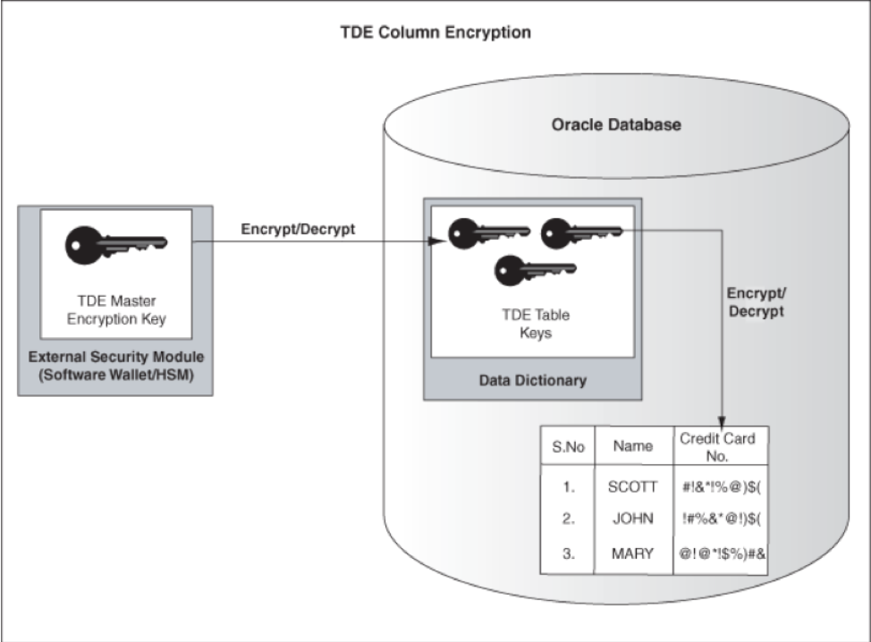

This blog discusses setting up Transparent Data Encryption (TDE) column-level
encryption in Oracle&reg; E-Business Suite&reg; (EBS) R12 environment. You can
set up column-level encryption on single-column or multiple-column tables,
depending on the user requirement.

<!--more-->

### Introduction

You can use TDE column-encryption functionality to encrypt selected columns of
tables. Because the encryption is transparent, you don't need to rewrite your
application code and can use existing code. The term *transparent* also means
that the database session can read encrypted data without any issues.

After going through the instructions in this blog, you can setup TDE column-level
encryption in an EBS R12 environment.

### Impacts of TDE

Your TDE encryption implementation can have an impact on the following aspects
of your applications:

-	Performance: Certain limitations in implementing TDE are documented in the
Advance Security Guide. You should review this before implementing TDE.  You
should also choose the columns to encrypt with care because the choice affects
the performance of Data Manipulation Language (DML) and other queries that use
the encrypted columns.

-	Patching: You should be aware of available EBS patches, especially patches that
apply changes to columns and are encrypted using TDE. This includes changes such
as the addition of indexes on an encrypted column.

### Limitation of TDE

TDE column encryption is not supported with Oracle LogMiner-based technologies,
such as Streams or DataGuard, in logical-standby mode. If you are using these
technologies, you cannot replicate encrypted columns. However, TDE encryption
is supported when you use DataGuard in physical-standby mode. In this case, a
wallet containing the master key must be copied from the primary server to a
physical standby server, as shown in the following image:

Image source: [https://docs.oracle.com/cd/E11882\_01/network.112/e40393/asotrans.htm#ASOAG9567](https://docs.oracle.com/cd/E11882\_01/network.112/e40393/asotrans.htm#ASOAG9567)

### Steps to implement TDE

Perform the following steps to implement TDE:

1.	Obtain a list of columns and tables that need to be encrypted.

2.	Create a wallet folder at the required location by running the following command:

        $ mkdir TDEWallet

3.	Make the required entry in `sqlnet.ora` or `sqlnet_ifile.ora` similar to the
   following line:

        [oratactp@odbprod1 tactprd_odbprod1]$ cat sqlnet_ifile.ora

4.	Set the `Master Key` by using the following commands, which create a wallet
   file at the wallet location specified in the previous step:

        $ Sqlplus  '/as sysdba'
        SQL> ALTER SYSTEM SET ENCRYPTION KEY IDENTIFIED BY "*****";
        System altered.

5.	Download and apply patch `7337863` if it is not already applied.

6.	Execute `aftdeval.sql` on the AppsTier from `$FND_TOP/sql` against the table
   or columns that need to be encrypted, as shown in the following example:

        SQL> @aftdeval.sql IBY IBY_CREDITCARD CCNUMBER E

7.	Execute all the encryption commands that were generated by `aftdeval.sql`.

8.	Verify the columns that are encrypted by using the following command:

        SQL> SELECT * FROM DBA_ENCRYPTED_COLUMNS;

        OWNER      TABLE_NAME                COLUMN_NAME          ENCRYPTION_ALG       SAL INTEGRITY_AL
        ---------- ------------------------- -------------------- -------------------- --- ------------
        IBY        IBY_CREDITCARD            CCNUMBER             AES 192 bits key     NO SHA-1

9.	You can open or close the wallet by using the following commands:

        SQL> ALTER SYSTEM SET ENCRYPTION WALLET CLOSE IDENTIFIED BY "****";
        SQL> SELECT * FROM v$encryption_wallet;

        SQL> ALTER SYSTEM SET ENCRYPTION WALLET OPEN IDENTIFIED BY "****";

10.	You can set **auto login** for the  wallet by using the following command:

        $ orapki wallet create -wallet <wallet_location> -auto_login

### Constraints for TDE implementation

The following constraints apply to TDE implementations:

-	Only certain data types can be encrypted.

-	Only columns defined as less than 3932 bytes length can be encrypted.

-	If the column is part of a foreign key or used in another database constraint,
   it cannot be encrypted.

-	If there is a function-based index on the column, it cannot be encrypted.

-	If a column is indexed and range scans are performed against that column,
   the index is no longer used after the column is encrypted. Instead, full table
   scans are performed.

-	If a table is partitioned and the partitions or subpartitions are exchanged,
   all table partitions must be similarly encrypted. The following tables
   currently fit this criterion:
   -	EGO\_MTL\_SY\_ITEMS\_EXT\_B
   -	EGO\_MTL\_SY\_ITEMS\_EXT\_TL
   -	WF\_LOCAL\_ROLES
   -	WF\_LOCAL\_ROLES\_STAGE
   -	WF\_USER\_ROLE\_ASSIGNMENTS
   -	WF\_UR\_ASSIGNMENTS\_STAGE
   -	WF\_LOCAL\_USER\_ROLES
   -	WF\_LOCAL\_USER\_ROLES\_STAGE
   -	WF\_LOCAL\_ROLES\_TL
   -	WF\_LOCAL\_ROLES\_TL\_STAGE

### Back out plan

If column encryption is not required, run the following commands as a back out plan:

    SQL> ALTER TABLE IBY.IBY_CREDITCARD modify (CCNUMBER decrypt); << repeat this for all columns/tables which were encrypted.

    Comment ENCRYPTION_WALLET_LOCATION from sqlnet_ifile.ora

After executing the preceding commands, restart  the environment and perform a
complete sanity test.

### Conclusion

By implementing TDE at the column level, you can prevent users from seeing
sensitive data stored in columns, such as credit card numbers or Human Resources
data. You don’t have to rewrite the application code after encryption.
Existing code can be used, and the database session can handle the encrypted data
without trouble.

Use the Feedback tab to make any comments or ask questions.

Learn more about our [database services](https://www.rackspace.com/dba-services).
