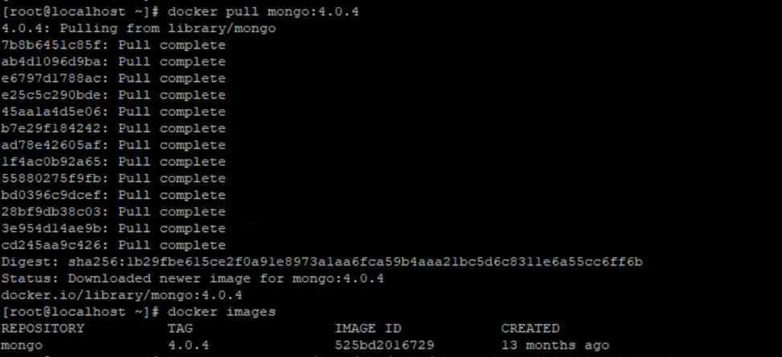

One of the most accessible NoSQL databases, MongoDB&reg;, has many available
deployment options. In this post, I use Docker&reg; to deploy MongoDB as a
container and use the shell client to interact with that container.

<!--more-->

### Introduction

After you install Docker on your computer or server, perform the following steps
to deploy MongoDB as a Docker container:

1.	Download the latest or a specific MongoDB Docker image.
2.	Deploy an instance of MongoDB as a container.
3.	Interact with the MongoDB Docker container with basic shell operations.

### Download the MongoDB Docker image

If you have Docker installed on your computer or server, you can get the MongoDB
image from the Docker Hub container registry. Be sure to download the specific
image version that you expect to use, such as mongo:4.0.4. You don't have to
specify the image version, but if you omit it, you get the most current version,
which could result in an inconsistent experience because Mongo can update the
latest version at any time.

Executing the `docker images` command gives a list of images available on the
server. In our case, it shows the MongoDB image with the tag 4.0.4 available for
use.

Use the following commands to download the MongoDB image and list your available
images:

    # docker pull mongo:4.0.4
    # docker images

### Deploy an instance of MongoDB as a container

Start the container in detached, `-d`, mode. Because containers use ephemeral
storage, you should mount a volume, `-v`, to retain the data by providing the
local path, **/data/db**. This path is the container's internal directory. This
action preserves the data on the host's **/data/db** path even when you stop or
remove the container. In the command, you provide a name, `--name`, for your
container followed by the Docker image and a tag. In this case, I used
**mongo:4.0.4** for the tag. The command returns a string with the
container's ID. The docker `ps` command shows a list of running containers.

    # docker run -d -v /data/db:/data/db --name mymongo mongo:4.0.4
    # docker ps

### Interact with the MongoDB Docker container with the shell

To take advantage of a functional MongoDB deployment, you can interact with
the database by using the shell client.

Because you are running the container in detached mode, you should connect by
using the interactive terminal. Use the following command to connect to your
deployment, named **mymongo**, and start the bash shell:

    # docker exec -it mymongo bash

To launch the MongoDB shell client, run the following command:

    # mongo

From the MongoDB shell client, you can access all the functions outlined in the
MongoDB documentation. For example, you can see what databases exist in your
instance with the following command:

    > show dbs

### Conclusion

In this post, I created a MongoDB container by using Docker with an attached
storage volume from a host system to a container. I also showed you how to start
interacting with the MongoDB Docker container through the shell. The post offers
a basic demonstration of running a MongoDB instance in a Docker container, but
you can use the same MongoDB image to build any number of containers. Use those
containers to create replica sets and do much more to create a robust
containerized application.

I hope this post helped you to get a general understanding of how to get a
MongoDB instance up and running and to start working with it in minutes.

Use the Feedback tab to make any comments or ask questions. You can also
[chat now](https://www.rackspace.com/#chat) to start the conversation.

<a class="cta blue" id="cta" href="https://www.rackspace.com/dba-services">Learn more about our Database services</a>
