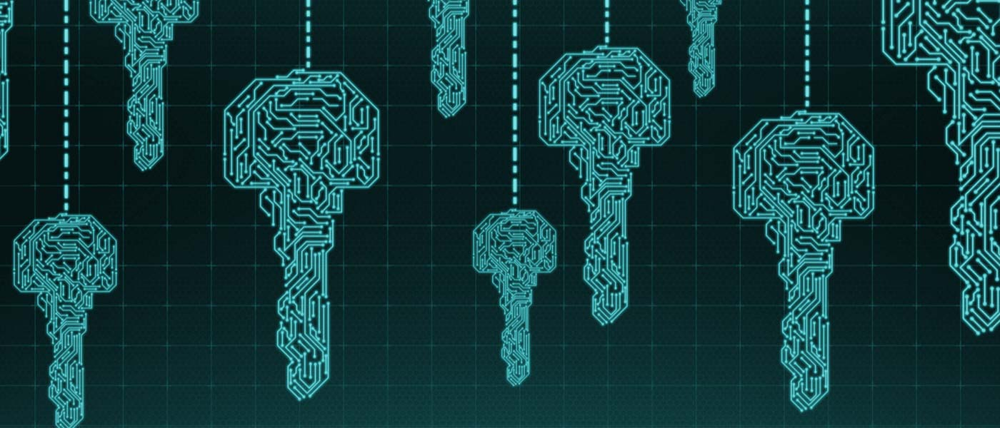

*Originally published on January 18, 2019 at ObjectRocket.com/blog.*

To validate your schema, debug for typos in fields, or find fields that you
shouldn't set, you need an understanding of all the keys in your MongoDB&reg;
collection.

<!--more-->

Many MongoDB-as-a-Service companies, including [ObjectRocket](https://www.objectrocket.com/),
offer an easy way to do this right in the user interface (UI). Seasoned MongoDB
users typically start with an object-document mapper (ODM), such as
[Mongoose](https://mongoosejs.com/) for JavaScript&reg; or [Mongoengine](https://mongoengine.org/)
for Python&reg;, so they can build a consistent schema for their application and
reduce typos. ODMs also do type validation, so you don't accidentally put a
string in a field that has integers and has math applied to it.

If you don't have a service or ODM, you can use several other methods to access
the keys. We've found the following methods to get all the keys in a MongoDB
collection for different circumstances.

### Find the MongoDB keys

Suppose you have the following example:

    db.activities.insert( { type : [‘indoor’, 'outdoor' , ‘mixed’] } );
    db.activities.insert( { activity : 'cycling' } );
    db.activities.insert( { activity : ‘skiing’, location: ‘Alpes’, } );
    db.activities.insert( { equipment : [‘paddles’,‘sunglasses’] } );

You need to get the unique keys: type, activity, equipment, and location.

#### MapReduce

You can get the keys with MapReduce by using the following operation:

    mr = db.runCommand({ "mapreduce" : "activities", "map" : function() { for (var key in this) { emit(key, null); } }, "reduce" : function(key, stuff) { return null; }, "out": "activities" + "_keys" })

After the operation finishes, run the following `distinct` command on the
resulting collection to find all keys:

     db.activities_keys.distinct("_id")

If you want to get a list of all the unique keys in a subdocument, modify
the following line:

    for (var key in this.first_level.second_level.nth_level) { emit(key, null); }

#### Aggregation

You can also use aggregation. This method works with all drivers that support
the aggregate framework. With your aggregations, use `$sample` or `$limit` to
reduce overhead.

**Note:** Running with primary read preference might impact performance. Consider
running with secondary read preference.

Use aggregation with `$objectToArrray` (available in version 3.4.4 and up) to
convert all top key and value pairs into document arrays followed by `$unwind`
and `$group` with `$addToSet` to get distinct keys across entire collection.

In the following example, `$$ROOT` references the top level document.

    db.activities.aggregate([ {"$project":{"arrayofkeyvalue":{"$objectToArray":"$$ROOT"}}}, {"$unwind":"$arrayofkeyvalue"}, {"$group":{"_id":null,"allkeys":{"$addToSet":"$arrayofkeyvalue.k"}}} ])

You can also use aggregation to get keys in a single document by using the
following command:

    db.activities.aggregate([ {"$project":{"arrayofkeyvalue":{"$objectToArray":"$$ROOT"}}}, {"$project":{"keys":"$arrayofkeyvalue.k"}} ])

#### Mongo shell

You can also get keys under the Mongo shell client by using the following command:

    var allKeys = {}; db.YOURCOLLECTION.find().forEach(function(doc){Object.keys(doc).forEach(function(key){allKeys[key]=1})}); allKeys;

#### Output fields for a single document

Because each document in a collection might have completely different keys, you
might need the output of fields for a single document in a collection. Use the
following command to do this:

    doc=db.thinks.findOne(); for (key in doc) print(key);

#### Python

You can use Python to get MongoDB keys. The following example returns the
set of all top-level keys in the collection:

    #Using pymongo and connection named 'db' reduce( lambda all_keys, rec_keys: all_keys | set(rec_keys), map(lambda d: d.keys(), db.things.find()), set() )

#### JavaScript

JavaScript offers another way to get the keys, as shown in the following example:

    db.collection('collectionName').mapReduce( function() { for (var key in this) { emit(key, null); } }, function(key, stuff) { return null; }, { "out": "allFieldNames" }, function(err, results) { var fields = db.collection('allFieldNames').distinct('_id'); fields .then(function(data) { var finalData = { "status": "success", "fields": data }; res.send(finalData); delteCollection(db, 'allFieldNames'); }) .catch(function(err) { res.send(err); delteCollection(db, 'allFieldNames'); }); });

After reading the newly created collection `allFieldNames`, delete it.

    db.collection("allFieldNames").remove({}, function (err,result) { db.close(); return; });

#### So many options

You’ve got a lot of options to get these Mongo keys. If you’re overwhelmed by
MongoDB management and want to focus on your code instead of database management,
we’re here for you.

<a class="cta blue" id="cta" href="https://www.rackspace.com/data/dba-services">Learn more about Rackspace DBA Services.</a>

Visit [www.rackspace.com](https://www.rackspace.com) and click **Sales Chat**
to get started.

Use the Feedback tab to make any comments or ask questions.
