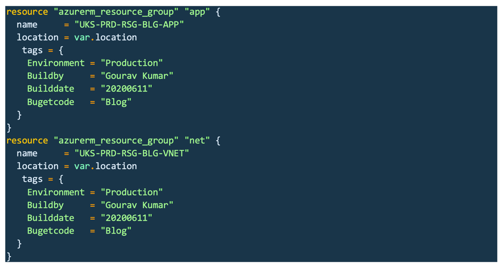
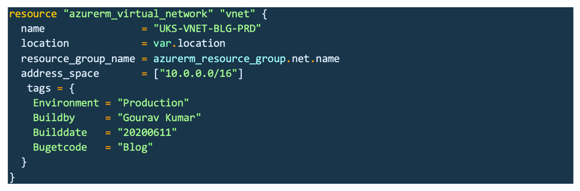
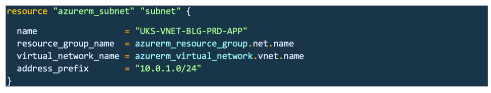
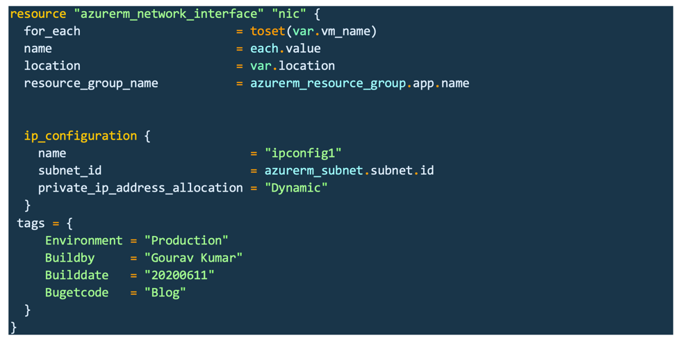
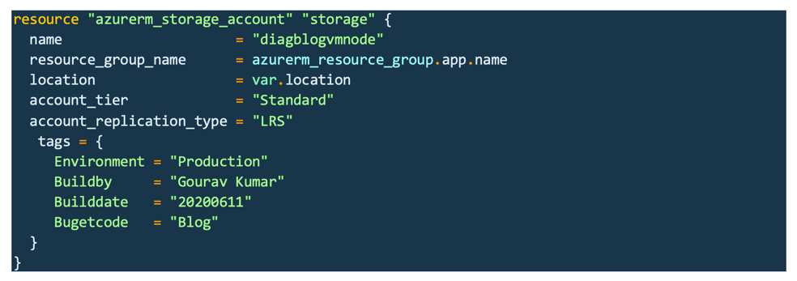
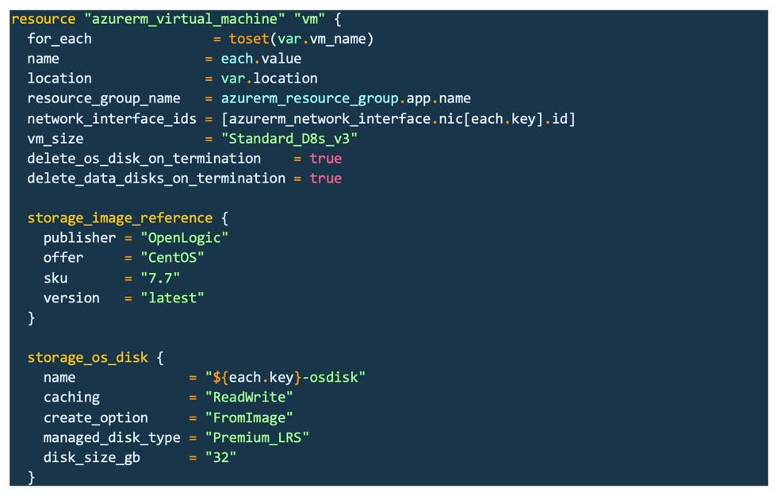
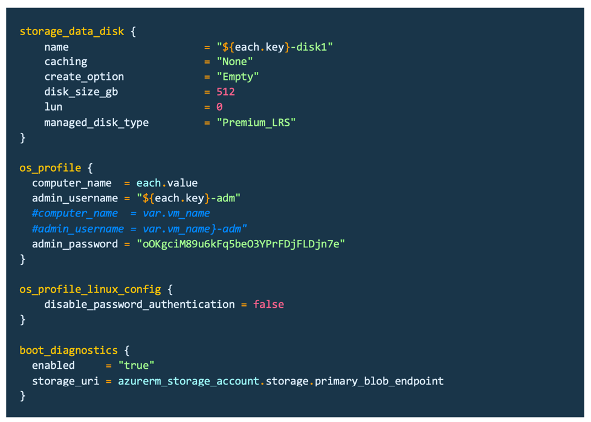
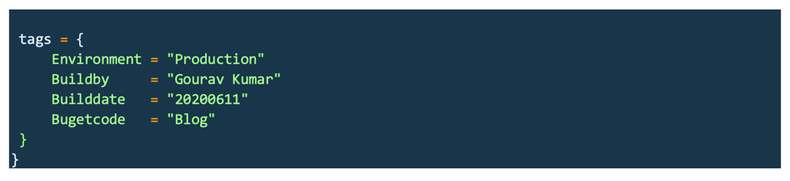
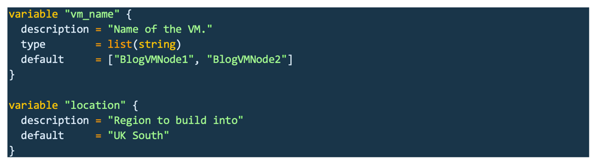

You can easily create multiple virtual machines (VMs) on Azure® by using
Hashicorp® Terraform® with the help of Visual Studio® Code (VS Code).

<!--more-->

### Overview

This blog post focuses on bulk VM creation on Azure. I also emphasize the
Infrastructure-as-Code (IaC) approach. I use VS Code throughout this blog, but
you can use your favorite IDE.

### Let's get started

I went through the general requirements to create multiple VMs in Azure with
some specific standard or typical nomenclature. Even when we build stuff on the
fly, we have to keep an eagle eye on everything to sustain our standards. And
maintaining the standard is not at all easy, mainly because we have to follow
the same name canons for VM name, OS disk, data disk, network interface controller
(NIC) name, and so on.

IaC lets us manage every aspect of maintaining standards, including things we
build in the backend on the real surface.

I have written some simple Terraform code to create two VMs in Azure with similar
names for every resource. I also use tags, which are the new way of segregating
things. So, let's straight jump into the action and get our hands dirty with
Terraform.

Azure VM creation requires a resource group (RG), virtual network (VNet), subnet,
NIC, and VM configuration. Keeping all that in mind, let's make all the files
separately so that it is easy to understand.

#### Create the resource group file

First, we need to create an RG code block in the Hashicorp configuration language
(HCL). Let's create two RGs (one for the VM and NIC and another for Networking
stuff). As a best practice, I don't recommend keeping everything together.
Before creating the RGs, define a provider block for Terraform, so it understands
that we are deploying Azure resources. Store this information for Terraform in
a separate file called **providers.tf**:

{{}}

The RG code, **rg.tf**:

{{}}

#### Create the VNET and subnet files

Now, the second task is to create a VNet and a subnet for our VM.

The VNet block, **vnet.tf**:

{{}}

And the subnet code, **subnet.tf**:

{{}}

#### Create the NIC file

We are almost done with networking stuff except for our VM's NIC. Let's put the
NIC code in the VM's RG. Notice that I referenced the app RG in
**resource\_group\_name** because keeping NIC details in the Network RG does not
suit me.

The NIC code, **Nic.tf**:

{{}}

#### Create the storage file

Now we are done with all the networking stuff, but most people consider a VM without
diagnostic settings enabled to be a poor build. And I don't want anyone to call
me a "new builder"! Storage account code is simple, and by using that, we can
call ourselves good Azure implementors.

The Storage account file, **storage_account.tf**:

{{}}

#### Create the VM file

We are all set for VM code, but remember, we have to use the same standards that
we used earlier, such as VM name, NIC name, disk name, and so on.

Final code for our VM, **vm.tf**:

{{}}

{{}}

{{}}

#### Create the variable file

Finally, I put a few things into variables such as all the VM names. You can put
other items into variables, such as RG, VNet, and subnet names. Using variables
helps when you do giant builds.

The variable file, **Variable.tf**:

{{}}

### Build the VMs

My goal is to create two VMs by using a for loop. Thus, the **vm_name** variable
has two VM names (you can add multiples), and the second variable is the location
to which I want to deploy the Azure resources.

Let me share how I keep my standards intact: I used **VMName-nic** for every NIC,
**VMName-Osdisk**, and **-data1**. All resources such as VM, NIC, and DISK pop
up with the same nomenclature, thus, we can easily understand which resources
belong to which VM.

#### Deploy

Let's get down to business and learn how to deploy the VMs in Azure. It's time
to boil the eggs.

For simplicity, I use the Azure CLI for this task instead of using a proper DevOps
approach and running this through a pipeline and storing the site files somewhere
other than our directory.

If you don't have the `az` CLI on your machine, you can
[install it](https://docs.microsoft.com/en-us/cli/azure/install-azure-cli?view=azure-cli-latest).

1. Log into Azure:

        az login

2. Check how many subscriptions we have for this tenant:

        az account list --output table

3. Set the right subscription for our deployment:

        az account set --subscription "XXXXXX-XXXXXXX-XXXX-XXX"

4. Navigate to the directory where we have put our all Terraform code files (I
   used temp for this example, but I don't recommend that location):

        cd 'C:\temp'

5. Initialize Terraform in this directory:

        terraform init

6. Run the Terraform plan to check what we are going to build and save the
   plan output for later use by adding the `-out` flag in the command:

        terraform plan

        or

        terraform plan -out

7. Execute the Terraform code to deploy and type yes at the confirmation check
   or use `-auto-approve` to skip manual confirmation:

        terraform apply

        or

        terraform apply -auto-apply

8. Check the VM that you created:

        az vm list -o table

### Some secret for loop hacks

You can create multiple VMs by running a Terraform for loop as shown in the
following code. The loop executes as many times as you defined the variable
(twice, in our case, because I defined two VM names in the variable):

    for_each = toset(var.vm_name)

#### The `each` object:

The for loop in Terraform has a key-pair, key and value, but both are generally
similar.

In resource blocks, where you set **for_each**, you can use an additional
*each* objects in your expressions to modify the configuration of each instance.

An **each** object has two attributes:

- **each.key**: The map key (or set member) corresponding to this instance.

- **each.value**: The map value corresponding to this instance. If you provided
  a set, this is the same as **each.key**.

You can use the Terraform **fmt** command to format the code, such as rewriting
Terraform configuration files to conform to a canonical format and style.
This command applies a subset of Terraform language style conventions, along
with other minor adjustments for readability.

### Conclusion

Have fun using Terraform for Azure and maintain standards with some simple code.

Use the Feedback tab to make any comments or ask questions.
