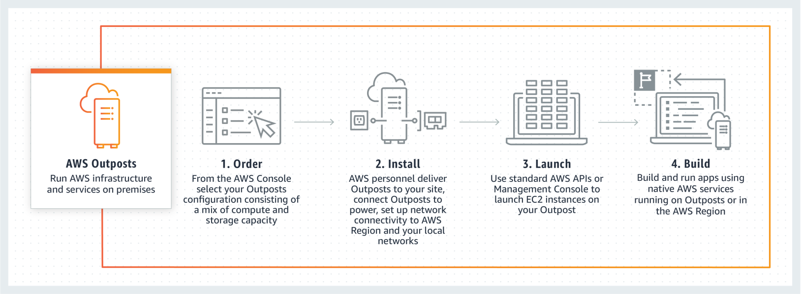

Amazon Web Services&reg; (AWS) Outposts is a fully managed service that extends
AWS infrastructure, AWS services, application programmer interfaces (APIs), and
tools to virtually any data center, colocation space, or on-premises facility
for a truly consistent hybrid experience.

<!--more-->

### Introduction

{{}}

AWS Outposts is ideal for workloads that require low latency access to on-premises
systems, local data processing, or local data storage.

This three-part series examines the following topics:

- Why AWS Outposts is relevant in today’s technology ecosystems
- How you can leverage Outposts to create hybrid environments
- What makes up an Outposts' data rack
- What does it cost to incorporate this technology into your environment
- How to begin your Outposts journey by setting up a site

### What once was old is new again

Has any organization in the history of information technology been more
instrumental in the proliferation of public cloud technology, and the abandonment
of traditional on-premise infrastructure than AWS? The Amazon public cloud
offering has grown at unprecedented rates, and it has done so at the expense of
the long-standing hardware giants that once ruled the data center.

At its core, the public cloud value-proposition tells us that the deployment of
racks of IT hardware inside a privately-owned or leased colocation facility is
an inefficient and wasteful endeavor. You acquire the racks of equipment, wrought
with underutilized and inflexible hardware, at a premium rate and at the cost of
being deprived of valuable capital assets. Public cloud provides the foundation
for rapid innovation, theoretically limitless scalability, unrivaled durability,
maximum availability, cost optimizations, and so much more.

On-premise data centers, on the other hand, typically require large capital
expenditures or costly leased models. Furthermore, IT decision-makers are forced
to take their current storage and compute needs, and then add an arbitrary
year-over-year growth rate to try to predict the optimal size of equipment to
buy. If their best guesses on the rate of growth are inaccurate, organizations
are forced to forego innovation and delay projects until the next budget cycle
arrives and allows them to purchase more hardware. It is a vicious cycle, and
it was one of the driving factors in the seemingly exponential cloud-adoption
rate across all verticals.

If cloud proponents view purchasing racks of hardware to place in an on-premise
data center negatively, how is it that one of Amazon’s newest services, introduced
at **re:Invent** in 2019, relies on that very concept? AWS Outposts might seem
to run contrary to the AWS goal of public cloud domination, but the decision to
create an extension of their secret sauce in hardware format is a savvy and
strategic move by the minds at AWS. In addition to AWS’s customer-obsessed
go-to-market strategy, they are also best known for driving solutions based on
business outcomes. To effectively do that, you cannot apply a one size fits all
mentality to your approach.

Maybe an organization wants to maximize their ROI on a previous CAPEX purchase
by extending the use of aging hardware. Or perhaps they’re at a loss about how
they can transform their IT staff from siloed device-specific SMEs into
cloud-focused engineers. Either way, many organizations attempt to hedge their
bets and straddle the line between the old and the new methodologies.

Even organizations that are ready to embrace cloud infrastructure fully often
find themselves retaining a portion of their infrastructure in on-premise
facilities. They might have existing licensing structures, applications that are
not cloud-friendly, or data that hasn’t been cleared to live in the clouds due
to security or compliance constraints. The result highlights the potential for
sub-optimal operations in both environments and a constant state of
bridge-building to make the two environments live in relative harmony. The more
time an organization’s staff must spend working on solutions to bridge the gap,
the less time they have to move up the stack to more productive endeavors.

So what is the best solution for overcoming the hybrid gap?

### A new twist on hybrid

The phrase *hybrid operating environment* often evokes the image of an aging
server farm sitting in a cold, lonely, dimly lit on-premise datacenter being
tended to by a slump-shouldered data center engineer clinging to the MCSE study
guide like it was the good book. Typically, that data center connects to a
bright and shiny AWS cloud infrastructure where rainbows are shining, birds are
chirping, and children are frolicking between rows of server racks shaped like
clouds, as Pharrell Williams’s “Happy” song plays on a loop. At least, that is
how many cloud enthusiasts would paint that scenario.

The reality is that this simply not the case, and on-premise data centers and
organizations that rent space in colocation facilities are still very abundant
throughout the world. This approach will continue to be a viable and acceptable
plan for IT infrastructure for decades to come. With cloud adoption skyrocketing
and on-premise data centers still holding their ground, there is a huge market
for organizations that can bridge that gap, and bridging that gap comes with its
own set of challenges.

For instance, some organizations think they are best served by a hybrid or
*multi-cloud* approach where they divvy up a little bit of functionality into
Azure&reg;, Google Cloud Platform (GCP)&reg;, On-prem, and AWS. These
organizations reason that by doing so, they’re avoiding vendor lock-in and trying
to leverage the best capabilities of each option. In reality, they’re adding
substantial complexity to their environment, decoupling their applications into
disparate systems that don’t play well together. And, they’re ensuring that their
recruiters will have to hire four times the number of people to support completely
different infrastructures.

Regardless of whether an organization prefers a hybrid approach because it simply
their preference or technical drivers make a hybrid approach the only possible
path forward, hybrid architectures will always present unique challenges that
need to be addressed and overcome.

However, what if hybrid was not so black and white? What if you could maintain
your on-premises data centers, and somehow incorporate and leverage the power
of AWS.

### Next

[Part two of the series](https://docs.rackspace.com/blog/aws-outposts-a-hybrid-approach-to-designing-hybrid-environments-part-two/)
is ready, so read on.

<a class="cta purple" id="cta" href="https://www.rackspace.com/managed-aws">Learn more about our AWS services.</a>

Use the Feedback tab to make any comments or ask questions. You can also click
**Sales Chat** to [chat now](https://www.rackspace.com/) and start the conversation.
