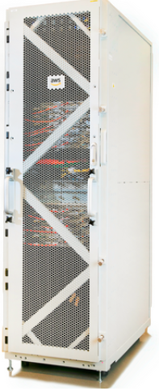
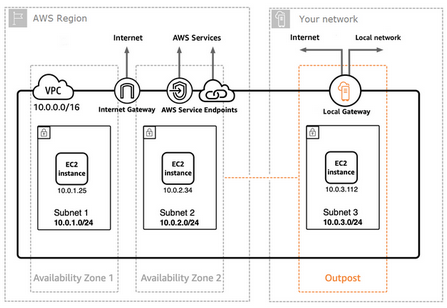

Amazon Web Services&reg; (AWS) Outposts is ideal for workloads that require low
latency access to on-premises systems, local data processing, or local data
storage. In Part two, we dive under the hood.

<!--more-->

This three-part series examines the following topics:

- Why AWS Outposts is relevant in today’s technology ecosystems
- How you can leverage Outposts to create hybrid environments
- What makes up an Outposts' data rack
- What does it cost to incorporate this technology into your environment
- How to begin your Outposts journey by setting up a site

If you haven't already seen it, read
[Part one of this series(https://docs.rackspace.com/blog/aws-outposts-a-hybrid-approach-to-designing-hybrid-environments-part-one/),
before reading this installment.

### AWS Outposts&mdash;Public cloud re-imagined

AWS Outposts allows organizations to physically extend their AWS virtual private
clouds (VPC)s into their on-premise environment while retaining all the power
of AWS cloud-native services. This tight coupling of cloud resources and on-premises
resources allows Outposts to leverage many of the tools and services that power
the AWS cloud, while still having local access to their on-premise networks. The
result is a purpose-built *bridge* that closes the gap between on-premises and
cloud operations.

### Under the hood

{{}} The AWS
Outpost enclosure, pictured on the right, is delivered in 42U rack, measuring
80in x 24in x 48in. These measurements align with traditional full-rack
specifications and should come as no surprise to anyone who has ever set foot
inside a data center. They assemble the racks based on the client's specifications,
and a team of AWS engineers delivers them pre-installed. In some instances, the
Outposts installation might consist of multiple enclosures, and they can aggregate
the resources into a single larger pool of capacity. The racks contain your
standard top-of-rack patch panels and fiber optic uplinks, network switches,
uninterruptible power supplies, PDUs, and of course, the physical
hosts that house the compute and storage resources. The hardware is not all AWS
proprietary, and they do leverage components from technology partners and independent software
vendors, such as Cisco&reg;, Citrix&reg;, Druva&reg;, Dynatrace&reg;, Veritas&reg;,
and others.

While this rack comes packed with the inner power of the AWS cloud,
it does not have all the same safeguards that are so readily available in Amazon's
state-of-the-art data centers. Outposts is an AWS-managed service, and the onus
is on AWS to keep that hardware and software healthy and happy. Still, it is at
the mercy of the datacenter it resides in, as it pertains to power, cooling, and
physical security. Even though Outposts is a tangible item that you can physically
touch, the real benefits come from the unseen components.

At the time of this post, Outposts boasts support for the following native AWS services:

- **Amazon EC2**
- **Amazon EBS**
- **Amazon ECS** (Docker)
- **Amazon EKS**
- **Amazon RDS** (MySQL, PostgreSQL)
- **Amazon EMR** (Apache Spark, Apache Hive, Presto)
- **Amazon S3** Local Object Storage (Road mapped for "2020")

This list of services perfectly complements many traditional on-premise compute,
storage, and database offerings. Still, it is the use of common AWS APIs, tools,
management services, and security constructs that truly sets Outposts apart from
other purpose-built 3rd party hybrid designs. Outposts is an extension of the AWS
region to which it is connected and provides on-premise access to a broad range
of services available within that region.

Now, let's look at some of the features that make up Outposts.

#### Compute and local non-S3 storage

Outposts supports a wide variety of compute and storage resource types, including
General Purpose, Compute Optimized, Memory Optimized, Graphics Optimized, and I/O
Optimized instance types. At the time of this post, only GP2 EBS persistent
block storage volumes were available at tiers of 2.7 TB, 11 TB, 33 TB, or 55 TB.
Like a standard cloud-based EC2 instance, the type of instance bundle selected
determines the hardware required to achieve the desired result. Those underlying
hardware specifications increase or decrease the cost accordingly. Note that
this is essentially dedicated hardware, and there is substantial capital
expenditure on AWS's part to source, build, deliver, and manage these enclosures.
Hence, AWS Outposts is not an inexpensive hybrid option. Just to give you an idea,
I pulled the least and most expensive options from the AWS Outposts pricing page,
shown in the following image:

{{}}

*Image source*: [https://aws.amazon.com/outposts/pricing/](https://aws.amazon.com/outposts/pricing/)

#### Networking

{{}} Outposts has
two important networking features that provide the foundation for the complete
hybrid experience: VPC Extension and Local Gateway. VPC Extension provides the
ability for organizations to extend their AWS cloud-based VPCs into their
on-premise Outposts appliances. The result is a seamless communication path for
your locally running AWS services on Outposts with all the other cloud services
and infrastructure in the native cloud environment. Using this concept,
organizations can even stand up more than one Outposts unit in their data center
and have each unit tied to a different AWS availability zone, introducing levels
of redundancy uncommon within on-premise data centers.

The second feature, Local Gateway, acts as the bridge from the Outposts unit
into the existing on-premise network. This low latency connection is a pivotal
component in joining Outposts hosted AWS services and legacy on-premise resources
to form hybrid applications.

#### Tools

As previously mentioned, Outpost acts as an extension to the AWS Region it is
attached to, and this framework allows tools such as CloudWatch, CloudFormation,
CloudTrail, Elastic Beanstalk, and many other services to integrate seamlessly
with the On-premise Outpost environment. When you couple the tight AWS integration,
expansive AWS toolset, and the "Local Gateway" feature of the networking stack,
you can see how Outposts will enable a seamless blend between two totally
different worlds.

#### Security

One of the technologies that Outposts is built on is AWS Nitro System. Nitro
System is an enhanced security service that offers continuous monitoring,
remediation, and verification of the Outposts unit's hardware and firmware. The
Nitro System forces dedicated hardware and software to support specific
virtualization resources and minimize the attack surface. The AWS Nitro System,
coupled with the traditional AWS shared security model and various encryption
capabilities, acts as the foundation for Outposts security. Since the Outposts
unit is an extension of your AWS cloud environment, concepts such as users, roles,
security groups, and other standard AWS security frameworks are all leveraged to
secure your data.

When you combine all these attributes and leverage the native cloud capabilities
of AWS, this service can change the hybrid game and force organizations to
reexamine their cloud approach. Now that you are aware of what makes up an
Outposts rack, let's examine what it takes to get a unit ordered and routed to
a data center near you.

### Coming soon

Part three of the series is coming soon, so stay tuned!

<a class="cta red" id="cta" href="https://www.rackspace.com/sap">Learn more about our SAP services.</a>

Use the Feedback tab to make any comments or ask questions. You can also click
**Sales Chat** to [chat now](https://www.rackspace.com/) and start the conversation.
