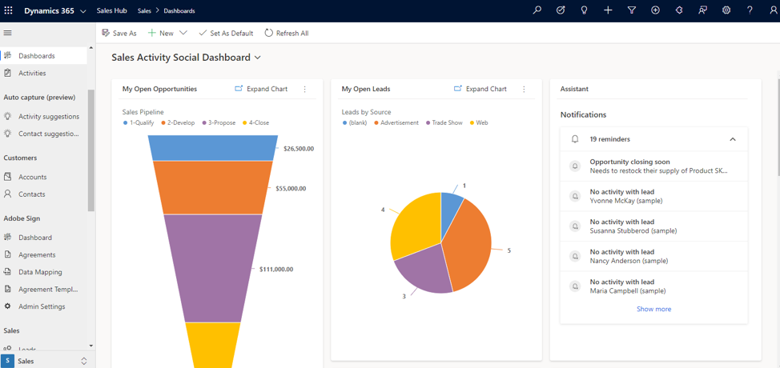

During these uncertain times, customer experience is even more important because
customers expect to receive proactive and personalized responses.

<!--more-->

Rackspace Technology's Chief Operating Officer, Subroto Mukerji,  discusses the
importance of
[delivering better customer experiences during and after COVID-19](https://www.rackspace.com/solve/delivering-better-customer-experiences-during-and-after-covid-19)
in his recent Solve post.

As true as this, it is equally valid that in this uncertain time, many small and
midsize businesses can't invest heavily in a proper customer relationship
management (CRM) solution to help foster those customer relationships. Through
a strategic partnership, Rackspace Technology can accommodate pricing options
for both customers who want to take a more self-directed approach and customers
who require more personalized attention for a Microsoft&reg; Dynamics 365&reg;
sales or customer service implementation. Core sales management or service
management implementations can take as little as six weeks so you can quickly
start managing customer engagements.

### What is Microsoft Dynamics 365?

Dynamics 365 is a Microsoft CRM Software-as-a-Service (SaaS) solution, with
integration capabilities to Microsoft 365 applications such as Microsoft
Outlook&reg;, Microsoft Teams&reg;, and Microsoft Excel&reg;. As a SaaS solution,
Dynamics 365 helps businesses enable employees to work from home while remaining
engaged with customers, all on a secure platform, Azure&reg;.

{{}}

### How Can Dynamics 365 Help?

Dynamics 365 offers the following advantages:

- **Common Data Model**: Dynamics 365 offers sales and customer service
  management capabilities and provides email tracking for Microsoft 365 customers
  with Outlook. Dynamics 365 customer relationship management applications
  (model-driven applications) are built on a common data model to store data in
  a unified form across the CRM applications. This design enables you to get a
  holistic view of your customers. For example, when sales representatives view
  a contact, they can see both open opportunities and open cases with a timeline
  of events.

    {{}}

- **Secure and Efficient**: Dynamics 365 works with Azure Active Directory to
  establish a connection as well as provide a single sign-on across Microsoft
  applications. Not only does this centralize identity management, but it also
  creates operational efficiencies. When you use Outlook or Teams, you do not
  need to enter your credentials again to access your Dynamics 365 application.
  Furthermore, the Sales and Customer Service apps have role-based security
  options to control what you can access within the Dynamics 365 application.

- **Scalability**: After you are up and running with the core functionality of
  your Dynamics 365 CRM applications, you can choose from the following  options
  to expand the system functionality further or automate recurring business
  processes:

    - add licenses for other Dynamics 365 core applications, such as Dynamics
      365 Marketing
    - purchase add-on licenses such as Sales Insights or Customer Service Chat
    - expand through the Power Platform using tools such as Power Automate or
      Power Virtual Agents
    - expand capabilities through Microsoft's App Source with access to over
      2,000 apps

When investing in Dynamics 365, consider it a long-term investment that can
grow or adjust to your business requirements. Starting with core functionality
might be your primary concern today. However, tomorrow you might need a more
robust solution with automated processes, and Dynamics 365 can adapt and grow
as your business grows.

### What's Next?

There are a few things that you can do as you think about or prepare to implement
a CRM solution. Here are some questions you can start thinking through as you
prepare to engage Rackspace Technology.

1. Ensure that you understand how you currently manage opportunities or services
cases. Understand what you and your team are doing correctly, and where there is
room for improvement. Also, begin to define the core requirements for your new
solution.

2. Ensure that your team has time to commit to implementing a new solution. You
need to engage key team members to clean up customer records for migration,
train, and test the system. These are essential implementation steps, so enabling
your team to complete these tasks helps ensure a successful and timely implementation.

3. After you understand what works well, what you want to fix, and know you are
ready to commit, consider if you're going to take the crawl-walk-run approach or
dive all in to streamline as many processes as possible. If you start with some
easy wins, you will have a quicker initial implementation timeline, and your
team can get comfortable with the system before conducting heavy configurations
or customizations. When you jump all in, you gain many efficiencies, but this
method tends to have higher upfront costs and a longer project duration. Take
the time to find the right balance between requirements and nice-to-haves.

4. Question why your business processes are the way they are. You do not
necessarily want to bring the old business processes into your new solution.
Yes, you need to keep the core practices that make your business unique, but if
you are currently running a multitude of custom reports, or adding daily manual
tasks, stop and ask why? Do you really need those reports, is there a better
method to handle that task, or did you not have the correct tools before? Allow
this solution change to provide you with business process efficiencies.

5. Contact experts to help you navigate through the next steps. We are here to
help advise, design, build, manage, and optimize a Dynamics 365 solution that
provides better customer experience and drives the business outcomes you want
to achieve. Spend less time on busy work and start building trusted relationships
with a solution that tracks customer communication, assists with task reminders,
manages opportunities, and provides you with a holistic view of your customer.

<a class="cta purple" id="cta" href="https://www.rackspace.com/microsoft/dynamics-365">Learn more about our Microsoft Dynamics 365 offerings and services.</a>

Use the Feedback tab to make any comments or ask questions. You can also click
**Sales Chat** to [chat now](https://www.rackspace.com/) and start the conversation.
