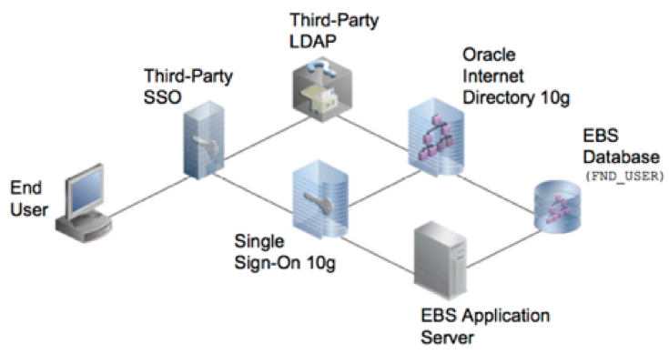

This post describes how to restore single sign-on (SSO) and Oracle Internet
Directory (OID) services after a server crash or disk corruption.

<!--more-->

SSO, an authentication process, permits you to enter your username and password
once to enable access to multiple applications. Because the process authenticates
you for all the applications for which you have rights, the applications don't
issue further prompts when you switch applications during a session.

{{}}

*Image Source*: [Oracle Internet Directory 11g (11.1.1.2) Certified with E-Business Suite](https://blogs.oracle.com/ebstech/oracle-internet-directory-11g-11112-certified-with-e-business-suite)

### Restore OID 10G services and enable SSO after a server crash or disk corruption

Use the following steps to restore the services and enable SSO:

#### 1. Restore the server

a. Work with your systems team to restart the server.

b. Make sure `df -h` shows the same output as before the server crash.

c. Ensure that all the Unix users are present.

d. Add the `ldap` server entry in the **/etc/hosts** file.

#### 2. Restore the OID home

a. Restore the OID home from the last backup. You can use the `tar/gunzip`
   command to restore the OID binaries.

b. Copy the last completed `rman` backup for the OID database.

c. After the restore of OID binaries completes, use the following commands to
   prepare the environment file, if the system did not restore it:

        [<user>@servername ~]$ cat <SID>.env
        export ORACLE_HOME=/<LOC>/product/infra
        export ORACLE_SID=<SID>
        export PATH=$ORACLE_HOME/bin:$ORACLE_HOME/opmn/bin:$ORACLE_HOME/OPatch:$ORACLE_HOME/jdk/bin:$PATH
        export TNS_ADMIN=<$ORACLE_HOME>/network/admin

d. Run the following command to source the environment file:

        [<User>@servername ~]$ . SID.env

#### 3. Start the listener service

Run the following command to start the listener:

       [<User>@<Server> ~]$ lsnrctl start <SID>

#### 4. Restore the OID database

a. Use the following commands to connect to the `rman` prompt:

       RMAN> SET DBID 12345;
       RMAN> STARTUP NOMOUNT;
       RMAN> RESTORE CONTROLFILE FROM "<Backup_Location>/<Backup_file_name>";
       RMAN> ALTER DATABASE MOUNT;
       RMAN> RESTORE DATABASE;
       RMAN> RECOVER DATABASE;
       RMAN> ALTER DATABASE OPEN RESETLOGS;

b. Set the DBID. You can find your DBID in one of the following locations:

   - The autobackup control file uses the DBID in its file name. Use the `show all`
     command to display the files. The autobackup naming convention uses the
     following format: **IIIIIIIIII-YYYYMMDD-QQ**

       - **IIIIIIIIII**: The DBID.
       - **YYYYMMDD**: The day the backup generated.
       - **QQ**: A hex sequence that starts with 00 and has a maximum value of FF.

   - The `rman` client displays the DBID in any text files that preserve the
     output from an RMAN session when it starts up and connects to your database,
     as shown in the following example:

        [<User>@<Server> ~]$ rman target /

        Recovery Manager: Release 10.1.0.5.0 - Production

        Copyright (c) 1995, 2004, Oracle.  All rights reserved.

        connected to target database: <ORACLE_SID>(DBID=134587536)

        RMAN>

#### 5. Start the OID services

In this case, nothing came up other than the OID and HTTP_Server server.

       [<user>@servername ]$ opmnctl status

        Processes in Instance: PM***.pmp***1.*****.com
        -------------------+--------------------+---------+---------
        ias-component   | process-type   |  pid | status
        -------------------+--------------------+---------+---------
        DSA           | DSA                  |  N/A      | Down
        LogLoader         | logloaderd              |  N/A      | Down
        dcm-daemon     | dcm-daemon          |  N/A      | Down
        OC4J         | OC4J_SECURITY       |  N/A      | Down
        HTTP_Server     | HTTP_Server            | 11738 | Alive
        OID            | OID                  | 11758 | Alive

### Possible errors

You might encounter the following errors while performing the preceding steps.

#### Connecting ldap server

You might get the following error while connecting the ldap server:

    [<user>@servername ]$ ldapbind -p 389
    Cannot connect to the LDAP server
    [<user>@servername ]$

Use the following command to ping the ldap server, which is reachable:

    [<user>@servername ]$  ping D**1.***eon.com
     PING D**1.***eon.com (<IP ADDRESS>) 56(84) bytes of data.
     64 bytes from D**1.***eon.com (<IP ADDRESS>): icmp_seq=1 ttl=126 time=2.48 ms
     64 bytes from D**1.***eon.com (<IP ADDRESS>): icmp_seq=2 ttl=126 time=1.63 ms

#### Errors in ssoServer and oidmon logs

While debugging issues, you might see the following errors in log files:

-**ssoServer.log**:

    Mon Mar 09 06:59:25 EDT 2020 [ERROR] Orion Launcher SSO: DB Error. Please make sure the database is available and restart SSO Server
    oracle.security.sso.server.util.DBException: Empty DB connect string. Could not create DB connection pool
    at oracle.security.sso.server.util.DBConnectionPool.init(DBConnectionPool.java:148)

-**oidmon.log**:

    2020/03/11:22:42:53 * oidmon_<SID>.***eon.com:0 *
    sgslupsCheckProcess: sigsend to pid 10683 failed, os error = 3
    2020/03/11:22:42:53 * oidmon__<SID>.***eon.com:0 *
    Retry count exceeded for OIDLDAPD instance 1
                      Check OIDLDAPD1.log for more details.
                      After fixing the problem execute the following command
                      oidctl connect=<SID> host=<SID>.***eon.com server=OIDLDAPD inst=1 start

Try the following steps to address these issues:

1. Use the following command to checking permission for the **oidldapd** file:

        [<user>@servername ]$ ls -tlr oidldapd
        -rwx--x--- 1 root apppo 2743487 Sep 1 2012 oidldapd
        [<user>@servername ]$

2. Start the oidldapd processes with debug enabled:

        oidctl connect=<SID> server=oidldapd instance=1 flags="-p 389 -debug 117440511" start

#### Errors in the oidldapd01 log

You might then see the following issue in the oidldapd01.log file:

    2020/03/11:22:12:22 * Main:0 * sgslunlListen: Bind failed (port=389), OS error=(13)
    2020/03/11:22:12:22 * Main:0 * FATAL * main * Dispatcher Process unable to bind to port
    2020/03/11:22:12:32 * Main:0 * sgslunlListen: Bind failed (port=389), OS error=(13)
    2020/03/11:22:12:32 * Main:0 * FATAL * main * Dispatcher Process unable to bind to port
    2020/03/11:22:12:42 * Main:0 * sgslunlListen: Bind failed (port=389), OS error=(13)
    2020/03/11:22:12:42 * Main:0 * FATAL * main * Dispatcher Process unable to bind to port
    2020/03/11:22:12:52 * Main:0 * sgslunlListen: Bind failed (port=389), OS error=(13)

To fix this, run the following command in **$ORACLE_HOME/root.sh**:

    [root@servername ~]# /u01/app/apppo/product/infra/root.sh
    Running Oracle 10g root.sh script...

    The following environment variables are set as:
    ORACLE_OWNER= ap***
    ORACLE_HOME= /u01/****/****/product/infra

    Enter the full pathname of the local bin directory: [/usr/local/bin]:
    The file "dbhome" already exists in /usr/local/bin. Overwrite it? (y/n)
    [n]:
    The file "oraenv" already exists in /usr/local/bin. Overwrite it? (y/n)
    [n]:
    The file "coraenv" already exists in /usr/local/bin. Overwrite it? (y/n)
    [n]:

    Entries will be added to the **/etc/oratab** file as needed by
    Database Configuration Assistant when a database is created
    Finished running generic part of root.sh script.
    Now product-specific root actions will be performed.

    Entering Oracle Internet Directory Root Installation Section

    OiD Server Installation
    Checking LDAP binary file protections
    Setting oidmon file protections
    Setting oidldapd file protections
    Setting oidrepld file protections
    Setting oidemdpasswd file protections
    Setting remtool file protections
    Setting oiddiag file protections
    Leaving Oracle Internet Directory Root Installation Section

After you debug the issue and start the **opmn** services, they should behave
as shown in the following example:

    [<user>@servername ]$ opmnctl status

    Processes in Instance: PM***.pmp***1.*****.com
    -------------------+--------------------+---------+---------
    ias-component      | process-type       |
     pid | status
    -------------------+--------------------+---------+---------
    DSA                     | DSA                           |
    N/A | Down
    LogLoader          | logloaderd                 |     N/A | Down
    dcm-daemon     | dcm-daemon             |   31430 | Alive
    OC4J                    | OC4J_SECURITY       |
    31349 | Alive
    HTTP_Server      | HTTP_Server             |   31254 | Alive
    OID                      | OID                            |
    31271 | Alive

### Conclusion

By implementing the preceding steps, you can follow a systematic approach for
debugging and restoring the services in case of SSO/OID 10G server restore.
Further, you also learn to debug various errors while performing the SSO/OID
10G server restore.

<a class="cta blue" id="cta" href="https://www.rackspace.com/dba-services">Learn more about Databases.</a>

Use the Feedback tab to make any comments or ask questions. You can also click
**Sales Chat** to [chat now](https://www.rackspace.com/) and start the
conversation.
