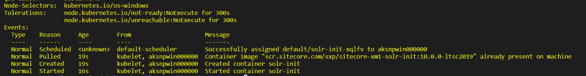

With the release of Sitecore&reg; version 10, Kubernetes&reg; is now a supported option. This opens up some great
benefits, such as better resource utilization, version-controlled images, and overall operations ease. While building
out an automated pipeline, I came across an error during the Kubernetes job step. Let's dive in and see the fix I used
to get successful deployments.

<!--more-->

### Configuration

Following the install document, you deploy the ingress controller, secrets, and then the external dependencies. These
dependencies include Redis&reg;, MSSQL&reg;, and Solr&trade;. Looking at the following helm install command, notice it
uses a `nodeSelector` to target a Linux&reg; node for the Nginx&reg; ingress. While Sitecore runs on Windows&reg; containers,
this usage informs us that we need to have Linux and Windows nodes for a full Sitecore deployment.

```
helm repo add stable https://kubernetes-charts.storage.googleapis.com/
helm install nginx-ingress stable/nginx-ingress --set controller.replicaCount=1 --set controller.nodeSelector."beta\.kubernetes\.io/os"=linux --set defaultBackend.nodeSelector."beta\.kubernetes\.io/os"=linux --set-string controller.config.proxy-body-size=10m --set controller.service.externalTrafficPolicy=Local
kubectl apply -k ./secrets/
kubectl apply -f ./external/
kubectl apply -f ./init/
```

Each step of my deploy went smoothly until I hit the init YAML step, which runs jobs within Kubernetes. While monitoring
my pods, I noticed **ErrImagePull** for the solr initialization job. I ran a **kubectl describe pod solr-init-m5dgj**
command to view more information, which yielded the following output:

```
QoS Class:       BestEffort
Node-Selectors:  <none>
Tolerations:     node.kubernetes.io/not-ready:NoExecute for 300s
                 node.kubernetes.io/unreachable:NoExecute for 300s
Events:
  Type     Reason     Age                    From                                        Message
  ----     ------     ----                   ----                                        -------
  Normal   Scheduled  <unknown>              default-scheduler                           Successfully assigned default/solr-init-m6dgj to aks-nodepool1-19665653-vmss000001
  Normal   Pulling    3m5s (x4 over 4m33s)   kubelet, aks-nodepool1-19665653-vmss000001  Pulling image "scr.sitecore.com/sxp/sitecore-xm1-solr-init:10.0.0-ltsc2019"
  Warning  Failed     3m5s (x4 over 4m32s)   kubelet, aks-nodepool1-19665653-vmss000001  Failed to pull image "scr.sitecore.com/sxp/sitecore-xm1-solr-init:10.0.0-ltsc2019": rpc error: code = Unknown desc = Error response from daemon: Get https://scr.sitecore.com/v2/: x509: certificate signed by unknown authority
  Warning  Failed     3m5s (x4 over 4m32s)   kubelet, aks-nodepool1-19665653-vmss000001  Error: ErrImagePull
  Warning  Failed     2m53s (x6 over 4m32s)  kubelet, aks-nodepool1-19665653-vmss000001  Error: ImagePullBackOff
  Normal   BackOff    2m41s (x7 over 4m32s)  kubelet, aks-nodepool1-19665653-vmss000001  Back-off pulling image "scr.sitecore.com/sxp/sitecore-xm1-solr-init:10.0.0-ltsc2019"
  ```

Having worked with Kubernetes for a while, I instantly spotted the error. While the message gave an x509 certificate
error, look at the job's assigned node. **aks-nodepool1-19665653-vmss000001** is a Linux node, and the image it pulled
has `ltsc2019`, which is an indicator for Windows. Because I used AKS, the Windows VMSS nodes are named with a structure
of **aksnpwin000000**, **aksnpwin000001**, and so on. A Windows image cannot run off a Linux node. 

The question comes up about why this randomly worked in previous deploys? Well, the Kubernetes scheduler handles the placement
of where to run the job, but we can target specific nodes based on the operating system. Auditing the Sitecore deployment YAML
files, I noticed they were indeed targeting Windows nodes, but the init jobs were missing this entry. I verified this by
looking at the describe pod output above, which has `Node-Selectors: <none>` set to `none`.

To fix this, open up each init job YAML file and add a `nodeSelector` entry targeting the operating system, `Windows`.

```
  spec:
  template:
    spec:
      nodeSelector:
        kubernetes.io/os: windows 
      imagePullSecrets:
        - name: sitecore-docker-registry
```

After editing the YAML file, delete the failed job and apply the new init YAML files.
Describing the pod should show a status of **ContainerCreating** and a **Node-Selectors** set to windows {{}}

### Parting thought

I have informed Sitecore about the missing node selector for the Kubernetes jobs, but in the meantime, it is an
easy fix to edit the YAML files. For more information about windows containers, reference the [kubernetes documentation](https://kubernetes.io/docs/setup/production-environment/windows/user-guide-windows-containers/).
