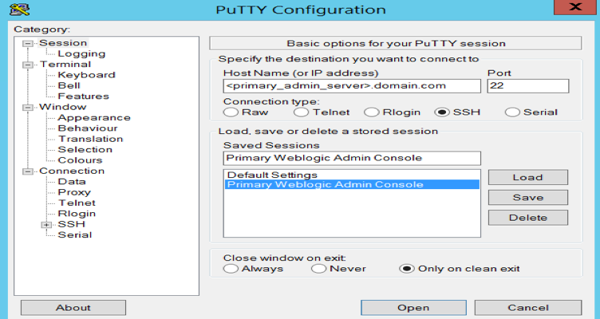
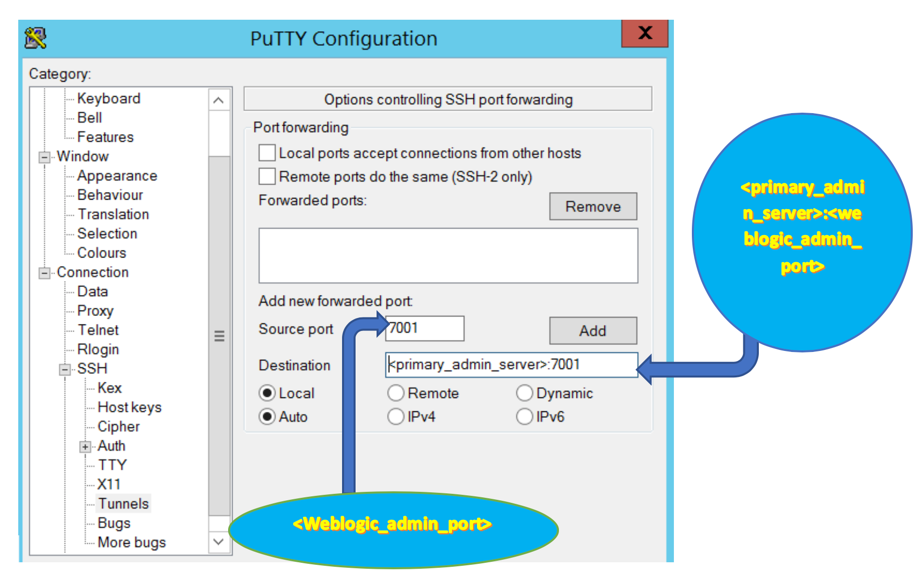
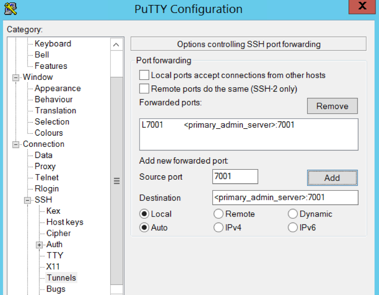
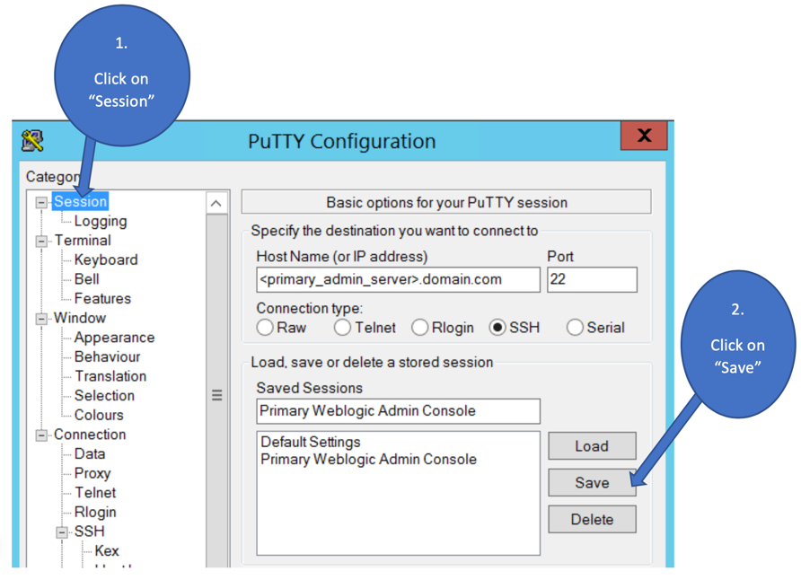

The post introduces steps to set up an SSH tunnel for Oracle&reg; WebLogic
Server (WLS) Administration Console access in version R12.2.

<!--more-->

### Introduction

Before you set up the SSH tunnel, you should apply one of the following updates
to Oracle E-Business Suite (EBS) Release 12.2:

- the April 2019 Oracle Critical Patch Update (CPU)
- the Oracle E-Business Suite Technology Stack Delta 11 release update pack (R12.TXK.C.Delta.11)

After you bring EBS up-to-date, AutoConfig secures access to the Oracle WLS
ports by using the WLS connection filters. At that point, the application tier
nodes of the Oracle EBS instance grant WLS ports unrestricted access. The WLS
Administration Console and Fusion Middleware Control need to use WLS
Administration ports, which have no default trusted hosts. Therefore, this post
introduces a means to give your administrators access to these tools. A
secure-by-default SSH tunnel for WLS Administration access should reduce the
available attack surface, control access to the ports, and protect the EBS
infrastructure. The feature lets you automate the use of WLS connection filters.

### Use SSH tunneling

**Note:** To use an SSH tunnel to access the Administration Console and Fusion
Middleware Control through the WLS Administration ports, you need operating
system access to the primary application tier node.

Perform the following steps in sequence to set up an SSH Tunnel with PuTTY&reg;
to access the WLS Administration Console:

#### Step 1: Add the primary WebLogic Administration server

1. Open a PuTTY session.

2. Enter the host information in the **Host Name (or IP address)** field,
replacing \<primary_admin_server\> with the primary application WebLogic
Administration node, where you are running the WLS Administrator.

{{}}

<ol start=3>
     
    <li>Add a saved name to identify the connection for access easily and click <b>Save</b>.</li>
</ol>

#### Step 2: Configure the tunnel

1. In the left-panel, click **SSH > Tunnels and add local port and destination <primary_admin_server>:<Weblogic_Admin_port>**
and click **Add**.

{{}}

<ol start=2>
    <li>Click <b>Add</b> to open the PuTTY configuration window.</li>
</ol>

{{}}

 

#### Step 3: Save the settings

In the left-panel, click **Session** and click **Save**.

{{}}

#### Step 4: Validate the tunneling

1. Login to PuTTY as the application OS user to your primary administration server.

2. Open a web browser to access `http://localhost:7001/console`.

After you set up SSH tunneling from your UNIX or Windows&reg; client, you can
securely access the WLS Administration Console and Fusion Middleware Control.
Launch a browser from your client and connect to the administrative URLs.

On a Windows client, you can use either one of the following SSH executables:

- Windows 10: OpenSSH `ssh` from Microsoft: If you use `ssh`, follow the syntax for
  `ssh` shown in the preceding example.

- Windows 7: `plink` from PuTTY: If you use `plink`, use the following command:

        C:\> plink.exe -N -L localhost:<WLS_admin_port>:<primary-apptier>:<WLS_admin_port> <OS_user>@<primary-apptier>

    For example, if the Oracle WebLogic Server Administration port is `7001`, and
    the OS user is `oracleuser`, use the following command:

        C:\> plink.exe -N -L localhost:7001:<primary-apptier>:7001 oracleuser@<primary-apptier>

### Conclusion:

SSH tunneling helps you access the WLS Administration console from a local
Windows device, where EBS restricted all access to the WLS Administration server
for other devices. You don't need any additional software other than PuTTY to
set up the SSH tunnel.

<a class="cta red" id="cta" href="https://www.rackspace.com/professional-services/data">Learn more about Rackspace Data Services.</a>

Use the Feedback tab to make any comments or ask questions. You can also click
**Sales Chat** to [chat now](https://www.rackspace.com/) and start the conversation.
