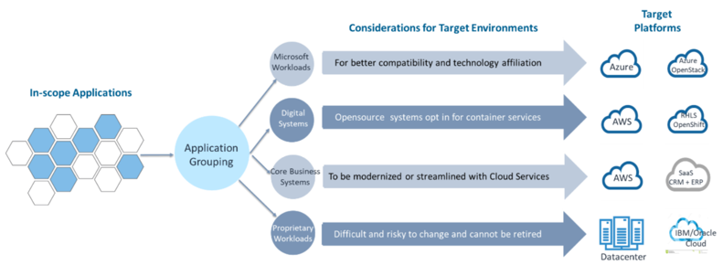

This three-part series introduces you to the art of managing the many necessary
decisions for managing your multicloud environment.

<!--more-->

### Why multicloud strategies?

In recent years, cloud computing has become instrumental for companies of
various sizes who want to undertake major business transformation. Its
flexibility, scalability, and high availability offer clear advantages for
businesses to save costs, experiment with new ideas, and pursue business
innovation.

Certainly, individual global and mature cloud computing platform providers,
such as AWS&reg;, Azure&reg;, and Google&reg;, can fulfill all common service
requirements for any businesses around the world. However, the multicloud
strategy is increasingly gaining traction from sizeable businesses across all
major industries. A multicloud strategy can simply refer to the deployment of
different cloud offerings encompassing Software-as-a-Service (SaaS),
Platform-as-a-Service (PaaS), and Infrastructure-as-a-Service (IaaS). These
offerings could well be offered collectively by more than one cloud platform
provider.

Businesses that opt-in for a multicloud strategy usually lean on a handful of
reasons&mdash;the more popular ones being data sovereignty, user proximity,
considerations for performance, reliability, and availability. And for some
other companies, it might just be a policy to avoid vendor lock-in. Regardless
of which drivers prevail, businesses have to make lots of important decisions,
and in many cases, these decisions are not intuitive and straight-forward.

### Decision management is instrumental to an effective multicloud strategy

The decisions associated with executing a multicloud strategy might center
around target platforms, technologies, governance, skills, security, compliance,
migration, and operations costs. While every company has its own unique context,
the resulting multicloud strategy must address an overarching question for the
entire organization: What viable options does the company have for cloud computing,
and how should its pre-existing data center workloads be managed up against
these options?

Many different factors can influence the complication of addressing the
overarching question for a sizeable company. The most common ones include:

- **Business objectives**: The business capabilities and results the company
  wants to achieve through cloud computing. Such objectives should have
  well-defined KPIs to indicate the level of success.

- **Stakeholders Priorities**: You should address the specific interests of
  different organizational units, functions, and stakeholder groups throughout
  the cloud transformation journey. Make sure you clearly understand and
  recognize these interests. Also, there might be different pathways reaching
  the same corporate goal, so the chosen path should balance different
  stakeholder groups' interests.

- **Regulatory Compliance**: Security and compliance usually top the list of
  stakeholders' requirements. They cast constraints and decisive factors into
  different aspects of the target state, and typically limit the company's viable
  options regarding migrating individual applications and infrastructure services.

- **Skill and Technology Affiliation**: The company might have a significant
  footprint on specific platforms and technologies, which implicates preferences
  on a future cloud computing platform. The incumbent skilled resources might
  also influence adoption decisions because most people prefer the cloud journey
  with the least friction to their job.

- **Migration Complexity**: The investment, technical complexity, and efforts
  associated with the execution of a future migration could impact the uptake
  pathway and velocity. Most companies want to have visibility of the challenges
  ahead.

Developing a successful multicloud strategy requires setting its foundation on
an effective decision management process. The process should incorporate guardrails
that help narrow down the viable options to only a few and enable an objective
thought-process to acquire recommendations for the final decision quickly.

### The value of a decision-management process to a multicloud strategy

When developing a multicloud strategy, it's essential to keep focusing on the
ultimate problem the company needs to resolve. With tens or hundreds of
applications and thousands of servers, the decisions to orchestrate the transfer
of all in-scope applications into suitable cloud computing resorts can be
daunting.

Consider a hypothetical scenario with a company that has:

- Several legacy and back-office systems running on Windows and SQL databases
- New developments, associated with an on-going digital transformation, that
  deploy opensource code running on Red Hat&reg; Learning Subscription with a
  preference for container services
- Several core business systems and critical databases that they might need to
  move to other platforms or refactor to incorporate new enhancements
- Some legacy systems still running on proprietary platforms or technologies
  residing in the existing data center or an incumbent private cloud.

The following diagram articulates the initial thoughts on mapping workloads to
target cloud platforms:

{{}}

*Figure 1: High-level planning for multicloud strategies*

The high-level plan in **Figure 1** provides initial guiding principles for the
company to implement its multicloud strategies. The company might need to execute
the strategy, however, at the individual application level Many factors can
influence individual applications so that they don't follow these principles,
and these factors could well be valid exceptions.

A Cloud Decision Management Process (CDMP) helps the company lay out a
thought-process framework to collect data and information for individual
applications. There, they consolidate, analyze, and abstract the data into
migration filters and platform evaluation criteria. The company can then execute
the CDMP and reference its recommendation for individual applications before
making a final decision on the hosting cloud platforms.

When functioning effectively, the CDMP helps you successfully perform the
following tasks:

- Orchestrate crucial technical information and insights about individual applications
- Incorporate different constraints and key dependencies for the cloud adoption
- Prioritize and balance stakeholders' interests in transforming in-scope application stacks
- Deliver consistent, speedy, and objective recommendations.

### Continue

Part two of this series is coming soon, and I'll add the link here. Stay tuned!

Use the Feedback tab to make any comments or ask questions. You can also click
**Sales Chat** to [chat now](https://www.rackspace.com/) and start the conversation.
