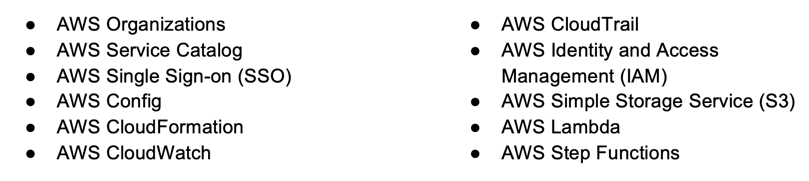
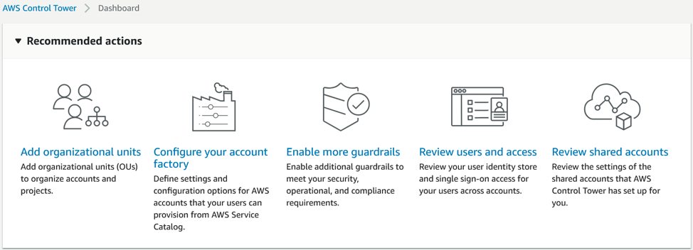

AWS&reg; Control Tower enables organizations with multiple AWS accounts and teams
to simplify their cloud setup and governance, reducing complexity and the amount
of time required to establish a secure and consistent infrastructure in the cloud.

<!--more-->

### Introduction

AWS Control Tower provides the easiest way to set up and govern a new and secure,
multi-account AWS environment based on best practices and the AWS Well-Architected
Framework concepts. Using AWS Control Tower, administrators can provision new
AWS accounts with minimal effort, while still adhering to company-wide security
and compliance policies.

This post examines:

- What is AWS Control Tower?
- AWS Control Tower&mdash;A look under the hood.
- How does Control Tower differ from a landing zone?
- Who are the optimal users for AWS Control Tower?

### AWS Control Tower:  A merging of many capabilities

Do you recall the first time you ever encountered a spork? I was 19 years old,
recently relocated to serve a 4-year enlistment in the US Navy, and I stopped
for a bite to eat at a Kentucky Fried Chicken in Norfolk, VA. I ordered my meal,
took a seat, and eventually realized that I had no utensils to enjoy my
artery-clogging, deep-fried dinner. I approached the counter to request a fork,
and the lady handed me an odd-shaped contraption wrapped in plastic. I was
mesmerized by this odd tool, which I later learned is called a *spork*. I
marveled at this beautifully crafted piece of plastic, a perfect blend of fork
and spoon, clearly the result of some unholy union in the silverware drawer.

{{}} For the
briefest moment, I knew how Ariel must have felt when she first held her
dinglehopper. This brilliant contraption had the spearing capability of the
conventional fork, coupled with the spoon's unrivaled scooping capability. I
recognized that this wasn't a new product, per se, but rather the combination
of existing products strategically blended to make life easier and more efficient
for both the restaurant and the paying customers.

When I began researching this article, I immediately began to get the same
feeling about AWS Control Tower as I got with the spork. Sure it looks kind of
different, it comes in its own custom wrapper, and as you'll learn, it certainly
simplifies the end-user experience. However, it is not entirely new, and it does
leverage quite a bit of existing functionality and best-practices that already
existed within other AWS services and Well-Architected Framework concepts.

Amazon&reg; announced AWS Control Tower for general availability on June 24, 2019. The
service's mission is to simplify the deployment of multi-account AWS environments
while simultaneously incorporating governance, security, company-wide policies,
and AWS best practices into the build. Best practices typically require deploying
a base landing zone (LZ), followed by a significant amount of engineering hours
to bring the new environment into compliance with both security and governance
standards and a host of other configurations related to logging, operations,
and auditability.

Control Tower eliminates the intermediate step of creating the basic landing
zone and subsequently configuring it. Instead, it allows organizations to
quickly provision new accounts with minimal effort, with the knowledge that the
new account will align with company-wide policies every time with no additional
effort required. The result is that you can grow and organize your AWS
environment without having to leverage AWS professional services or your
preferred partner of choice, which is obviously Rackspace Technology. (I know,
that was a shameless plug.) The best place to start when discussing AWS Control
Tower is how it works: what gives this tool the power to spin up new accounts,
while simultaneously implementing security best-practices, and how do we set up
organizations to meet their compliance requirements?

### AWS Control Tower - A look under the hood.

Control Tower leverages a host of existing AWS services to perform its mission.
It is best to think of Control Tower as, well, a control tower at your local
airport. It is the central hub for overseeing, coordinating, and managing a
fleet of independent moving parts to achieve a common goal. An airport control
tower can't physically transport you from NYC to Los Angeles in 5 hours, but it
does bring together all the components required to help you land at LAX in one
piece, with your luggage in hand.

Just as the control tower at the airport is responsible for orchestrating both
airplane and vehicle movement on the tarmac, AWS Control Tower is responsible
for orchestrating numerous existing AWS services' integration and interoperability.
Each service brings its unique capabilities to bear to achieve a common goal, a
fully functioning AWS landing zone&mdash;a true example of the whole being
greater than the sum of the parts.

While the following list is not exhaustive, I want to touch on the major players
briefly:

{{}}

**AWS Organizations**: Provides the ability to automate account creation, group
accounts into logical groupings, apply policies, define cross-account sharing,
and define central configurations.

**AWS Service Catalog**:  Provides the ability to create and centrally manage a
catalog of IT services approved for use on identified or participating AWS
accounts. You can think of it as an AWS Service whitelist for your organization's
accounts and sub-accounts.

**AWS SSO**: Provides the ability to centrally manage single-sign-on (SSO) access
for authorized users within your AWS accounts. SSO also handles the management of
access for third-party Software-as-a-Service (SaaS) applications and integration
with custom apps using SAML 2.0.

**AWS Config**: Provides the ability to assess, audit, and evaluate the
configuration of your AWS resources.

**AWS CloudFormation**: Provides configuration management capabilities and allows
organizations to deploy and manage stacks of AWS resources leveraging an
Infrastructure-as-Code mentality.

**AWS CloudWatch**:  Provides the ability to collect, assess, and correlate data
and service metrics across all AWS services.

**AWS CloudTrail&reg;**:  Provides the audit trail, enabling governance,
compliance, operational auditing, and the ability to assess the risk to your AWS
account.

**AWS IAM**: Provides the ability to grant access and manage access to AWS
services.

**AWS S3**:  Provides theoretically limitless object-based storage.

**AWS Lambda**: Provides a platform to create seemingly limitless functionality,
which is run as code, negating the need to provision or manage servers.

**AWS Step Functions**: Provides serverless orchestration capabilities, typically
used in conjunction with Lambda functions, to create a sequential process of
taskings to perform.

While I undoubtedly only touched the treetops of these individual services'
capabilities, I think you can start to understand why Control Tower has gained
such popularity.  Harnessing the preceding services' individual capabilities is
basically like a landing zone in a box&mdash;no assembly required.

### How does Control Tower differ from a landing zone?

AWS Control Tower incorporates and deploys a pre-defined framework of guardrails
and standardized configurations that are automagically deployed behind the scenes
leveraging services such as AWS CloudFormation, AWS Lambda, and AWS Step Functions.
These pre-defined frameworks make use of the native capabilities of AWS Service
Catalog, AWS Config, and AWS SSO to deploy landing zones that adhere to the
corporate standards, which have been agreed upon by the organization. When you
first log into AWS Control Tower, you need to create two new sub-accounts, one
for your log archive and one for your audit archive.

This process takes roughly 60 minutes and creates two new AWS accounts under
your root account. Upon completion, you can enter the Control Tower Dashboard,
which provides the following options, shown in Figure 1.

{{}}

*Figure 1 - AWS Control Tower Dashboard*

This dashboard allows you to add organizational units (OU), enable additional
guardrails, review user access, and review policies associated with shared
accounts. You have essentially leveraged the power of all the services mentioned
previously to create a landing zone aligned with the AWS Well-Architected
Framework without so much as accessing any other service. If you need to add a
new OU for a new R&D project, you can do so with a couple of button clicks. The
GUI-driven simplicity of Control Tower is truly the primary differentiator.

Traditional landing zones leverage nearly all the same services and offer almost
the same result, but the steps required to get there are far more involved.

Traditional AWS landing zones require far more familiarity with the underlying
services within the AWS portfolio. If an organization wants to add a new
sub-account to its environment, it likely starts by accessing AWS Organizations.
Inside of Organizations, it goes through creating and subsequently inviting the
new account to join the organization. After that initial sub-account has joined
the OU, the administrators might decide to define a service control policy (SCP)
that it can then apply to that new sub-account.

Perhaps the administrator would then log into AWS Config or AWS Service Catalog
and define and associate those services to the newly created sub-account. You
can achieve the same result delivered through AWS Control Tower with a
traditional landing zone. Still, as you can see from my brief example, the steps
taken are far more numerous, and each of those processes is often wrought with
unseen challenges that take a savvy engineer to navigate. This begs the
question: Why would anyone want to deploy a traditional landing zone over the
seemingly more optimal Control Tower version of a landing zone?

### Who are the optimal users for AWS Control Tower?

In true AWS fashion, there is something for everyone based on the specific
outcomes the user is looking to achieve. Not every situation will call for a
fully involved Control Tower deployment.

Control Tower is optimal for organizations that need to deploy and manage a
greenfield or existing multi-account AWS environment with a pre-defined
blueprint to establish security and compliance baselines in all new accounts.
Organizations with less experience or capabilities with the greater AWS service
portfolio find what AWS refers to as the "self-service experience" to be hugely
advantageous. This canned approach to account expansion does come at the cost
of some upfront customization, because Control Tower creates each sub-account with
the same blueprint, which favors speed but not one-off modifications. Landing
zones are the exact opposite in some regards.

Organizations that do not have a use case that requires repeated and expedited
creation of new sub-accounts might find themselves better suited to creating a
traditional AWS landing zone. This choice affords them a greater focus on
customization, leveraging configuration management platforms to incorporate
Infrastructure-as-Code, and lets them incorporate additional services that fall
outside of the Control Tower core service set. This additional customization
requires significantly more planning and engineering capability. Suppose they
are unfamiliar with the processes or best-practices associated with creating a
landing zone according to the AWS Well-Architected Framework principles. In that
case, organizations might need to seek outside help from the AWS Partner Network.

{{}}Like any
project, knowing which tool to leverage to address the identified
requirements is half the battle. If we learned anything from Ariel, it is that
while you can certainly use a fork to brush your hair, there is probably a
better tool for the job, and those decisions can carry far greater impacts to
cost and operational efficiency when you're dealing with the AWS cloud
infrastructure.

### Summary

AWS Control Tower offers organizations the ability to quickly expand their AWS
account structure without sacrificing security or compliance considerations. It
harnesses the power of keystone AWS services to create, monitor, restrict, audit,
assess, build, and manage AWS OUs and their associated AWS accounts.

{{}}This remarkable
tool negates the need for deep technical expertise to grow your
environment and provides a repeated and blueprint-driven framework for expansion.
While Control Tower is a robust service, it might not always be the best tool
for the job. Organizations that require greater customization levels, have
deeper pools of engineering expertise around the AWS platform, or do not plan
on expanding beyond a single AWS account might find the use of the traditional AWS
landing zone to be more beneficial. Even though a fork can get the job done in
most cases, sometimes it pays to seek optimizations and leverage a spork-like
utensil that blends multiple functionalities into a single tool. If your
organization is looking to embark on a cloud project, be it proof of concept (POC)
or complete enterprise migration, leveraging a qualified AWS partner or the AWS
professional services team is never a bad idea.

<a class="cta blue" id="cta" href="https://www.rackspace.com/sap">Learn more about our AWS services.</a>

Use the Feedback tab to make any comments or ask questions. You can also click
**Sales Chat** to [chat now](https://www.rackspace.com/) and start the conversation.
