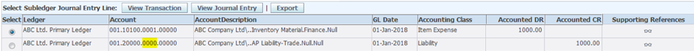
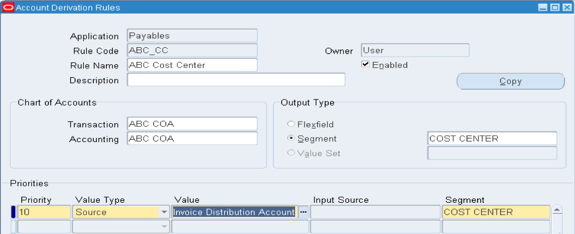
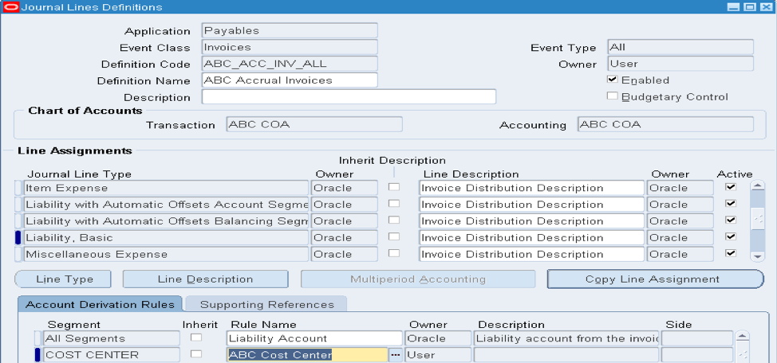
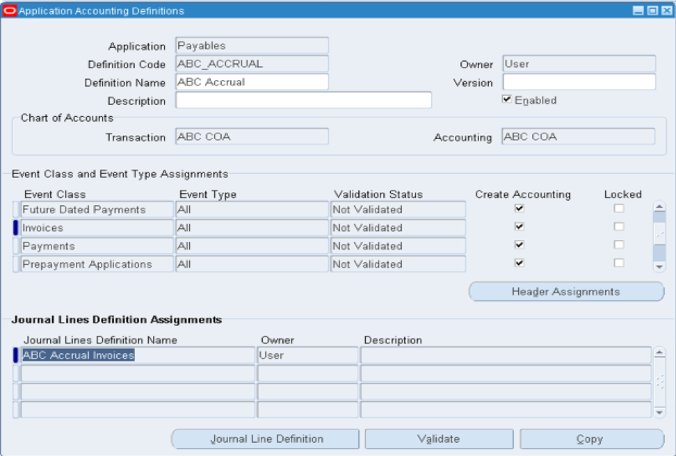
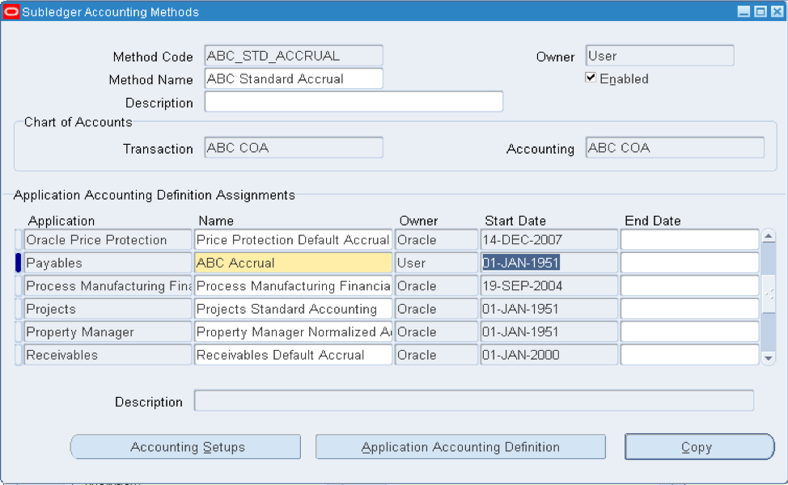
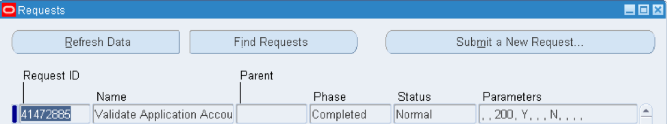
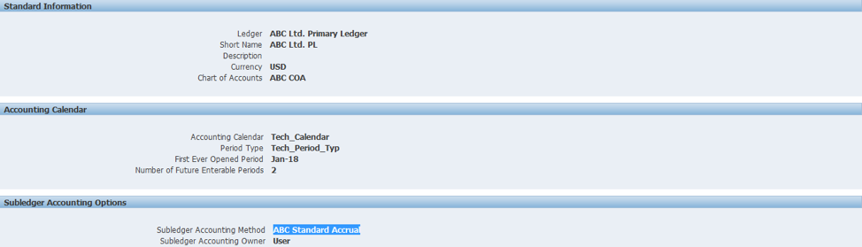
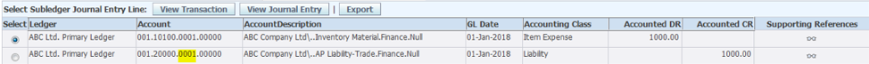

Subledger Accounting (SLA) is a dynamic feature of Oracle&reg; R12 that you can
use for meeting the accounting needs of the business.

<!--more-->

### Overview

By using SLA, you can easily modify all the accounting requirements by following
a few steps. In this post, I offer five easy steps to customize SLA. By
implementing these steps, you can modify the accounting process according to your
business needs.

### Business Requirement

To illustrate with an example, assume Company ABC Ltd. has included a company,
account, and cost center in their chart of account structure, and they use
standard accrual at the ledger level for their accounting method.

When they enter a standard invoice in the payables module, SLA generates the
following standard accounting entry:

    Expense: 001.10100.0001.00000 DR (Manually entered combination)
    Liability:  001.20000.0000.00000 CR (Derived from the Supplier/Supplier Site or Financial Options)

{{}}

The business's finance department wants the process to pick the **Cost Center**
Segment from the Expense Account entered at the invoice distribution level. Thus,
the third segment's value should be changed from `0000` to `0001` on the Liability
account combination.

### Solution

To fulfill this business requirement, you need to customize SLA to implement the
desired accounting process by using the following steps:

#### Step 1: Create a new Account Derivation Rule (ADR)

Select **Payables > Setup > Accounting Setups > Subledger Accounting Setup > Accounting Method Builder > Journal Entry Setups > Account Derivation Rules**.

{{}}

The rule explains that SLA should pick the value from the standard Oracle source,
**Invoice Distribution Account**, for the **COST CENTER** segment.

#### Step 2: Create a Journal Line Definition (JLD)

A JLD is a set of all the Journal Line Types (JLT) defined for a specific Subledger module.

1. Select **Payables > Setup > Accounting Setups > Subledger Accounting Setup > Accounting Method Builder > Methods and Definitions > Journal Line Definitions**.

2. Copy the Standard Oracle JLD and create a new JLD, as shown in the following
   example:

      {{}}

3. After you copy the definition, add the ADR rule you created for the
   **COST CENTER** segment in Step 1 and save the definition.

Because the example is on the Liability account, you will use the JLT as a
`Liability, Basic`.

#### Step 3: Create an Application Accounting Definition (AAD)

An AAD is a set of Event Classes or Event Types and JLDs.

1. Select **Payables > Setup > Accounting Setups > Subledger Accounting Setup > Accounting Method Builder > Methods and Definitions > Application Accounting Definitions**.

2. Copy the Standard Oracle AAD and create a new AAD, as shown in the following
   example:

      {{}}

3. After you copy the definition, add the JLD created in Step 2 and save the
   definition. You can individually attach the JLD to all the Event Classes.
   For this session, you can use Event Class as `Invoices`.

#### Step 4: Create a Subledger Accounting Method (SLAM):

A SLAM is a group of AADs defined for the Subledger modules.

1. Select **Payables > Setup > Accounting Setups > Subledger Accounting Setup > Accounting Method Builder > Methods and Definitions > Subledger Accounting Method**.

2. Copy the standard Oracle SLAM (Standard Accrual) and create a new SLAM, as
   shown in the following image.

      {{}}

3. After you copy the definition, add the AAD you created in Step 3 against the
   Payables application and save the definition.

4. To run the **Validate Accounting Definitions** program for Payables, select
   **Payables > View > Request > Submit a New Request**.

{{}}

#### Step 5: Attach the SLAM to the Ledger

1. Select **Payables > Setup > Accounting Setups > Ledger Setup > Define > Accounting Setups**.

{{}}

2. Attach the SLAM created in Step 4 and complete the Ledger setups.

### Validation

To validate your SLA setup, create a new invoice, validate it, and run the
**Create Accounting** program.

You can now see the change: The Cost Center value has been changed from `0000`
to `0001` for the Liability String.

    Expense: 001.10100.0001.00000 DR (Manually entered combination)
    Liability:  001.20000.0001.00000 CR (Derived from the SLA)

{{}}

### Conclusion

In R12 Oracle, SLA is one of the most well-organized methodical approaches to
confront the accounting needs that various businesses require. Understanding the
requirement is the key to this process. After you have a plan ready, you can
effortlessly customize the SLA by using the steps in this post to meet your
business requirements by customizing SLA.

<a class="cta teal" id="cta" href="https://www.rackspace.com/professional-services/data">Learn more about Rackspace Data Services.</a>

Use the Feedback tab to make any comments or ask questions. You can also click
**Sales Chat** to [chat now](https://www.rackspace.com/) and start the conversation.
