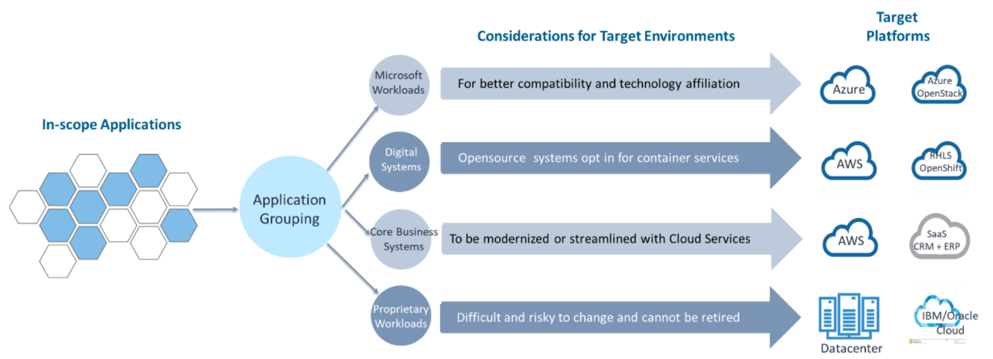
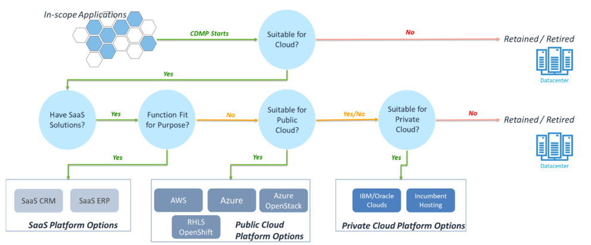
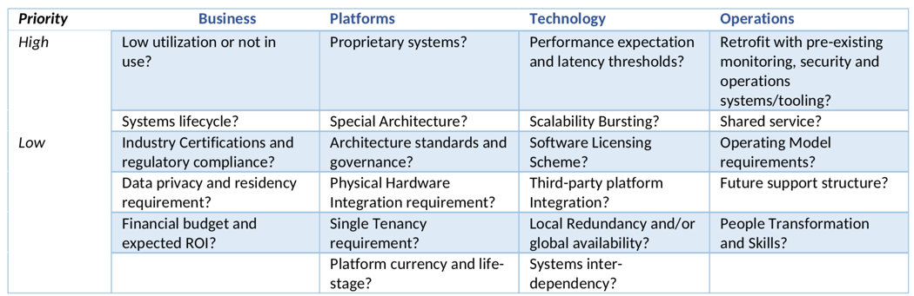
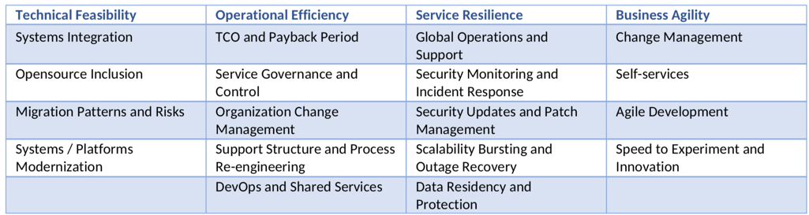

This three-part series introduces you to the art of managing the many necessary
decisions for managing your multicloud environment.

If you missed it, check out [Part One](https://docs.rackspace.com/blog/the-art-of-decision-management-for-multicloud-strategies-part-one/).

<!--more-->

### The approach for developing a multicloud decision management process

CDMP is an application-centric process that ultimately recommends which target
cloud platforms that individual applications should be landing. You can execute
this in two stages: Workload Filtering and Application Grouping, followed by
Cloud Platform Evaluation and Recommendation. Each of these stages has its unique
objectives and target outcomes.

#### CDMP Stage 1: Workload Filtering and Platform Association

To enable speedy decision making with concerted efforts, CDMP acts as a funnel
to filter those applications not suitable for cloud computing. For those deemed
suitable, they are associated with viable cloud platform options. Essentially
this step limits each application to a small number of cloud platforms for further
consideration.

{{}}

*Figure 1: High-level planning for multicloud strategies*

Using the example in Figure 1, the CDMP establishes a sufficient number of
filtering questions (mostly closed questions asking for binary 'Yes' or 'No'
response). CDMP then uses these questions to direct individual applications to
their potential destinations, including public clouds, private clouds, SaaS,
OpenShift, or simply retained in the current data center. The key mechanism is
a decision tree that fits each application to a single destination platform, if
possible, or to associate them with a few platform options. The outcome of the
latter can then inform the evaluation process taking place in Stage 2.

{{}}

*Figure 2: CDMP Stage 1 Decision Tree*

Figure 2 shows a possible decision tree framework the company can build for the
scenario illustrated in Figure 1. Each circular shape is an abstract of one or
more filtering questions that help determine each application's fit-for-purpose
cloud platform. In this illustration, the filtering process takes two levels.
The first level aims to immediately disqualify those applications that are not
suitable for cloud computing. Perhaps the applications are at their end of
lifecycle or their usability and compatibility with other systems after migration
to the cloud. The second level aims to determine the appropriate cloud platforms
for individual applications. The sequence in which the filters are processed
should reflect the company's cloud adoption strategy. In this illustration, the
company prefers SaaS over public clouds and private clouds, assuming everything
else is equal. You can expect that if the company has a different strategy or
policies related to cloud adoption, then the illustrated decision routing in
Figure 2 would be quite different.

Within each circular filtering function, the company needs to develop one or
more questions to effectively associate each application to a single platform
or several options. The appropriate and relevant questions differ from company
to company when we put their cloud adoption strategies in context. However, in
general, these filtering questions would most likely be centered amongst four
different domain areas of consideration, namely: Business, Platforms, Technology,
and Operations.

{{}}

*Figure 3 – Domain Areas for CDMP Filtering Questions*

Figure 3 illustrates examples of the filtering questions that you can set for
the four domain areas. You should focus on those questions that will help
accelerate the identification of appropriate platforms for applications to keep
the overall CDMP stage-1 decision tree relatively simple. For example, determining
proprietary technologies and frontloading that determination in the decision
tree would help you quickly identify a handful of applications not suitable for
cloud computing. For systems with stringent data privacy and security requirements,
the public cloud might be the unlikely option. Under such scenarios, the decision
tree might branch out to the current data center, or the incumbent private cloud
operator might be the only viable option.

The company should also limit the number of questions sitting on the decision
tree. Each application should traverse no more than a dozen of filtering
questions in total before reaching a recommendation. Eventually, you should
identify a small subset of available options out of public cloud, private cloud,
SaaS, or some other variations before entering CDMP Stage-2. Suppose you can
determine a single cloud platform as the most appropriate destination for any
particular application. In that case, there is no need to go further within the
CDMP for this application.

#### CDMP Stage 2: Target Cloud Platform Evaluation and Recommendation

By the time you reach Stage 2 of the CDMP, you have associated each application
with a subset of platform options identified in Stage 1. The purpose of Stage 2
is to evaluate these platform options to select the most suitable destination.
Because you are comparing different platform options, you should establish a
finite number of evaluation criteria to enable an objective and consistent
assessment.

You can perform platform evaluation quite intuitively with common guardrails or
more methodically with a due-diligence process. If the applications and their
associated infrastructure are not complicated, many companies might just
handpick one of the platform options recommended from Stage 1. Perform this
based on simple criteria such as cost of ownership, technology affiliation,
risks of migration or transformation, or systems interdependency, whichever
makes the most sense for the key stakeholders. However, when the company manages
a massive installed base, and several applications carry a substantial inventory
of compute, storage, and interacting systems, the evaluation should be undertaken
with a more structured approach to generate consistent and objective outcomes.
These systems could be quite mission-critical, have several key users and stakeholders,
and be architecturally complex. Under such circumstances, the evaluation should
be systematic and constitute the following major components:

##### Evaluation Criteria

This component focuses on what the company wants to measure when assessing
potential cloud platforms to host a particular application. The evaluation
criteria mainly encompass four different perspectives: technical feasibility,
operational efficiency, service resilience, and business agility.

Technical feasibility is concerned with the technological challenges the cloud
platform might present. These include risks and challenges attributed to migration,
systems integration, use of opensource or other cloud-native services,
modernization of pre-existing systems, and so on.

Operational efficiency focuses on time, manpower, and cost-savings that come
from the future environment. These might include considerations of the future
operating model, governance and control, support structure, people transformation,
and skill requirements. The more cost-efficiently the company can transition
into its steady-state, the better the platform option is.

Service Resilience is the key security, compliance, and availability baselines
the company would like to pursue from the future cloud computing environment.
As part of their cloud transformation objectives, most companies would like to
improve these baselines so that they are getting more protection against
unpredictable outages, satisfying industry regulations, and meeting corporate
audit requirements.

Business agility, which could be the most neglected perspective if the
transformation is led by IT, would grant credits for a target platform that
accommodates the best route to business innovation, business change, and ad-hoc
experimentation. These are typical customer-facing business unit priorities that
need to be articulated into respective infrastructure capabilities, both
functional and non-functional.

Figure 4  outlines some examples of evaluation criteria across the four
perspectives, but this is not an exhaustive list.

{{}}

*Figure 4 – Cloud Platforms Evaluation Criteria*

These perspectives and criteria are relevant consideration regardless of how the
company wants to approach assessing the target cloud platforms, be it with
intuitive judgment or through a formal due diligence process. To keep the overall
process streamlined, the company should also limit the number of criteria to
those most impactful to business and IT performance.

##### Evaluation Epics

After the company has criteria selected for evaluation from one of the four
perspectives above, we need an epic to put the evaluation criteria into context
to drive the evaluation process. The epic should state the scenario to which the
criteria applies so that the platform options can be assessed for their
suitability of hosting the particular application.

##### Credit Tiering

By reaching stage 2 of the CDMP process, you have determined all individual
platform options to be suitable for hosting the subject application. The
challenge is to assess the extent of suitability among different choices and
surface the best one. Because we are comparing different platform options, one
approach is to define a list of conditions for reflecting the extent of
suitability, or credit tiering, and assign a score to each tier. The company can
then score each platform option by applying the evaluation epic against the
credit tiers. After passing through all evaluation criteria, you could then
recommend the platform option that comes up with the highest total score at the
end.

##### Business Multiplier

You should not treat the multiple criteria used for platform evaluation equally
since they have different business impact levels. For instance, criteria related
to systems availability to the business are likely to be more important than
criteria purely on how the subject application's maintenance can be automated.
Because of this, you can introduce a business multiplier to amplify the score,
backing up the most suitable platform option to gain weight towards becoming the
final recommendation.

Figure 5  illustrates an example of how all these components work together to
provide a platform recommendation. The example assumes three target platforms
are deemed suitable for an application that requires heavy integration with
another system. Depending on where the other system resides, the evaluation
schema incorporates an evaluation epic (question for qualifying the target
platform) and an exhaustive credit tiering to assign a score to each of the
target platforms based on a list of scenario options. The business multiplier,
which models the business impact, doubles the initial scores to capture more
weight for this evaluation epic in the final recommendation.

{{}}

*Figure 5 – CDMP Stage 2 Cloud Platform Evaluation Schema*

This example also shows why CDMP is essentially a consensus-building process.
The evaluation epic has to be a common concern from the majority of stakeholders.
The credit tiering has to be exhaustive to leave no gaps for credit assignment.
The scenario options need to be relevant to what the epic is trying to assess,
and the business multiplier must be appropriate to reflect the relative
importance of these criteria, among others. All these are defined with inputs
from different stakeholder groups with checks and balances to ensure CDMP's
recommendations are consistent, objective, and representative for the company's
overall interest.

### Continue

Part three of this series is coming soon, and I'll add the link here. Stay tuned!

Use the Feedback tab to make any comments or ask questions. You can also click
**Sales Chat** to [chat now](https://www.rackspace.com/) and start the conversation.
