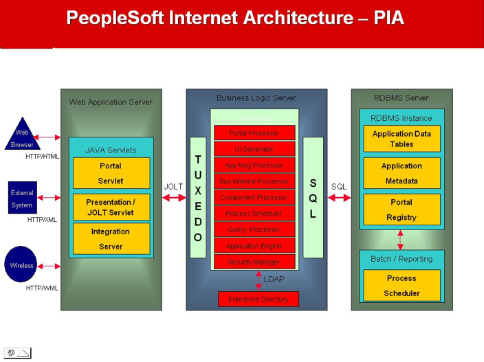

Refreshing a PeopleSoft&reg; non-production environment with your production
environment can become a monthly, weekly, or even daily activity, depending on
the business needs.

<!--more-->

For some, refreshing an environment can be such an ordeal. Not having updated
data to test issues and develop can lead to potential problems, especially when
you do not regularly refresh your non-production instances with production.

The following image shows a typical PeopleSoft Environment:

{{}}

*Image Source*: [https://onlineappsdba.com/index.php/2009/03/04/oracle-peoplesoft-a-new-start-onlineappsdbacom/](https://onlineappsdba.com/index.php/2009/03/04/oracle-peoplesoft-a-new-start-onlineappsdbacom/)

A single PeopleSoft environment typically consists of thousands of relational
database tables, indexes, and views, with the delivered DEMO and SYS environments
created with the Data Mover tool. You usually create all other environments
(Development, Test, Quality Assurance, Production, and so on) by cloning or
copying an existing environment to a target.

RMAN Backup/Restore is one of the several methods available to clone or copy
PeopleSoft databases. Using the RMAN method, you restore a full backup of the
source database over the target database. After the restore, you need to edit
some PeopleSoft tables to reflect the new database name, new server location,
and so on.

### The Rackspace procedure

Rackspace has expertise in performing clones of the PeopleSoft environment and
applies the following method, which involves using customized scripts to refresh
any environment.

In the following example, we want to refresh the TEST (target) database from the
PROD (source) database.

1.	Make sure there is enough space in the source backup directory. Back up the
   source database, and check the log file for any errors after the backup
   completes.

2.	Move the backup files of source database backup to target machine.

3. Take pre-refresh export backups of the target database before dropping it and
   restoring the source database backup. Perform these exports to ensure that
   you don't lose any critical TEST data during the refresh activity.

4.	Take a backup of the dblinks, security, roles, PIA users, and projects, if
   any, from the target database, which you want to restore.

5.	Conduct any other customer-specific pre-refresh tasks that are necessary.

6.	You can also take an export of some tables, including the integration broker
   settings, report nodes, REN server, and SSL, if implemented. Following are
   some of the listed tables:

      - **Gateway and Node tables**: PSGATEWAY, PSCONN, PSCONNPROP, PSMSGNODEDEFN, and so on
      - **Web Profiles**: PSWEBPROFBROW, PSWEBPROFCOOK, PSWEBPROFILE, and so on
      - **SSL Certificates**: PSCERTDB
      - **Report Nodes**: PS\_CDM\_DIST\_NODE, PSSERVERSTAT, and so on
      - **REN SERVER**: PSREN, PSRENCLUSTER, and so on

7. Perform the restore. Rackspace has developed scripts and procedures that drop
   the target database (TEST) and replace it with the source database (PROD).
   After the target is up and running again, you can continue with the post
   refresh steps.

8.	Import the dblinks, database users, security, roles, PIA users, projects to
   the target database.

9.	You need to edit some of the PeopleSoft tables on the target database to
   reflect the new (TEST) database name, new server location, and so on. You can
   also run the import of the tables that you exported in step 6 or manually do
   the changes online related to nodes, report nodes, integration broker, and
   the REN server.

       a. Complete the PeopleSoft environment settings.
       b. Update the REN server settings.
       c. Validate or update the integration broker settings.
       d. Validate or update the Elastic Search&reg; or SES settings.

10. Perform any necessary customer-specific post-refresh tasks.

11. Do a sanity check and release the environment to the client.

### Conclusion

As you can see, with our Rackspace expertise and experience, you can easily
refresh your PeopleSoft environment. Many of the steps involved require no manual
intervention, and you automated them fully. This helps to minimize downtime of
a non-production environment. Rackspace also provides the flexibility so you can
adhere to your existing business practices and customize the refresh process to
exceed your expectations.

<a class="cta teal" id="cta" href="https://www.rackspace.com/sap">Learn more about our SAP services.</a>

Use the Feedback tab to make any comments or ask questions. You can also click
**Sales Chat** to [chat now](https://www.rackspace.com/) and start the conversation.
