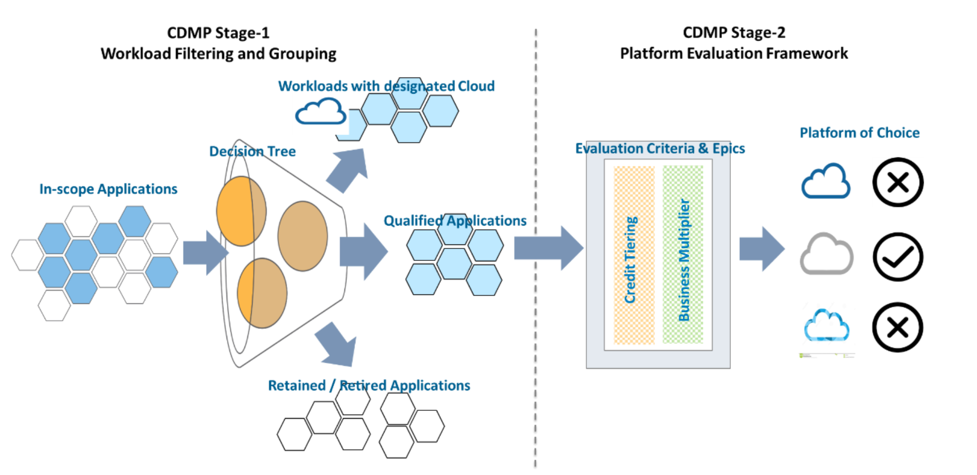

layout: post
title: "The art of decision management for multicloud strategies&mdash;Part Three"
date: 2020-09-03
comments: true
author: Wilfred Wah
authorAvatar: 'https://ca.slack-edge.com/T07TWTBTP-UR3DD1J83-93420d85dfea-512'
bio: "Wilfred is a Principal Consultant of Advisory Services, Rackspace
Technology North Asia. His area of expertise includes cloud migration assessment,
cloud economics, people transformation, cloud adoption strategy, and the
transformation roadmap. He has more than 15 years of consultancy experience with
major vendors such as Dell/EMC, SAS, and AWS before joining Rackspace."
published: true
authorIsRacker: true
categories:
    - General
metaTitle: "TThe art of decision management for multicloud strategies&mdash;Part Three"
metaDescription: "This three-part series introduces you to the art of managing
the many necessary decisions for managing your multicloud environment."
ogTitle: "The art of decision management for multicloud strategies&mdash;Part Three"
ogDescription: "This three-part series introduces you to the art of managing the
many necessary decisions for managing your multicloud environment."
slug: "the-art-of-decision-management-for-multicloud-strategies-part-three"

---

This three-part series introduces you to the art of managing the many necessary
decisions for managing your multicloud environment.

If you missed them, check out
[Part One](https://docs.rackspace.com/blog/the-art-of-decision-management-for-multicloud-strategies-part-one/)
and [Part Two](https://docs.rackspace.com/blog/the-art-of-decision-management-for-multicloud-strategies-part-two/).

<!--more-->

### Other key dependencies and best practices

Cloud Decision Management Process (CDMP) helps reduce the risks of making
inappropriate decisions. A customized decision tree and a platform evaluation
framework help match each application with an appropriate cloud platform and
filter those workloads that you should not transfer to Cloud.

It should be clear that the effort to construct an effective CDMP is not trivial.
The process could be complicated by rounds of facilitated discussion among major
organization stakeholders. As you can determine target cloud platforms for the
majority of applications either quite intuitively or within Stage 1, only large
organizations implementing a multicloud strategy for hosting several complicated
application stacks should require the due diligence process at Stage 2. Failure
to make the right decisions could entail costly consequences. See
[Part Two](https://docs.rackspace.com/blog/the-art-of-decision-management-for-multicloud-strategies-part-two/)
for a refresher on Stages 1 and 2.

{{}}

*Figure 1: CDMP Framework Overall Process Flow*

CDMP depends on a few fundamental information sources to function well. Two of
the most outstanding ones are the company's corporate guardrails for multicloud
strategy and its application portfolio discovery.

### Corporate Guardrails

These guardrails are policies or a wish-list for the company to realize its
multicloud strategy. These typically govern the future direction and approach
to different application stacks for their cloud journey as the company tries to
develop and execute a migration plan over a multi-month timeline. For example,
the company might have the following guardrails defined for their cloud journey:

- We should retire all back-office systems running on legacy or proprietary OS
  and technologies in three years. We should seek a replacement with SaaS
  products in the marketplace before considering a new build or a Cloud purchase.

- We should containerize all digital transformation workloads to accelerate the
  adoption of DevOps through Agile in a consistent manner.

The preceding guardrails affect how you define questions on the decision tree
at Stage 1 and the order in which you execute them. The decision tree should
route those retiring back-office systems to SaaS platform options before
everything else. Meanwhile, the evaluation epics at Stage 2 could compare
functions or ease of use across different SaaS products. By the same token, the
second guardrail could make OpenShift a more favorable choice over other platforms
for digital stacks. Any evaluation epics concerning digital systems can incorporate
credit tiering reflecting the preference for OpenShift.

### Application Portfolio Discovery

While corporate guardrails provide the company with the direction its multicloud
efforts should spearhead, the application portfolio analysis reveals the constraints
and dependencies that the company must consider in formulating their strategy.
Before developing a CDMP framework, an assessment of the current application
portfolio helps capture important information concerning your target cloud
platform selection. These might include the following considerations for each
in-scope application:

- Most notably, inter-dependency with other applications
- Current and projected TCO
- Opportunity for system modernization
- Room for architecture improvement
- Reasonable migration patterns
- Systems integration requirements to achieve pre-existing and new functional objectives

Compiling questions for the decision tree at Stage 1 need to incorporate some
or all of the preceding considerations to help direct different applications to
the appropriate cloud platform choices. Failing to do so might result in
unrealistic or undesirable outcomes at the exit of Stage 1. Likewise, at Stage 2,
the evaluation epics and credit tiering should also cover these constraints and
dependencies to ensure their importance is reflected in the final recommendation.

It is important to note that the corporate guardrails and the application
portfolio assessment outcomes might direct the company to move towards different
directions. For example, a retiring CRM system should adopt a target SaaS product
within 24 months based on the guardrails, while the TCO analysis for its application
stack reveals a three-fold expenditure increase over the next few years. Another
example is that a mobile application running on SQL databases is subject to be
containerized in Azure. In contrast, the portfolio discovery indicates it should
adopt open-source databases to integrate with modern analytics technologies and
save costs in the long run. These are situations and decision points where a CDMP
would be helpful for a reference resolution.

### Conclusion

Decision management should keep abreast of the change in business strategy,
business and IT requirements, and stakeholders' priorities over time. Therefore,
the lifespan of a static CDMP framework is quite short, and it must be kept up
to date to stay relevant. If you break the cloud journey into key phases with
multiple weeks or months between successive phases, then you should review and
refresh the CDMP process to serve each phase's specific purpose. With the
continuous process improvement mindset, the CDMP is a valuable asset to companies
with complicated application stacks and sizeable infrastructure to reckon with
for a strategic multicloud journey.

Use the Feedback tab to make any comments or ask questions. You can also click
**Sales Chat** to [chat now](https://www.rackspace.com/) and start the conversation.
