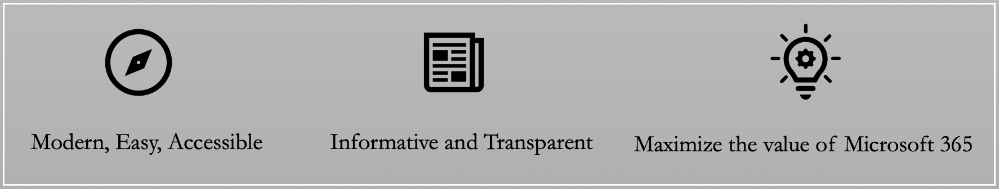
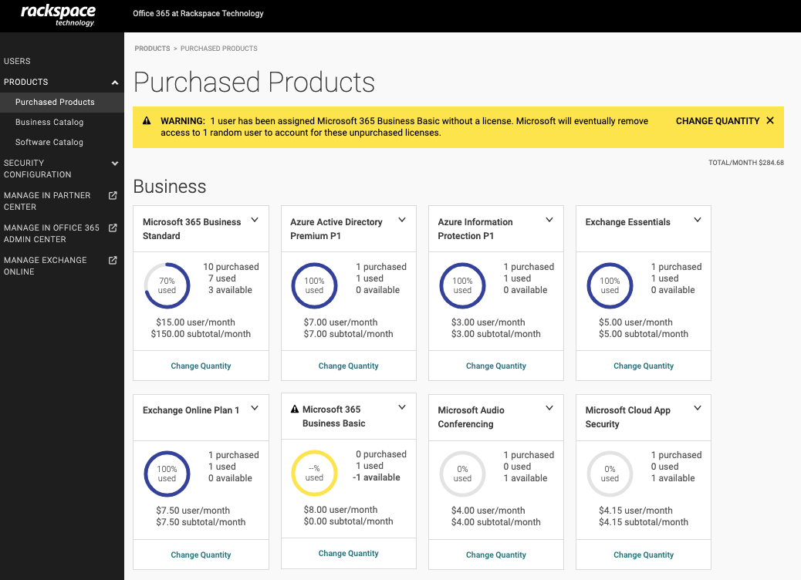
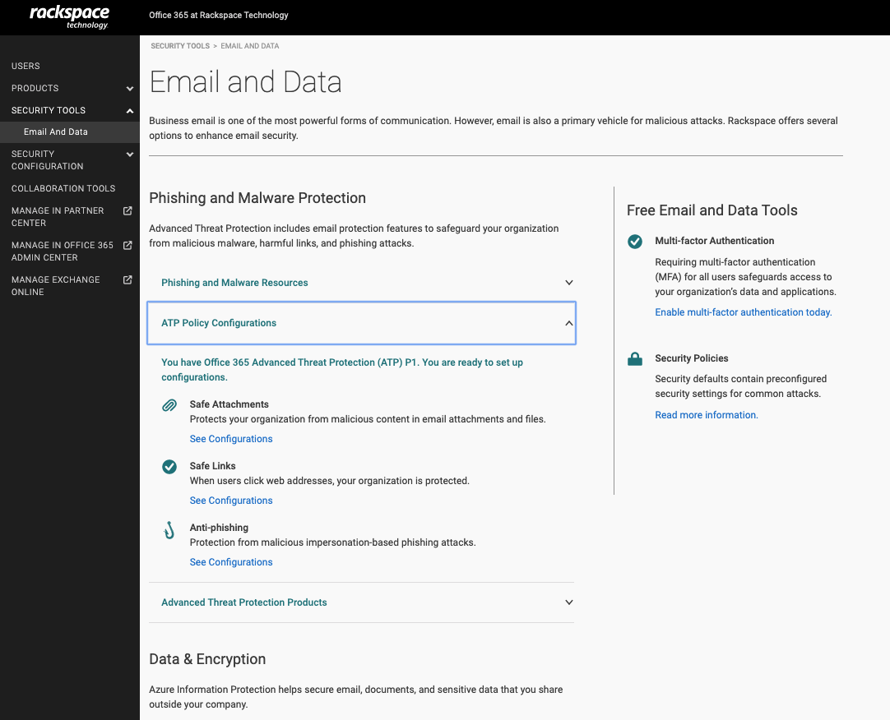
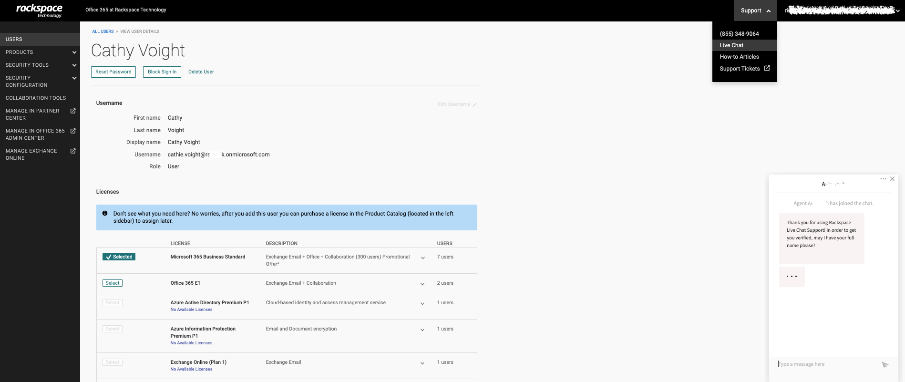

Rackspace Technology is the home of Fanatical Experience&trade;. We wrap
everything we do in our obsession with our customers’ success. However, trying
to accomplish success only through raw Racker-power is not scalable. This
limitation is the primary reason we spent months researching what our customers
need so that we can provide them the same Fanatical Experience through technology.

<!--more-->

The result? A Microsoft 365&reg; Rackspace Customer Experience portal that
embodies the Rackspace Fabric&trade; principles and offers a proprietary software
platform that unlocks a Next-Gen Experience.

We want working in our portal to be like working with a real human being. Through
our customer research, we identified three guiding principles to help us achieve
this vision, as shown in the following image:

{{}}

**Guiding Principles for the Microsoft 365 Rackspace portal**

### Modern, easy, accessible

When we built the Microsoft 365 Rackspace portal by using the latest technologies,
we did the following:

- Optimized it for speed
- Used asynchronous design patterns so an administrator can perform multiple actions in parallel
- Used Microsoft Authentication to support single sign-on with other Microsoft portals

The portal is a one-stop shop to purchase all Microsoft 365 and Dynamics 365&reg;
licenses. You can also create users, assign licenses, reset passwords, and manage
access. A premium yet straightforward design experience makes onboarding and
offboarding users a breeze.

{{}}

### Informative and transparent

We take our customers seriously, and we value our relationship with them. We
have industry-high NPS scores for our support team who provide 24x7 support to
our 10,000+ customers. How do we mimic that level of trust and service through
software? In our portal, we display information upfront. The portal displays all
products, including add-ons, in one list with detailed descriptions and actual
pricing. Our search engine uses weighted search algorithms to help you find the
right product match quickly.

{{}}

One of our favorite portal features is the intuitive dashboard that displays how
many licenses are assigned and how many are available for use. We provide
proactive warnings to inform you of possible issues during product transactions
like license deletions and quantity deficits. This information gives you a quick
view of current license consumption to help drive future purchase decisions and
save you money by removing underutilized licenses.

{{}}

### Maximize the value of Microsoft 365

Everybody thinks *email* when they hear Microsoft 365, but there is so much more
to Microsoft 365 than just email. To help bridge that knowledge gap and maximize
the value, we built pages that focus on other Microsoft 365 solutions available
to you. You can learn how to configure policies that protect your organization
from phishing and malware and discover other products that enable features like
encryption and archiving. The portal also highlights collaboration products to
facilitate secure work from home capabilities such as a free six-month trial of
[Microsoft Teams](https://support.rackspace.com/how-to/getting-started-with-microsoft-teams/)
or a more comprehensive solution like
[Windows Virtual Desktop](https://www.rackspace.com/sites/default/files/white-papers/Rackspace-Data-Sheet-Crisis-Solutions-Work-Anywhere-Microsoft-MST-TSK-1223_US_rnd03.pdf).

{{}}

Through this portal, we offer a software platform to help you achieve success.
We have various articles to guide you and your end-users onboard into the modern
workplace and continue to add features to demonstrate the benefit of moving to
the Cloud with Rackspace Technology.

{{}}

However, technology can never fully replace the energy and expertise of our
Fanatical Experience Support team. You will always get 24x7x365 access to our
award-winning support with unlimited support requests and no per-incident charges.
Within this portal, real-person chat support is just a click away.

{{}}

### Conclusion

If you have been on the fence about moving to the Modern Workplace or struggling
to create a seamless communication and collaboration solution across your
organization, let us help solve your challenges and empower you to succeed. If
you are a current Microsoft 365 customer, you can log in to the
[Microsoft 365 Rackspace Portal](https://office365.cp.rackspace.com/) today!

<a class="cta red" id="cta" href="https://www.rackspace.com/microsoft/office-365/pick-your-plan">Learn more about Microsoft Office 365 and pick your plan.</a>

Use the Feedback tab to make any comments or ask questions. You can also click
**Sales Chat** to [chat now](https://www.rackspace.com/) and start the conversation.
