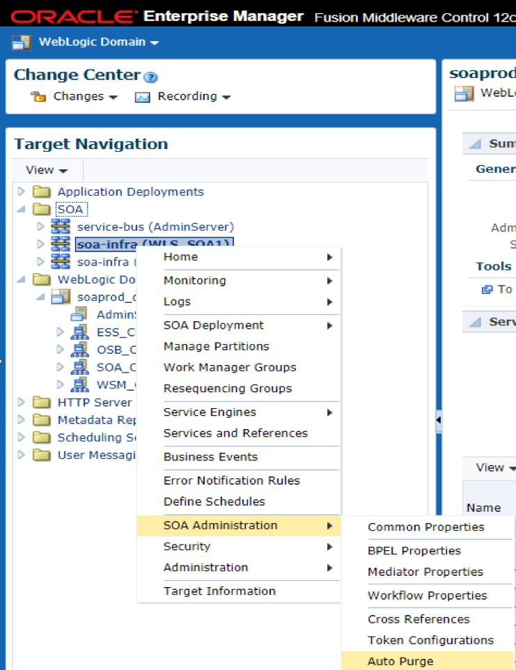
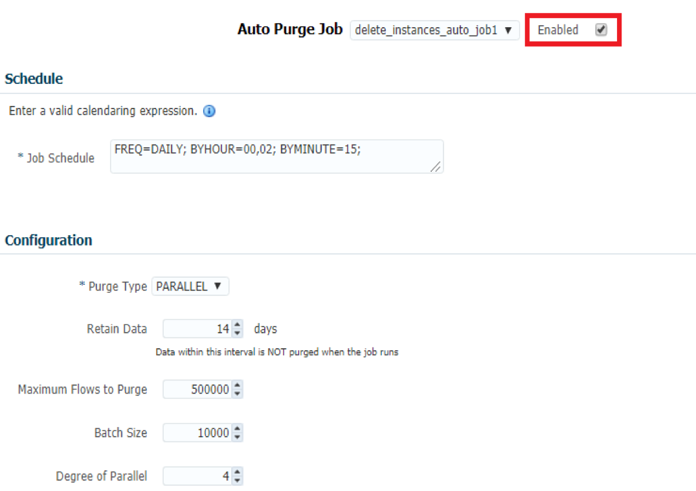
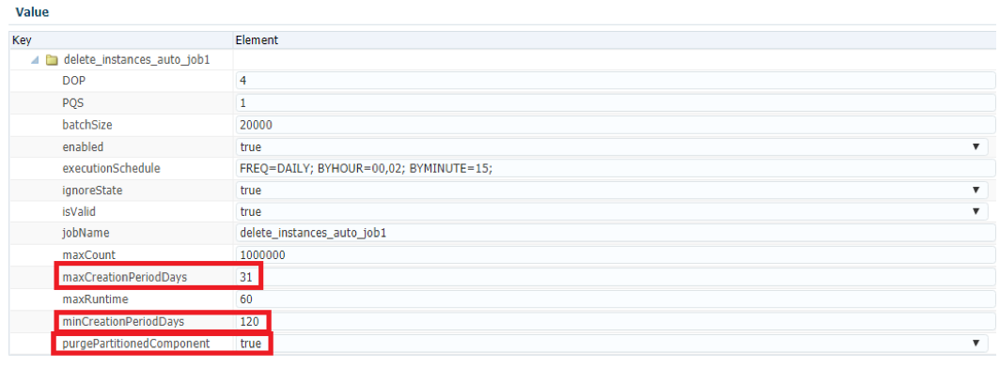
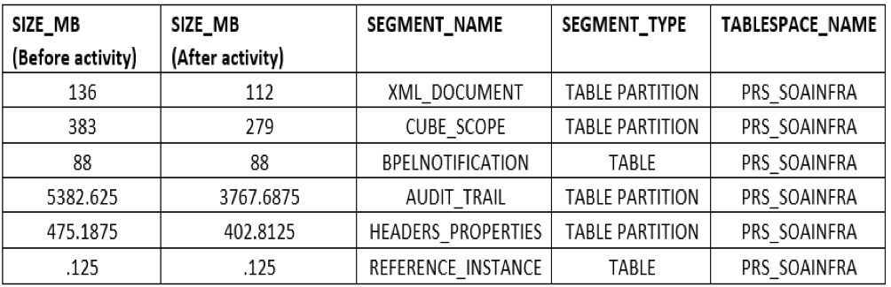

The term *purge* means to remove or erase something completely. Data purging is a
process or activity mostly related with database technologies and tasks, such as
cleaning up databases.

<!--more-->

### Introduction

Any organization expects or prefers to preserve all its historical data
accumulated over a period for data mining and analysis. There is always a finite
amount of storage available to warehouse those bits and bytes. When you don't
purge this data regularly, the tables in a database can grow so enormous that
performance deteriorates. Purging is the most important aspect of database
performance tuning because it frees up space in the database or deletes
obsolete data that the system no longer needs. You can base the purge process
on either the data age or type.

### Background

Oracle&reg; included purging for the first time in version 11g, released in
November 2009. Scripts included filters for the composite name and state. Purging
considerations include performance issues along with the orphaned references.

### Why purge?

Consider the following reasons to purge data:

- Because databases expand at an uncontrollable rate, storage and retrieval
  processes can create issues.
- Ever-expanding databases badly affect system performance and, thereby, business
  efficiency.
- Though data storage is relatively cheap, upgrading hardware is a very
  cost-intensive activity.
- You need to ensure agility in case of disaster recovery.

### Key benefits

Purging data has the following benefits:

#### Improves performance

Purging data serves you in the following areas.

- Advantage processes run faster because there are fewer records to process
- Decreased backups and restore periods
- Reduced disk space requirements
- Speedier advantage lookups

#### Simplifies data management

Less data is easier to manage! Data duplication consumes an average of 25% of
software system data allowances. With an archiving solution, you can identify
and remove redundant data and purge files you no longer need. You can also remove
older files from the file servers and replace them with stubs that hold predefined
data for testing purposes.

#### Reduces Backups Windows

With data accumulating in your database, backup times can stretch even beyond 24
hours. By archiving or purging unnecessary data, you can reduce backup times and
avoid backing up historical data.

#### Increase data report visibility

Reporting your data accurately enables you to pinpoint and identify improper
usage, wastage, and abuse of your organization's storage. You can perform in-depth
analysis when you can view files by various attributes such as server, owner,
size, type, name, oldest, newest, largest, or most frequently changed.

#### Protects from accidental deletion

You can create simple rules and policies to protect your data.  For example,
"After file deletion, do not remove the copy from the archive for 120 days".

### Auto-purge configuration

To perform instance purging, Oracle Service-oriented architecture (SOA) 12c
automated jobs at the Enterprise Manager (EM) Console level.

Perform the following steps to configure automatic purging:

#### Step 1: Choose Auto Purge

In the console, navigate to **Target Navigation –>SOA–> soa-infra–>SOA Administration ->Auto Purge**.

{{}}

#### Step 2: Change the settings

The following image shows the settings page:

{{}}

Available settings include the following options:

##### Predefined jobs

There are two predefined database purge jobs displayed, **delete\_instances\_auto\_job1**
and **delete\_instances\_auto\_job2**.

Select **Job1** to run `delete_instances_auto_job1` on a schedule appropriate
for weekdays (Monday through Friday at midnight). This job is enabled by default.

Select **Job2** to run `delete_instances_auto_job2` on a weekend schedule
(Saturday and Sunday) that might be more aggressive. This job is not automatically
enabled.

##### Purge type

Purge options include the following settings:

- **Single**: A single, loop purged script that performs a batched purge.

- **Parallel**: This option works similarly to the single option, but it enables
  the **dbms_scheduler** package to spawn multiple purge jobs to work on the subset
  data.

If you have many CPU hosts, the parallel script can save time. Oracle has the
following recommendations for parallel processing:

- Use parallel processing only during off-hours.

- When purging data during off-hours, drop indexes before purging large amounts
  of data and then add the indexes back in. This speeds up the purge process and
  keeps indexes from becoming unbalanced.

##### Batch size

This setting determines the maximum number of business flows to delete at a time.
The default value is 20000.

##### Schedule

You can click the calendaring expression icon to see examples of job scheduling
syntax. Copy and paste the syntax for your environment into the **Job Schedule**
field and modify it. Explore  **More Info** to learn more about available options.

Use the required **Job Schedule** field to specify the instance purge schedule.
By default, purges occur daily at midnight. The scheduling syntax is not case
sensitive.

##### Degree of Parallel

This metric indicates the number of operations that the server can or is
simultaneously executing. It describes the performance of parallel programs and
multi-processor systems. The default value is four CPUs.

##### Retain Data

The operation does not purge data that falls within this interval when the job
runs. The default value is seven days.

#### Set creation period days

The following image shows settings for auto job 1:

{{}}

Use the following steps to set the **maxCreationPeriodDays** and
**minCreationPeriodDays** values:

###### Step 1: Navigate to the job

1. Log in to the EM console and choose **Target Navigation–>SOA–>soa-infra–>SOA Administration–>Auto Purge**.

2. Choose **More Auto Purge Configuration Properties–>PurgeJobDetails–>DELETE\_INSTANCES\_AUTO\_JOB1**.

###### Step 2: Choose the settings

Set the following values:

- **maxCreationPeriodDays**: 31, which deletes data older than 30 days
- **minCreationPeriodDays**: 120, which deletes 120 days of data and keeps the
  most recent 30 days of data

The **maxCreationPeriodDays** field shows the maximum creation period in days.
The **minCreationPeriodDays** shows the minimum creation period in days. Uses
these two properties to select the flows created between a certain period.

Following is a brief description of the other available settings:

- **ignoreState**: Defaults to false, but when true, this setting purges all
  open and closed instances within the specified date range. Purging open
  instances might leave your system in an inconsistent state, so use this option
  cautiously.

- **maxCount**: Shows the maximum number of flows to purge.

- **PQS**: Displays the number of parallel query replica servers. You can add
  additional replicas to improve expensive SQL commands performance.

- **purgePartitionedComponent**: Defaults to false and indicates if the operation
  should purge partitioned tables. When true, the system invokes the same purge
  job to delete partitioned data. You might not want to purge partitioned tables
  because a DROP statement maintains them. However, if you are using a
  **Large Database** type, which set when creating schemas by using RCU, you need
  to set partition purging to "true."

- **purgeType**: Sets either the single or parallel type.

### Purging

During a purge, perform the following steps:

#### Step 1: Shut down the application services.

You need approximately 15 – 20 minutes of downtime, depending on how many
managed servers you configured in a domain.

**Tables for purge**:

- AUDIT\_TRAIL
- XML\_DOCUMENT
- CUBE\_SCOPE
- BPELNOTIFICATION
- REFERENCE\_INSTANCE
- HEADERS\_PROPERTIES

#### Step 2: Gather the space consumption by objects

Determine space usage for all objects.

#### Step 3: Rebuild the tables, indexes, and table partitions

After you rebuild the tables listed in Step 1, gather the stats and validate
the logs.

Run the following scripts in the database server **/home/oracle/TAB\_REORG/**
and **/home/oracle/TAB\_REORG/** directories:

1. `SpacebeforeActivity.sql`
2. `MoveTab.sql`
3. `GatherStat.sql`
4. `space_after_Activity.sql`

#### Step 4: Gather the space consumption after the activity

Notice the reduced space usage. The process freed approximately 1.8 GB.

{{}}

#### Step 5: Start the application services.

Restart all the application services.

### Conclusion

Capacity planning and testing with consideration for future growth is paramount
to a well-designed SOA database growth management strategy. So, don't limit your
decisions to only current requirements. If production needs to expand, your design
might be insufficient and require downtime to resolve.

Carefully balance the need for database maintenance and Online Transactional
Processing (OLTP) performance because they are equally important.

<a class="cta blue" id="cta" href="https://www.rackspace.com/dba-services">Learn more about Databases.</a>

Use the Feedback tab to make any comments or ask questions. You can also click
**Sales Chat** to [chat now](https://www.rackspace.com/) and start the conversation.
