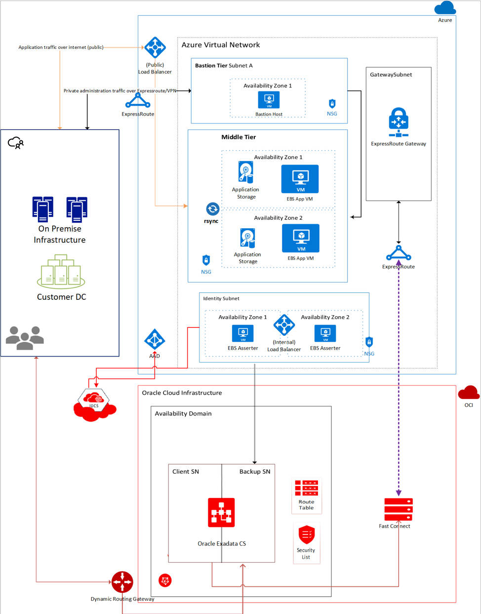
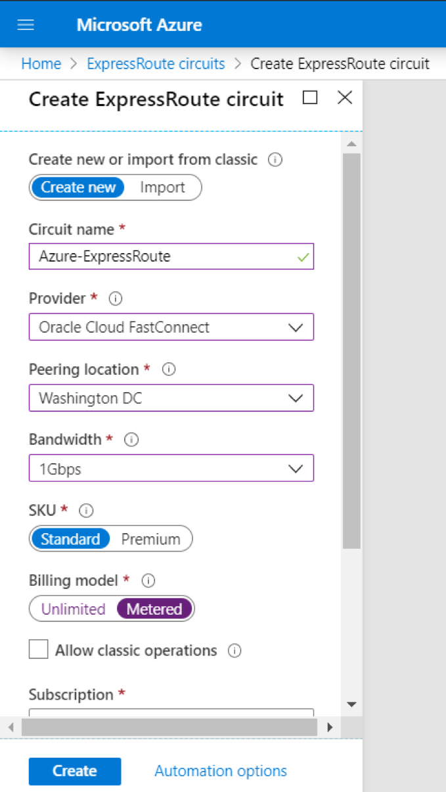
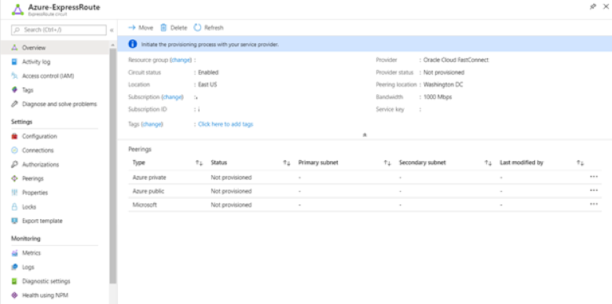
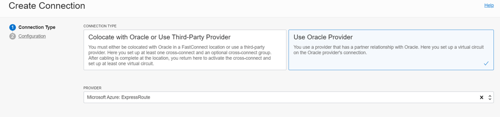
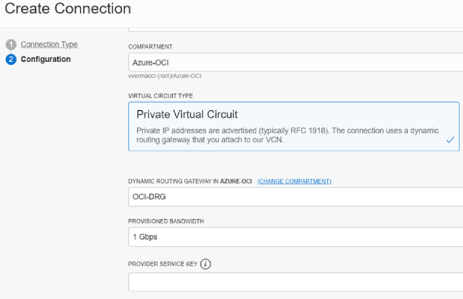
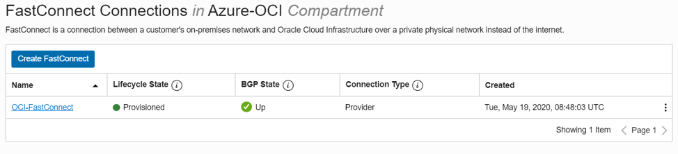
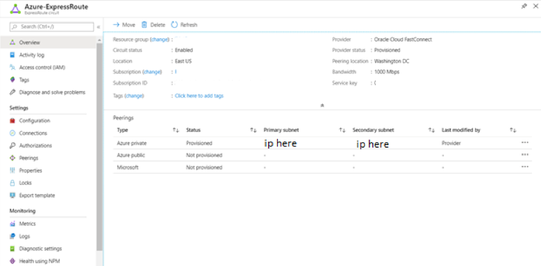
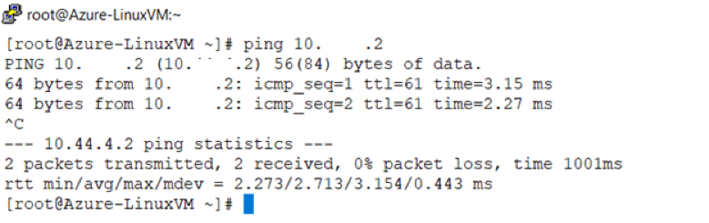

Microsoft&reg; and Oracle&reg; have worked together to enable customers to
deploy Oracle applications such as Oracle E-Business Suite&reg;, JD Edwards&reg;
EnterpriseOne, and PeopleSoft&reg; in the cloud.

<!--more-->

### Introduction

You can use the direct interconnect between Azure&trade; ExpressRoute&reg; and
Oracle FastConnect to establish high-bandwidth, private, and low-latency
connections between the application and the database layer. This connection
enables you to run Oracle Applications in Azure infrastructure, connected to
backend databases in Oracle Cloud Infrastructure (OCI).

You can also integrate Oracle applications with Azure Active Directory to set
up single-sign-on to log in to Oracle application by using your Azure Active
Directory (AD) credentials. With this integration, you can take advantage of the
best of both clouds. Microsoft and Oracle have tested Oracle Applications on a
multi-cloud architecture and confirmed that the performance meets standards set
by Oracle for Oracle Apps.

### OCI FastConnect

OCI FastConnect is a network connectivity alternative for using the public
Internet to connect your network to OCI and other Oracle Cloud services.
FastConnect provides an easy, elastic, and economical way to create a dedicated
and private connection with higher bandwidth options and a more reliable and
consistent networking experience when compared to the internet-based connections.

### Microsoft Azure ExpressRoute

According to [Beringer Technology Group](https://www.beringer.net/beringerblog/microsoft-azure-express-route-options-benefits/):
ExpressRoute lets you extend your on-premises networks into the Microsoft cloud
over a private connection facilitated by a connectivity provider. With ExpressRoute,
you can establish connections to Microsoft cloud services, such as Azure and Office
365. Connectivity can be from any-to-any (IPVPN) network, a point-to-point
Ethernet network, or a virtual cross-connection through a connectivity provider
at a co-location facility. ExpressRoute connections do not go over the public
Internet.

### Microsoft Azure to Oracle Cloud connection

You can connect a Microsoft Azure virtual network (VNet) with an Oracle Cloud
Infrastructure virtual cloud network (VCN) and run Oracle E-Business Suite with
an Application Tier on the Microsoft Azure and a Database Tier on the Oracle
Cloud Infrastructure. This blog post sets up a direct back-to-back connection
between the two cloud platforms in the US East Region. You can use this one-time
setup to connect multiple compute resources between the two cloud platforms. The
connection between the two clouds is a private connection with no exposure to the
Internet. Also, you don't need an intermediate service provider to enable the
connection. After you set up the connection, you can install and configure Oracle
E-Business Suite on the computer instances used during the setup. The following
image depicts the Oracle E-Business Suite cross-cloud architecture:

{{}}

*Image source: [https://docs.microsoft.com/en/azure](https://docs.microsoft.com/en/azure)*

### Connection setup

Use the following steps to connect Microsoft Azure and OCI by using Azure
ExpressConnect and OCI FastConnect.

1. Log in to the [Azure Portal](https://portal.azure.com) and create a virtual
   network with a subnet.

2. Create a virtual network gateway. When enabled, FastPath sends network traffic
   directly to virtual machines in the virtual network, bypassing the gateway.

   a. For **Gateway Type**, select **ExpressRoute**.

   b. For **SKU**, select **Ultra Performance** or **ErGw3AZ** to enable FastPath.

3. Create an ExpressRoute circuit.

   a. For **Provider**, select **Oracle Cloud FastConnect**.

   b.  For **Peering Location**, select **Washington DC**.

   c. Select **1Gbps** for **Bandwidth** to match the configuration on the FastConnect.

   {{}}

4. Create a Virtual Machine.

5. Verify the ExpressRoute deployment.

  {{}}

6. Log in to Oracle Cloud. Create a Virtual Cloud Network. When creating the VCN,
   ensure that the IP address space in the OCI virtual cloud network does not
   overlap with the Azure virtual network's private IP address space. Create a
   regional Subnet and select defaults for **Route Table** and **Security List**.

7. Create a FastConnect connection and select **Microsoft Azure: ExpressRoute**
   as the **PROVIDER** and copy the Service Key from Azure ExpressRoute for the
   **PROVIDER SERVICE KEY**.

  {{}}

  {{}}

8. Create a compute instance.

9. Create a network security group to allow SSH or ping from Azure VNet to the
   OCI compute instance. Then, assign the network security group to the compute
   instance that you created previously.

   a. Verify that the FastConnect connection state is **Provisioned**.

   {{}}

   b. Verify that the Azure ExpressRoute provider status is **Provisioned** and
   the peerings display.

   {{}}

   c. Test the connection by using SSH from the OCI server to the Azure server.

   {{}}

   d. Verify the connection from the other side by pinging the OCI server from
   the Azure server.

   {{}}

### Conclusion

The post gives an overview of the connection setup from Microsoft Azure to OCI.
After you establish the connection, you can use the compute instance provisioned
on both clouds to install Oracle E-Business Suite or other Oracle related products,
with application services running on the Azure Cloud and database services running
on Oracle Cloud.

### Conclusion

<a class="cta purple" id="cta" href="https://www.rackspace.com/sap">Learn more about our SAP services.</a>

Use the Feedback tab to make any comments or ask questions. You can also click
**Sales Chat** to [chat now](https://www.rackspace.com/) and start the conversation.
