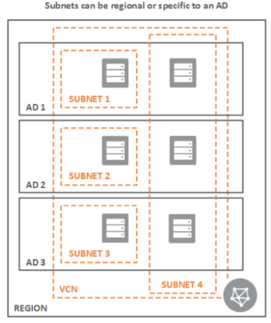
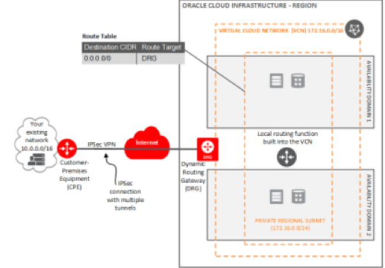
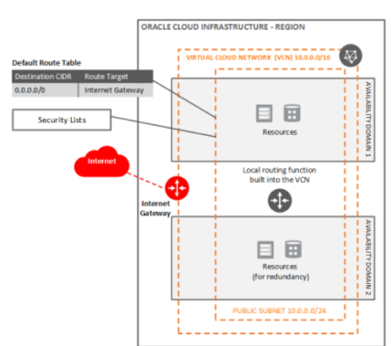
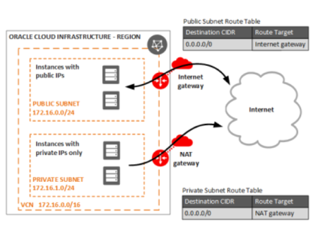
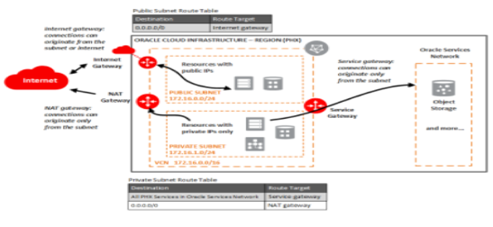

This post gives an overview of the components that are part of the Oracle&reg;
Cloud Infrastructure (OCI) network.

<!--more-->

### Introduction

An OCI network comprises the following components:

- Virtual Cloud Network
- Subnet
- Virtual network interface card
- Security Lists
- Route tables
- Route rules

### Virtual Cloud Network

You need to create a Virtual Cloud Network (VCN) before you launch an instance
to work in an OCI network. The VCN is like the traditional data center network
and includes subnets, route tables, and gateways.

The VCN resides within a single region but can cross multiple availability
domains (AD) that cover a single, contiguous IPv4 Classless Inter-Domain Routing
(CIDR) block. When you delete a VCN, you should remove the attached gateways and
make sure the subnets are empty.

VCNs automatically come with the following default components that you cannot
delete:

- Route table, with no rules
- Security list, with default rules
- Dynamic Host Configuration Protocol (DHCP) options, with default values.

Each subnet you create has the following components associated with it:

- One route table
- One or more security lists
- One set of DHCP options

If you do not specify the preceding components, the subnet automatically uses
the default VCN components.

### Subnet

A subnet is a subdivision of the VCN and can be either a specific or regional
AD. Oracle recommends using regional subnets because they are more flexible.

You can have multiple subnets in an AD that use the same route table, security
lists, and DHCP options. Subnets contain virtual network interface cards,
which are attached to the instances. Each subnet has a contiguous range of IPs,
and the IP ranges cannot overlap.

You can designate subnets as either of the following choices:

- **Private**: Instances contain private IP addresses assigned to the VNICs.
- **Public**: Instances have both private and public IP addresses assigned to the VNICs.

In the following diagram, the ADs each have one or more datacenters located
within a region (local geographical area). The region is composed of three
availability domains.

{{}}

*Source: [https://docs.cloud.oracle.com/en-us/iaas/Content/Network/Tasks/managingVCNs.htm](https://docs.cloud.oracle.com/en-us/iaas/Content/Network/Tasks/managingVCNs.htm)*

### Virtual network interface card

A virtual network interface card (VNIC) enables an instance to connect to a VCN
and determines how the instance connects with endpoints inside and outside of a
VCN.

The primary VNIC is attached to each instance during launch, and you cannot
remove it. You can attach secondary VNICs and remove them from an existing
instance that is in the same availability domain as the primary VNIC.

### Security lists

Security lists  are virtual firewall rules for the VCN and provide information
about the following types of traffic:

- **Ingress**: Incoming traffic
- **Egress**: Outgoing traffic

There are two types of rules:

- **stateful**: Uses connection tracking for any traffic that matches that rule
- **stateless**: Does not use connection tracking for any traffic that matches that rule

The security rules are enforced at an instance level, even though they are
associated at the subnet level.

### Route tables

Use route tables to send traffic out of the VCN, which consists of route rules
with the following elements:

- Destination CIDR Routing
- Targets for the traffic that matches that CIDR

### Route rules

You don't need route rules to enable traffic within the VCN itself.

Permissible target types for route rules include the following ones:

#### Dynamic routing gateway

A dynamic routing gateway routes private network traffic between your VCN and
on-premises network by using either an IPSec VPN, FastConnect, or a peered VCN
in another region.

{{}}

*Image Source: [https://docs.cloud.oracle.com/en-us/iaas/Content/Network/Tasks/overviewIPsec.htm](https://docs.cloud.oracle.com/en-us/iaas/Content/Network/Tasks/overviewIPsec.htm)*

#### Internet gateway

Use an Internet gateway for public subnets that access the Internet directly.
The public subnet must have a route table and use a security list to control
the traffic in and out of the resources. Internet gateways support connections
initiated within VCN and from the Internet, such as from web servers.

{{}}

*Image source: [https://docs.cloud.oracle.com/en-us/iaas/Content/Network/Tasks/managingIGs.htm](https://docs.cloud.oracle.com/en-us/iaas/Content/Network/Tasks/managingIGs.htm)*

#### Network Address Translation gateway

Use a Network Address Translation (NAT) gateway for resources that have the
following qualities:

- Do not have public IP addresses
- Need outbound access to the Internet
- Cannot receive inbound connections initiated from the Internet

The public IP is automatically assigned to the NAT gateway, and you cannot
choose or use the reserved public IP addresses. A database system that needs to
download patches from the Internet might use a NAT gateway.

{{}}

*Image source: [https://docs.cloud.oracle.com/en-us/iaas/Content/Network/Tasks/NATgateway.htm](https://docs.cloud.oracle.com/en-us/iaas/Content/Network/Tasks/NATgateway.htm)*

#### Service gateway

Use a service gateway for subnets that need private access to Oracle services,
such as an autonomous database.

{{}}

*Image source: [https://docs.cloud.oracle.com/en-us/iaas/Content/Network/Tasks/servicegateway.htm](https://docs.cloud.oracle.com/en-us/iaas/Content/Network/Tasks/servicegateway.htm)*

#### Local Peering gateway

The subnets that need private access to a peered VCN in the same region communicate
by using private IP addresses. The two VCN's in the peering network cannot have
overlapping CIDRs.

{{}}

*Image source: [https://docs.cloud.oracle.com/en-us/iaas/Content/Network/Tasks/localVCNpeering.htm](https://docs.cloud.oracle.com/en-us/iaas/Content/Network/Tasks/localVCNpeering.htm)*

### Conclusion

Set up your OCI network by creating the VCN, subnets, internet gateway, NAT
gateway, service gateway with basic security list rules. In just a couple of
guided steps the **Virtual Networking QuickStart** wizard console, you can
quickly create the VCN and other components described in this post.

### Conclusion

<a class="cta teal" id="cta" href="https://www.rackspace.com/dba-services">Learn more about Databases.</a>

Use the Feedback tab to make any comments or ask questions. You can also click
**Sales Chat** to [chat now](https://www.rackspace.com/) and start the conversation.
