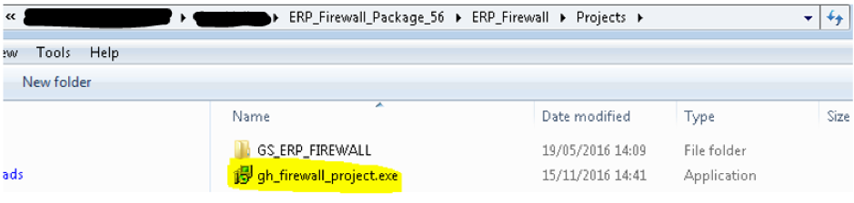
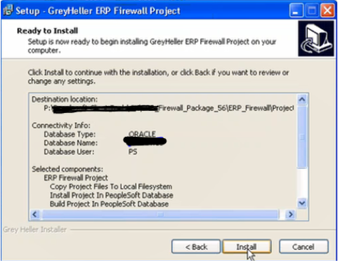
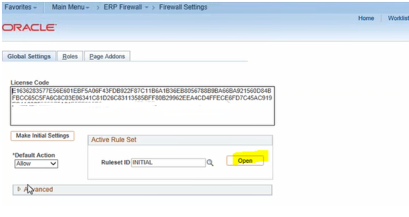
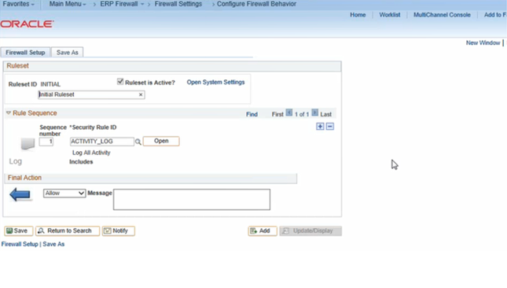
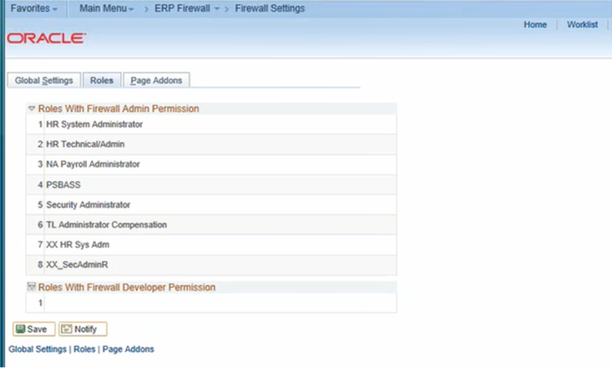
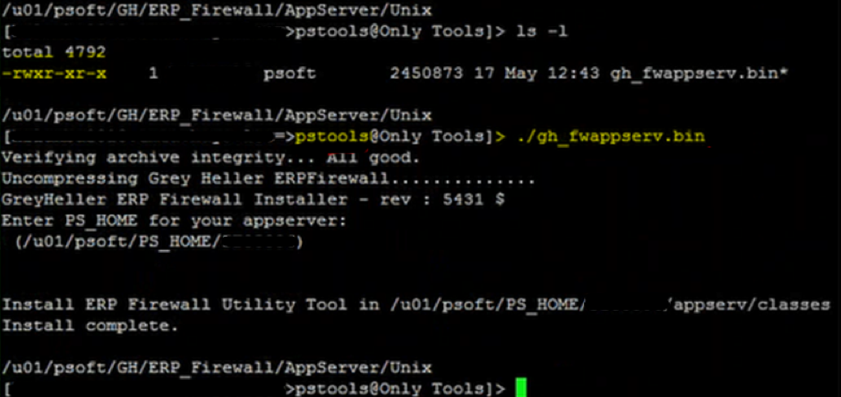
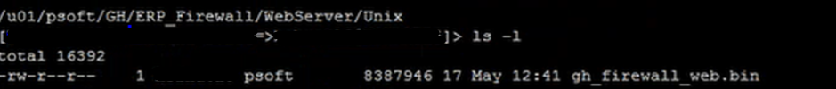
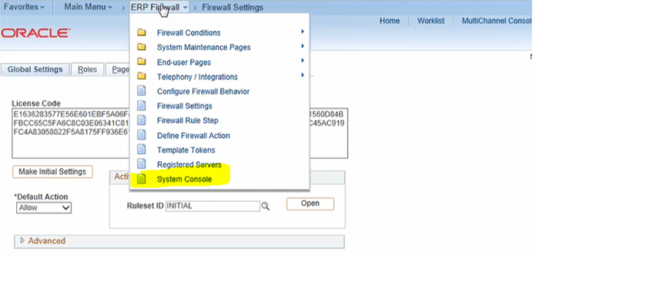

Appsian Security Platform (ASP), formerly ERP Firewall, is a component of the
Appsian security suite that allows PeopleSoft&reg; customers to control,
restrict, and audit access to PeopleSoft systems and content. PeopleSoft
customers using ASP have the flexibility to differentiate the privileges and
access based on content, location, device, user, external tokens, and PeopleSoft
data. Many customers from the higher education, healthcare, consumer packaged
goods, retail, and financial services industries are using ASP to secure
administrative functions in PeopleSoft Human Capital Management (HCM),
campus solutions, financials, and supply chain.

<!--more-->

### Introduction to ASP for Peoplesoft

ASP, for PeopleSoft products, is built to provide maximum security to
PeopleSoft applications. One firewall feature is that it doesn't accept requests
coming in as URL strings, which could include executable regular expressions.
The feature scrutinizes the request in the context of PeopleSoft applications.
ASP recognizes PeopleSoft components, Web Profile, PeopleSoft-specific security,
and so on.

### The Rackspace advantage

Rackspace has successfully implemented the ASP solution for many clients. As
technical and theoretical experts in ASP implementation, Rackspace technicians
created a step-by-step document for our PeopleSoft team to efficiently and
effectively implement ASP. The steps, with flexible installation and
configuration directory paths according to organization standards, are similar
for any client.

Rackspace has performed this installation on different PeopleTools versions,
and the following steps are from version PT8.56.

### Install ASP for PeopleTools

1. Sign on to your server and launch **App Designer** for the database on which
   you want to install ASP. Close all the other **App Designer** or **Data Mover**
   instances.
2. Go to the location where you saved the ASP packages. For example,
   **P:\Peoplesoft Client Tools\Appsian\**. You can also put the package on your
   virtual machine to speed up installation.
3. Execute the installation package, **gh_mobile_project.exe**. The installation
   package automatically detects the tools instance from the open **App Designer**
   session. Click **Next**.

     {{}}

4. Set the installation path to the desired install location, such as
   **P:\Peoplesoft Client Tools\GH\ASP+Package_56\ASP\Projects**. Click **Next**.
5. For a fresh install, select **New Installation**. Otherwise, select
   **Upgrade Installation**. Click **Next**.
6. Select your Peoplesoft **env name/user**.  The installer automatically picks
   from Step 1 of the open session of **App Designer**. Click **Next**.
7. The default tablespace name is **PSDEFAULT**. You do not need to select any
   tablespace name. Click **Next**.
8. Verify the following details before proceeding with installation:

      {{}}

9. After the installation finishes, use the DMS logs to verify the installation.

### Configure PeopleSoft Pure Internet Architecture (PIA)

Use the following steps to configure PIA:

1. To navigate to PIA in the installation environment, select
   **Main menu -> ERP Firewall -> Firewall Settings**.
2. On the **Firewall Settings** tab, update the **License Code** with the code
   provided in **license_key_xxx.txt **.

      {{}}

3. Save the entry.
4. Click **Open** under **Active Rule Set**.
5. Verify the setting, as shown in the following image:

      {{}}

6. Verify the list of **Roles** on the **Roles** tab. PeopleSoft security SOP
   defines Roles. Following are some examples:

      {{}}

### Configure the server-side application

Use the following steps to configure the application:

1. Copy the ASP folder to your Linux&reg; server.
2. On the Linux server, change directory to the ASP folder.
3. Bring down the application server before performing the following steps.
4. Log in with `pstools`. Make sure **gh_fwappserv.bin** has the execution
   permission and then run it. This process installs ASP in the
   **$PS_HOME/appserv/classes** folder.

      {{}}

5. Bring up the application Server.

### Configure the server-side webserver

Perform the following steps to configure the webserver:

1. Log in to the Linux server with application user `xxxxx` and make sure
   **gh_firewall_web.bin** has execution permission.

      {{}}

2. Execute **gh_firewall_web.bin**.
3. Put the **$PS_CFG_HOME/webserv** in the **Enter PS_HOME for your webserver**
   field.
4. Copy the **psjoa.jar** file from the **$PS_HOME/appserver/classes** folder
   to the following webserver location:
   **/u01/psoft/PS_CFG_HOME/PTXXX/webserv/applications/peoplesoft/PORTAL.war/WEB-INF/lib**.
   The process automatically backs up **web.xml** as
   **../../applications/peoplesoft/PORTAL.war/WEB-INF/web.old.xml**

      {{}}

5. Stop and start the webserver.

### Verify ASP system console

Open PIA now. You can directly check the status of the Peoplesoft site from the
System Console page.

{{}}

The system console page shows you PIA instance details, including the filter
status of `ENABLED` or `DISABLED`. Under Registered servers, the selected entry
(highlighted in yellow) is currently active. You can remove the filters and
reload the firewall configuration from here as well. If you click the **Name**
field, you can check the selected active site's status.

### Conclusion

Because it protects PeopleSoft's sensitive data from external threats, ASP
implementation is advantageous for any organization. Rackspace has the knowledge,
experience, and expertise to implement this product successfully.

Contact our experts today to set up ASP for your PeopleSoft applications.

<a class="cta purple" id="cta" href="https://www.rackspace.com/security">Learn more about our Security services.</a>

Use the Feedback tab to make any comments or ask questions. You can also click
**Sales Chat** to [chat now](https://www.rackspace.com/) and start the conversation.
