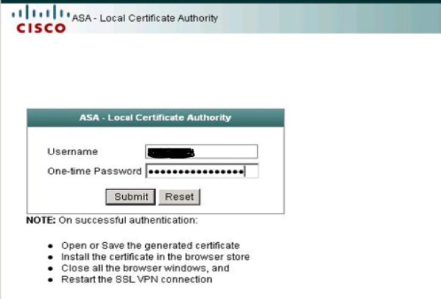
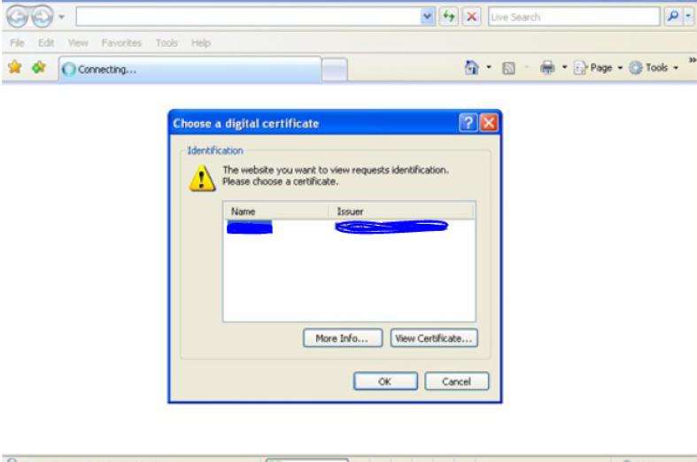

Certificate-based authentication is one of the most secure methods that Cisco
AnyConnect provides to enable you to access VPN remotely with a one-time password (OTP).

<!--more-->

### Introduction

After software version 8, Cisco&reg; included a complete certificate authority
(CA) solution in the firewall with a web front end. This post describes how to
use the built-in CA server feature of Adaptive Security Appliance (ASA) to issue
certificates to SSL clients and perform certificate-based authentication.

### Overview

Use the following steps to implement certificate and OTP-based authentication
for an existing AnyConnect&reg; environment:

- Check and synch the time
- Activate & configure local CA server
- Create user accounts for all users eligible to obtain an identity certificate from ASA
- Create a tunnel group that uses certificate-based authentication
- Change the VPN authentication to the certificate
- Create a map certificate to the connection profile

### Verify certificate-bases authentication

Perform the following steps to verify certificate-based authentication for
AnyConnect remote access VPN:

#### 1. Verify the correct date and time

Use the following commands to verify the current time:

    show clock
    show ntp status

If time is not synced correctly, you need to match it with the external NTP server.

#### 2. Activate and configure the local CA server

Issue the following commands to activate the local CA server, configure the
lifetime, key size, certificate issuer, and create a strong passphrase to protect
the local CA server. You can also configure the SMTP server used to send
instructions to users for obtaining identity certificates.

    crypto ca server
    lifetime ca-certificate 3650
    lifetime certificate 365
    keysize 2048
    keysize server 2048
    issuer-name CN=anyconnect certificate authentication
    no shutdown passphrase Cisco987

#### 3. Create user accounts and a one-time password

After you enable CA, use the following commands to create user accounts for all
the users eligible to obtain an ASA identity certificate.

    crypto ca server user-db add cert_user dn CN=cert_user ,OU=IT,O=exampleorganization
    crypto ca server user-db allow user cert_user display-otp

Take note of the OTP and keep it handy.

Download and import the certificate by browsing to
**https://\<firewall IP address\>/+CSCOCA/+enroll log** and logging in with your
username and OTP as shown in the following image.

{{}}

*Source*: [https://www.petenetlive.com/KB/Article/0000335](https://www.petenetlive.com/KB/Article/0000335)

#### 4. Create a tunnel group

Run the following commands to create a tunnel group where you are going to use
the certificate-based authentication:

    tunnel-group AnyConnect-TG-Cert type remote-access
    tunnel-group AnyConnect-TG-Cert general-attributes
    address-pool AnyConnect-Pool
    default-group-policy AnyConnect-GP

##### 5. Change the VPN authentication

Run the following commands to change the VPN authentication to the certificate:

    tunnel-group AnyConnect-TG-Cert webvpn-attributes
    authentication certificate

#### 6. Create a map certificate

Run the following commands to create a certificate map to the tunnel group, so
ASA uses the right user connection profiles for users authenticating with
identity certificates:

    crypto ca certificate map Cert-MAP 100
    subject-name attr ou eq IT
    webvpn
    certificate-group-map Cert-MAP 100 AnyConnect-TG-Cert

#### 7. Connect to the VPN portal

After you complete the preceding steps, users should now be prompted for
certificate-based authentication when they connect to the VPN portal, as shown
in the following image:

{{}}

### Conclusion

By using the steps in this post, you can easily configure certificate-based
authentication for Cisco AnyConnect Remote access VPN and setup the authentication
process using the inbuild CA server. You can also use a third-party, paid CA
server in production to meet the regulatory compliance and standard requirements.

<a class="cta blue" id="cta" href="https://www.rackspace.com/security">Learn more about our security services.</a>

Use the Feedback tab to make any comments or ask questions. You can also click
**Sales Chat** to [chat now](https://www.rackspace.com/) and start the conversation.
