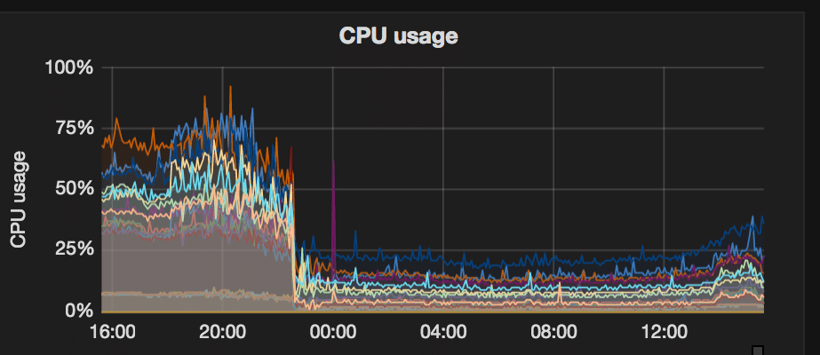
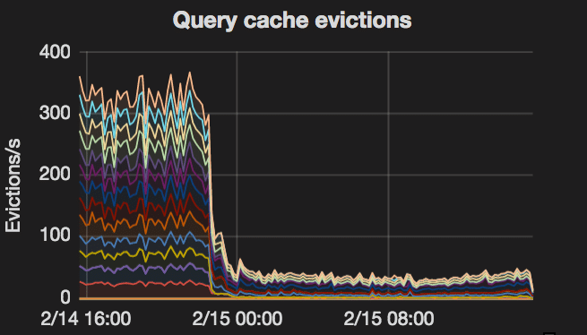
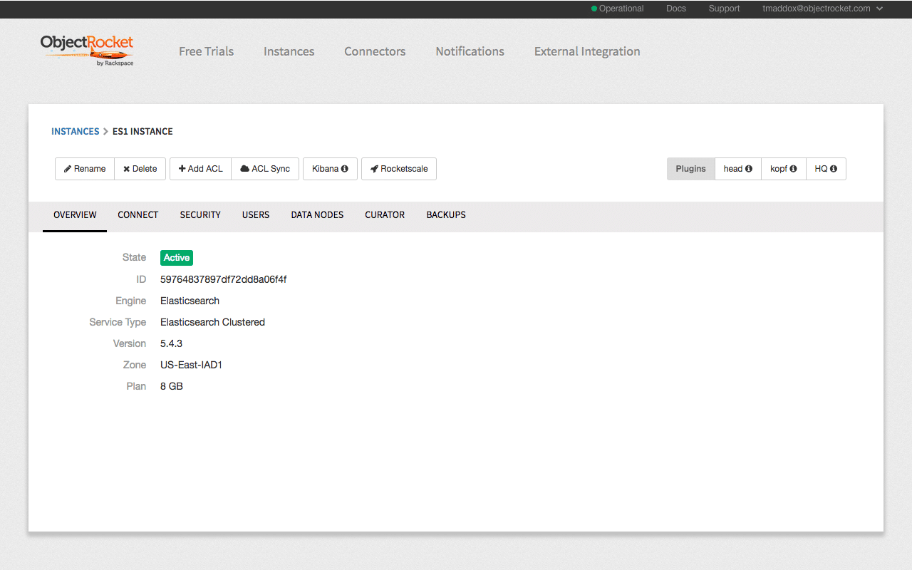
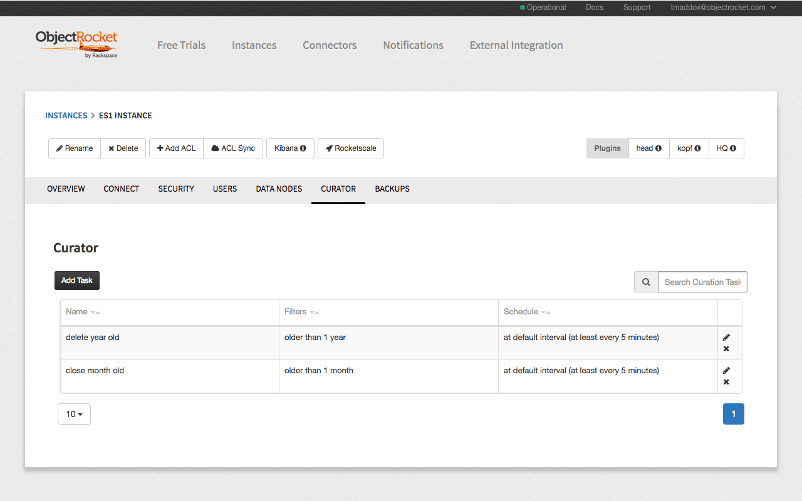
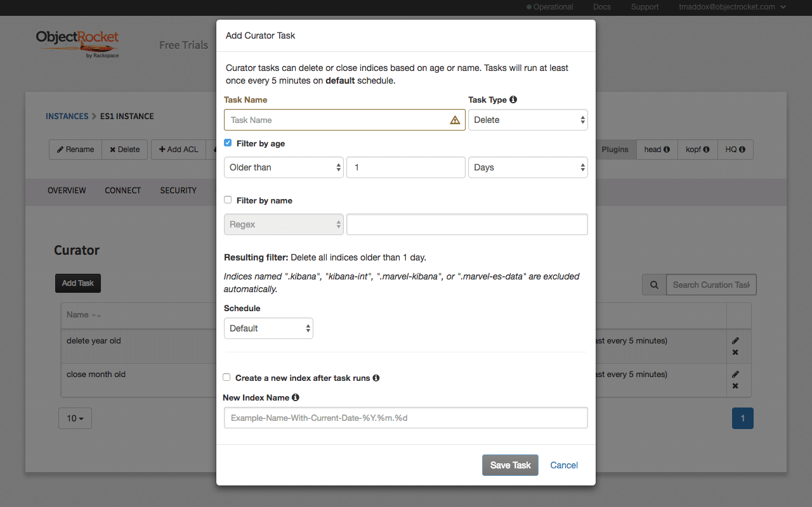
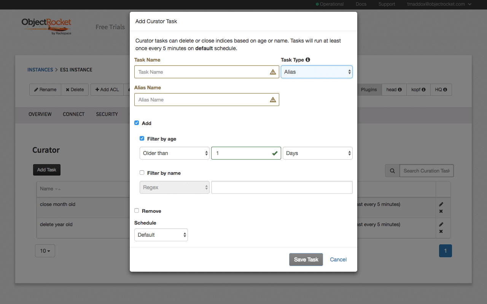
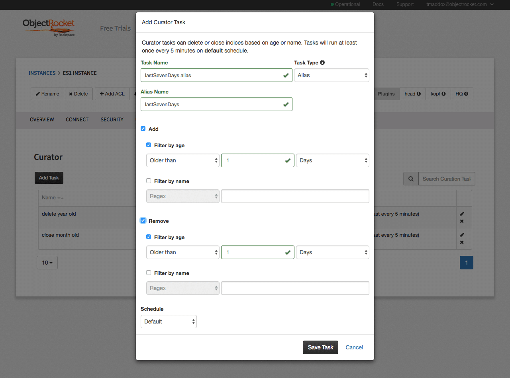

<!--more-->

## Intro to using aliases in Elasticsearch&reg;

_Originally published on August 24, 2017 at ObjectRocket.com/blog_

{{}}

In this article, We will go over **Elasticsearch** aliases to celebrate  access to our alias action in ObjectRocket’s hosted Curator implementation. We will also review the advantages of Elasticsearch aliases and how you can use them. 

A good strategy for good Elasticsearch hygiene is avoiding massive indices that hold an excessive amount of data. However, once your data has spread across multiple indices, you’ll probably want the best way to search across them. That’s where aliases come in handy.

Aliases in Elasticsearch are exactly what they sound like: "A secondary name that can be used to refer to an index, or multiple indices, that can even include some filtering to accommodate your needs." In this article, I want to walk you through some cool ways to use aliases and the procedure to use our feature, which enables you to quickly and easily set up an Alias Curator task for your Object Rocket Elasticsearch clusters.

#### CRUD (Create, Read, Update and Delete) with aliases

Let’s walk through a simple example of how aliases work. You can list aliases using either the `_cat` API, which returns a line for each alias-index association, and whether filtering or routing is applied:

```
    GET _cat/aliases?v
    alias index filter routing.index routing.search
    atest test1 – – –
    atest test2 – – –
    atest2 test2 * – –
```

Alternatively, you can use the `/_alias` endpoint to see all aliases, or the `/index/_alias` endpoint to just see the aliases for that index.
You can also add Aliases to an index during creation via an index template or using the `PUT`command:
```
    PUT /test2
    {
    “aliases” : {
    “atest” : {},
    “atest2” : {
    “filter” : {
    “term” : {“user” : “objectrocket” }
    }
    }
    }
    }
```

and add or modify later with the `/_` aliases endpoint by specifying the index and alias to add or remove.

```
    POST /_aliases
    {
    “actions” : [
    { “add” : { “index” : “test1”, “alias” : “atest” } },
    { “remove” : { “index” : “test3”, “alias” : “atest” } }
    ] }
```

From there, you can use the alias name instead of the index name in a query. Keep in mind that you can only index documents to an alias that points to a single index. There is obviously a whole lot more depth to aliases that you can get from the official docs, but this should give you a feel for how to work with aliases.

#### What’s the big deal?

That all seems pretty simple and you might be already sold, but in case you aren't, here are a couple of places where aliases really help.

#### Reindex with no downtime

One of the most useful features in Elasticsearch is the Reindex API. However, after reindexing, you still have to manage the cutover from the old index to the new index. Aliases allow you to make this cutover without downtime. Here’s how.


1. Assume I have an index called `oldIndex` and I want to reindex it into `newIndex`.

2. Create an alias `myalias` and add it to `oldIndex`.

3. Make sure that your application is pointing to `myalias` rather than `oldIndex`.

4. Create your `newIndex`, and begin reindexing the data from `oldIndex` into it.

5. Add `newIndex` to `myalias` and remove `oldIndex`. Do this in a single command and the change is atomic (very small and individual), so there will be no issues during the transition.

6. Verify that you’re getting the results you expect with the alias and then you can remove `oldIndex` when you’re ready.

It’s good practice to use an alias for reads or queries from your application to avoid unnecessary steps.

###Grabbing ranges of time-based indices

If you’re using Logstash&reg; or Beats&reg;, you’re probably familiar with indices named `something-yyyy.MM.dd`. This makes curation and management of the data really easy. Wildcards and index lists are not always as flexible as you’d like, especially, when you want to search across a range of dates. Aliases provide you with an easy solution for such cases.
Let’s assume you have daily logstash indices and you retain your logs for 30 days. However, you may only need to look at the last 7 days for certain types of queries. By using aliases and curator, you can do this rather easily.

1. First you’ll need to create an alias similar to this example:  `lastSevenDays`

2. Set up your index template to add the index to the new alias by default

3. Using the **Elasticsearch Curator** with the alias action and age/pattern filters, or a basic script, set up a recurring task to remove indices older than 7 days.
4. From there all searches to `lastSevenDays` will only hit the indices that were created in the last 7 days

#### Customer example

I want to close out on a small example from one of our customers. A customer of ours was recently having issues with slowness and after some review we noticed that one of their common queries was actually searching across their entire date range of the cluster. This query was very similar to the scenario listed above and only needed the last 7 days of data, so was a perfect candidate for managing with with an alias that was regularly updated to point to the indices from the last 7 days. In the graphs below, you can see that the impact on the performance of their cluster is astounding:

{{}}

{{}}


Since this alias was frequently queried, we can see the impact this change had. These graphs show us that CPU usage dropped by over 50% on all nodes, the number of query cache evections dropped by ~75%. While the results you see may not be this drastic, depending on the query frequency and index size, it illustrates how important it is to manage the scope of your searches and index appropriately.

#### Recap
Aliases are yet another tool in the Elasticsearch toolbox that should make it easier to manage and work with your cluster day to day. This post isn’t exhaustive, but should give you an idea of where and how you can use aliases in your Elasticsearch implementation.

#### How can you set up an Alias Curator task through ObjectRocket?

While aliases are already supported by our Elasticsearch clusters, our new Alias Curator task feature makes it simple to set up regular maintenance of alias(es) by allowing you to specify filters to add or remove indices from an alias at a regular interval based on your criteria.

To illustrate this, let’s take the `lastSevenDays` alias example, which already references using Elasticsearch Curator. To keep this simple, we will let the first run of the Curator task set the Alias for us. You can reference existing aliases in the Curator task, allowing you to set up the alias separately if you wish to have more custom settings.

To manage this alias, you’ll want to keep it up-to-date by having only indices that fit the age criteria of being created within the last 7 days.
Start at the instance details page for the cluster we want to add an Alias Curator task for:

{{}}

Once here, let’s select the “Curator” tab to see our current curator tasks:

{{}}

As you can see, We already have a couple of curator tasks. Let’s create another, this time it’ll be an “alias” curator task. To do this, select “Add Task”:

{{}}

Now, you can select the “Alias” task type:

{{}}

After naming our task, we need to specify the alias name. We’ll go with `lastSevenDays` for this example. You can also see a couple of options: **Add** and **Remove**. These are to allow you to specify filters for the indices that you wish to add or remove from the alias. for `lastSevenDays` we’re going to add some indices and remove others. So, let’s select both:

{{}}

The desired filters will add all the indices that are more recent than 7 days and remove those older than 7 days. Once filled in, the indices look similar to the following example:

{{}}

We can leave it at the default interval (every 5 minutes) to specify that we want this task to run regularly to keep our alias up-to-date. We can select “Save Task” and that’s it! Now the task will run every 5 minutes to keep the Elasticsearch Alias updated.

<a class="cta purple" id="cta" href="https://www.rackspace.com/sap">Learn more about our SAP services.</a>

Use the Feedback tab to make any comments or ask questions. You can also click
**Sales Chat** to [chat now](https://www.rackspace.com/) and start the conversation.
