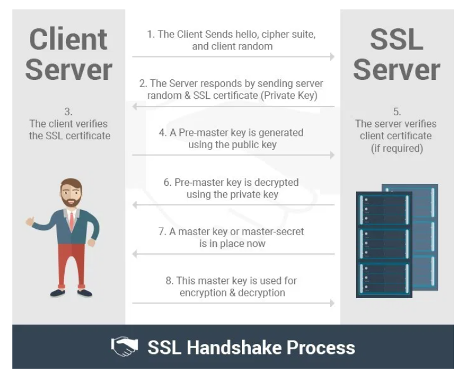

This post introduces Secure Sockets Layer (SSL) and Transport Layer Security
(TLS) protocols, how these protocols work, and why you might use them.

<!--more-->

### Secure Sockets Layer

The SSL handshake layer provides data integrity and privacy for communication
between a client and a server. The server and client exchange the necessary
information to establish a secure communication during a handshake.

#### Types of SSL handshakes

There are two types of SSL handshakes:

- **One-Way SSL**: With this handshake, only the client validates the server's
identity. Whenever you browse HyperText Transport Protocol Secure (HTTPS) URLs,
you're using one-way SSL. The browser (client) validates the identity of the
website (server).

- **Two-Way SSL (Mutual SSL)**: In this case, the client and server can validate
  each other's identity. Two-way SSL is mostly used in server-to-server
  communication where both the ends need to validate each other's identity.

#### SSL versions

Netscape developed SSL in 1994. The Internet Engineering Task Force (IETF)
picked up the protocol and standardized it as a protocol. SSL 3.0 is the current
SSL version in use.

SSL versions include the following ones:

- **SSL 1.0**: Due to security flaws, Netscape did not release SSL v1.0.

- **SSL 2.0**: Netscape released SSL v2.0, the first public release of SSL, in
  1995, but there were design flaws. Netscape deprecated SSL v.2.0 in 2011.

- **SSL 3.0**: SSL v3.0 fixed the security design flaws of SSL v2.0. However,
  SSL v3.0 was deemed insecure in 2004 due to the Padding Oracle on Downgraded
  Legacy Encryption (POODLE) attack, which exploits a vulnerability in the SSL
  v3.0 protocol (CVE-2014-3566).

### Transport Layer Security

TLS, a cryptographic protocol successor of SSL v3.0, was released in 1999.

TLS versions include the following ones:

- **TLS 1.0**: TLS v1.0, an upgradable version of SSL v.3.0, was released in
  1999, but it allows connection downgrade to SSL v3.0. Further releases include
  TLS 1.1, TLS 1.2, and TLS 1.3.

- **TLS v1.3**: This version, released in 2018, had features that differed
  significantly from TLS v1.2, including the following features:

   - Removes MD5 and SHA-224 support.

   - Requires a digital signature.

   - Uses perfect forward secrecy for public-key-based key exchange.

   - Handshake messages are encrypted after the *Server Hello* message.

### Differences between SSL and TLS

The differences between SSL and TLS are minor. In fact, only a technical person
can differentiate between the two protocols. The following list includes some
differences:

- **Cipher suites**: SSL protocol offers support for the Fortezza&reg; cipher suite,
and TLS doesn't.TLS follows a better standardization process that makes defining
new cipher suites easier like RC4, Triple DES, AES, IDEA, and so on.

- **Alert messages**: SSL has a *No certificate* alert message. TSL protocol
  removes the alert message and replaces it with several other alert messages.

- **Record Protocol**: SSL uses Message Authentication Code (MAC) after
  encrypting each message. In contrast, TLS uses Hash-Based Message Authentication
  Code (HMAC) after encrypting each message.

- **Handshake process**: In SSL, the hash calculation also comprises the master
  secret and pad, while TLS calculates the hashes over handshake messages.

- **Message Authentication**: SSL messages authentication adjoins the key details
  and application data in an ad hoc way, while TLS relies on HMAC.

SSL and TLS are cryptographic protocols that authenticate data transfer between
servers, applications, systems, and end users. SSL was a first of its kind of
cryptographic protocol, and TLS is a recently upgraded version of SSL.

**Note**: In a nutshell, SSL is obsolete, and TLS is the new name of the older
protocol that everyone uses to meet the latest encryption standard. Technically,
TLS is more accurate, but everyone is more familiar with SSL. SSL handshakes are
now called *TLS handshakes*, although the *SSL* name is still widely used.

### The handshake

The following image depicts the SSL Handshake process:

{{}}

*Image source: [https://dzone.com/articles/what-is-ssl-how-do-ssl-certificates-work](https://dzone.com/articles/what-is-ssl-how-do-ssl-certificates-work)*

### SSL or TLS handshake process

The following scenario demonstrates the SSL or TLS handshake process:

**Client**: Hello, server. I want to establish secure communication between us.
Here are my compatible SSL/TLS version and cipher suites.

**Server**: Hello, Client. I have checked your cipher suites and SSL/TLS version.
We are good to go ahead. Here are my certificate and public-key details.

**Client**: Let me verify your certificate. (Pause.) Okay, but I need to verify
your private key. I'll generate and encrypt a pre-master (shared secret key) key
by using your public key. Decrypt it using your private key, and we will use the
master key to encrypt and decrypt the information. (Symmetric encryption.)

**Server**: Done

Now that both the ends know who they are talking to, the information transferred
between them is secured by using the master-key. The encryption takes place
through the master-key only, also known as symmetric encryption.

**Client**: I'm sending you this sample message to verify that our master-key
works. Send me the decrypted version of this message.

**Server**: It works. I think we're all set.

After that, all data transmitted between the server and client is encrypted,
which sums up the SSL or TLS handshake process.

### Conclusion

In a digital economy, data is more valuable than ever. Protecting and securing
information is one of the essential aspects of surviving in the IT world because
data leaks and thefts can damage an organization's reputation and adversely impact
customers. End-to-end encryption is a must for ensuring safe data transfer.

<a class="cta blue" id="cta" href="https://www.rackspace.com/professional-services/data">Learn more about Rackspace Data Services.</a>

Use the Feedback tab to make any comments or ask questions. You can also click
**Sales Chat** to [chat now](https://www.rackspace.com/) and start the conversation.
