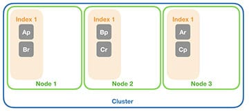

*Originally published on Nov 27, 2020 at ObjectRocket.com/blog.*

Elasticsearch&reg; is awesome at spreading data across your cluster with the default settings, but once your cluster begins to grow, you should adjust your default settings to enhance effectiveness. Let’s go over some of the basics of sharding and provide some indexing and shard best practices.

<!--more-->

### Clustered Elasticsearch&reg; index, shard, and replica best practices

{{}}

Replication decisions, shard count, and indexing are some of the most common sources of support tickets we see on the Rackspace&reg; ObjectRocket&reg; for Elasticsearch&reg; platform. Elasticsearch has awesome default settings that make spreading data across your cluster a great experience. However, once your cluster begins to grow, the default settings will not suffice. This article provides you with some of the basics of sharding, as well as, best practices for indexing and shard count.

#### An Introduction to Elasticsearch Sharding

There is a great number of docs out there about how Elasticsearch shards work, but the basic concept of sharding is breaking your data into several smaller pieces so that searches can operate on multiple parts in parallel. To facilitate clustering and parallelization of index functions, each index in your Elasticsearch instance is sliced up into numbered slices. These slices are called shards. Let’s look at some of their key behaviors:

* Each shard replicates depending on the `number of replicas` setting for the index. E.g. For a `number of replicas` setting of one, there will be two copies of each shard: one _primary_ shard and one _replica_ shard. The primary shard is the main shard and used for `indexing/write` and `search/read` operations, while the replicas are used only for `search/read` operations and for recovery if a primary fails.
* Replica shards must reside on a different host than their "parent" primary shard.
* Shards automatically spread across the number of hosts in the cluster by default, but the same physical host might contain multiple primary shards. You can use the Elasticsearch settings to modify this behavior (e.g. rebalancing, shards allocation, etc.), the procedure is beyond the scope of this blogpost.
* Each shard must reside in only one host because shards are indivisible.
* The number of shards that an index creates can be set during index creation, a global default can also be used. Once the index is created, the number of shards cannot be changed without reindexing.
* The number of replicas that an index has is set either during index creation or a global default can be used. This CAN be changed after the index is created.

{{}}

Let’s look at a small example. I’ve created an index with a shard count of three and a replica setting of one. As you can see in the diagram above, Elasticsearch will create 6 shards for you: Three primary shards (Ap,Bp, and Cp above), and three replica shards (Ar, Br, and Cr).
Elasticsearch will ensure that the _replicas_ and _primaries_ are on different hosts, but multiple primary shards can be allocated to the same host. On the subject of hosts, let’s dive into how shards are allocated to your hosts.

#### Shard Allocation and Clustered Elasticsearch

Elasticsearch will attempt to allocate shards across all available hosts by default. At Rackspace's ObjectRocket, each cluster is made up of master nodes, client nodes, and data nodes. It’s the data nodes in our architecture that form the “buckets” that the shards can be assigned to.
Using our example above, let’s take those six shards and assign them to an ObjectRocket for Elasticsearch cluster with 2 data nodes (the minimum). In the diagram below, you can see that for each shard, the primary will land on one data node, while the replica is guaranteed to be on the other node. Keep in mind that the examples here show just one possible allocation, the only definite thing is that a replica will always be placed on a different data node than its primary.

{{}}

Now, let’s extend this example and add a third data node. What you see is that two shards will be moved to the new data node. You’re now left with 2 shards on each node.

{{}}

Finally, let’s add a new index to this cluster with a shard count of two and the number of replicas set to two. What you’re left with is two new primaries (Xp and Yp) and four replicas (Xr0, Xr1, Yr0, Yr1), that could be spread across the cluster as seen in the picture.

{{}}

That’s it. Elasticsearch does all of the hard work for you, but there are some pitfalls to look out for.

#### Pitfall #1 – Massive Indexes and Massive Shards

Troubleshooting a massive index with massive shards is one of the easiest issues to mitigate in Elasticsearch. A user starts with a very manageable single index and as their application grows, so does their index. This leads to huge shards because shard size is directly related to the amount of cluster data.

The first issue this causes is poor efficiency in cluster utilization. As the shards grow, it gets harder to place them on a data node. It takes a large block of data node free space to store a shard there. This leads to nodes with a lot of unused, wasted space. Tha is, if I have 8GB data nodes, but each shard is 6GB, I’ll be stranding 2GB on each of my data nodes.
The second issue is “hot spotting”. If your data is consolidated into few shards then complex queries will not have the opportunity of being split across a larger number of nodes and executing in parallel.

#### Don’t be stingy with indexes

Use multiple indexes to solve stalled space issues. Spreading your data across multiple indexes will increase the number of shards in the cluster and help spread the data evenly. In addition to just an easier game of “Tetris” when Elasticsearch places shards, multiple indexes are easier to curate. The alias capabilities in Elasticsearch can still make multiple instances appear as a single index to your app.
Most of the Elastic Stack will create daily indexes by default, which is a good practice. You can then use aliases to limit the scope of searches to specific date ranges, curator to remove old indexes as they age, and modify index settings as your data grows without having to reindex the old data.

#### Increase shard count as your index size increases

Add indexes more frequently, and increase the shard count as your index grow. Once you see shard sizes starting to exceed your desired space, you can update your index template (or whatever you use to create new indexes) to use more shards for each index. However, this only helps if you create new indexes often, which is why this recommendation is listed second. Otherwise, you’ll have to reindex to modify the shard count, which represents more work than managing multiple indexes.

Our rule of thumb: If a shard is larger than 40% of the size of a data node, that shard is probably too big. In this case, we recommend reindexing to an index with more shards or moving up to a larger plan size (more capacity per data node).

#### Pitfall #2 – Too many indexes or shards

The inverse is far too many indexes or shards. After reading the previous section, you may just say “Fine, I’ll just put every doc in its index and create a million shards”. The problem there is that indexes and shards have overhead. That overhead manifests itself in storage, memory resources, and processing performance.

Since the cluster must maintain the state of all shards and where they’re located, a massive number of shards becomes a larger bookkeeping operation which will have an impact on memory usage. Also, since queries will need to be split more ways, there will be a lot more time spent in scatter or gather for queries. This pitfall is highly dependent on the size of the cluster, use case, and other factors, but in general, we can mitigate this with a few recommendations.

#### Shards should be no larger than 50GB

In general, 25GB is an ideal size for large shards, 50GB would require reindexing. This is related to the performance of the shard and the process of moving that shard when you necessary. When rebalancing, move shards to a different node in the cluster. A 50GB-data transfer can take too long and tie up two nodes during the entire process.

#### Keep shard size less than 40% of data node size

As mentioned above, the second shard size metric that interests us is the percentage of data node capacity a shard takes up. On the Rackspace ObjectRocket service, we offer different plan sizes that relate to the amount of storage on the data nodes. We try to size the cluster and the shards to ensure that the largest shards don’t take up more than 40% of a data node’s capacity. In a cluster with several indexes with various sizes, this is fairly effective, but in a cluster with very few large indexes, we are even more aggressive and try to keep the data node's capacity to below 30%.

Ideally, make sure you aren't stranding capacity on a data node. If your shards are about  45% the size of the data node, you’ll need a data node at roughly half utilization to place that shard. That’s a lot of unused spare capacity!

### Conclusion

Selecting the right shard and indexing settings can be difficult, but by planning, making some good decisions upfront, and tuning as you go, you can keep your cluster healthy and running optimally. We help businesses refine their Elasticsearch instances all the time

<a class="cta purple" id="cta" href="https://www.rackspace.com/sap">Learn more about our SAP services.</a>

Use the Feedback tab to make any comments or ask questions. You can also click
**Sales Chat** to [chat now](https://www.rackspace.com/) and start the conversation.
