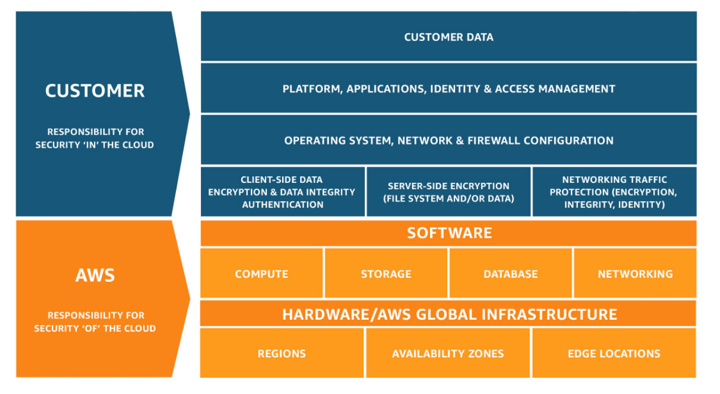

In 2009, over 12 million malware infections were reported globally. By 2018, this increased
to over 812 million detected threats. The sophistication of these attacks multiplies
rapidly&mdash;it's a nearly impossible task to be on top of security threats without having
a dedicated team to manage and operate the effort. Security threats come in many different
forms. For example, cybercrime has increased by 600% due to the COVID19 outbreak. Very few
would have predicted a pandemic would open us to more cybercrime.

<!--more-->

### Introduction

When Amazon&reg; introduced Infrastructure-as-a-Service in the form of its AWS&reg; offering,
it was hugely popular. However, there was some resistance to cloud adoption from certain
industries, such as healthcare and finance. This pushback was deeply rooted in their existing
technology footprint, where they had incorporated decades of security hardware and features
to protect personal data. 

Industries that deal with sensitive information have the responsibility to shield their
customers' data in this ever-changing threat landscape. Furthermore, these businesses must
respect a variety of stringent governance practices to safeguard the public trust. 

### Shared responsibility

The AWS Shared Responsibility model is an important concept to follow when architecting
*in* the cloud.

{{}}

*Image Source: [Shared responsibility model](https://aws.amazon.com/compliance/shared-responsibility-model/#:~:text=Security%20and%20Compliance%20is%20a%20shared%20responsibility%20between%20AWS%20and%20the%20customer.&text=The%20customer%20assumes%20responsibility%20and,AWS%20provided%20security%20group%20firewall)*

AWS manages the underlying infrastructure that runs all of the AWS Cloud offerings while
maintaining responsibility for the security *of* the cloud. It is the customer's
responsibility to ensure there is security *in* the cloud. AWS protects the hardware your
EC2 instance is running on, but you must apply adequate protection at the OS layer, for
example. 

This concept is critical when applying security solutions to your environment because 73%
of organizations use over 25 tools to protect against cyber-attacks. Furthermore, 95% of
CIOs expect cybersecurity threats to increase in the coming years, but they know they have
a skill gap in this area. (See
[https://www.cyberbit.com/blog/cybersecurity-training/cyber-security-statistics-2019/](https://www.cyberbit.com/blog/cybersecurity-training/cyber-security-statistics-2019/).)

Cyber-attack is the biggest threat to your organization and, unfortunately, is an overhead
that burdens your day-to-day operations team. Fortunately, security is the number one
priority for AWS. This is no secret because Amazon has released many security features over
the years for easy adoption. It can be challenging to align all of this into a cohesive
solution without having a dedicated team to set up and manage the security features. 

### Rackspace Cloud-Native Security 

Rackspace's Cloud-Native Security (CNS) [Service Block](https://www.rackspace.com/cloud/public/service-blocks)
is a managed security service offering that brings in a dedicated 24/7 Security Operations
Center (SOC) to deal with your high-priority security alerts as well as provide remediation.  

Rackspace is the first of its kind to partner with AWS for
[Security Hub ](https://aws.amazon.com/security-hub/?aws-security-hub-blogs.sort-by=item.additionalFields.createdDate&aws-security-hub-blogs.sort-order=desc)
as a consulting Managed Security Service Provider (MSSP) to offer consulting with a dedicated
SOC.

By integrating with AWS Security Hub and underlying technologies like Amazon GuardDuty&reg;
and IAM Access Analyzer, Rackspace can automatically pull threat information and alerts
directly from your AWS security tools into our SOC Security Information and Event Management
(SIEM) system. This ability allows us to create a comprehensive view and analysis of your
environment and keep you one step ahead of security threats.

For example, an existing AWS financial services start-up wanted to offload the cybersecurity
management to a dedicated team instead of using their internal IT support for triage. They
engaged Rackspace to integrate CNS into their critical workloads, which handles and
processes customer sensitive data. After a consultation, based on the customer's workflow,
Rackspace identified another opportunity and encouraged the customer to integrate CNS into
their development environment, too.

After a few weeks of being protected by CNS, the dedicated SOC team identified unusual
network traffic correlating with steady CPU spikes in the development environment during
off-peak hours. After further analysis, we detected several compromised docker containers
that were being used for cryptocurrency mining. We immediately reported this finding to the
customer, and based on pre-defined runbooks, the SOC team isolated the threat. 

While the development environment was not holding sensitive data, discovering this
vulnerability allowed the customer to tighten their security gaps in their production
environment. Furthermore, after remedying the threat, the customer saw their AWS bill drop
by 15% due to the reduced consumption from the compromised containers.

### Cloud-native security architecture

{{}}

Each customer has a security hub master account with member accounts added to the master.
This design allows the master account to aggregate findings from each member account, which
AWS Kinesis Firehose then integrates with Rackspace SIEM.

As part of the on-boarding process, Rackspace works with you to create specific CloudWatch
alerts and remediation tasks in the form of runbooks. 

Rackspace SIEM assesses, filters, and classifies alerts as part of a correlation action to
create an event for the findings. Thus, we can encapsulate multiple findings into one event.
This reduces noise, and alerts trigger only on *true positive* results. 

The pricing is utility-based per each event alert. Rackspace works with you to define your
minimum severity level. Based on this level, the system passes findings to Rackspace SIEM.

To ensure your security posture on the cloud is consistent, we conduct monthly account
reviews, allowing you to be flexible with your severity levels.

### Conclusion

Cybersecurity has always been essential for any organization, but it gets neglected
sometimes and becomes an afterthought. AWS empowers you to have security top of mind for
all the decisions you make for your application or the infrastructure. You have native tools
like AWS Inspector and Macie at your disposal. 

Security Hub brings these security features together in a central location to optimize how
you remediate risks to your business. 

Integrating CNS into your cybersecurity portfolio reduces the attack vector to which your
organization is exposed because Rackspace backs you with a dedicated team to remediate any
threats.

<a class="cta teal" id="cta" href="https://www.rackspace.com/security">Learn more about our Security services.</a>

Use the Feedback tab to make any comments or ask questions. You can also click
**Sales Chat** to [chat now](https://www.rackspace.com/) and start the conversation.
