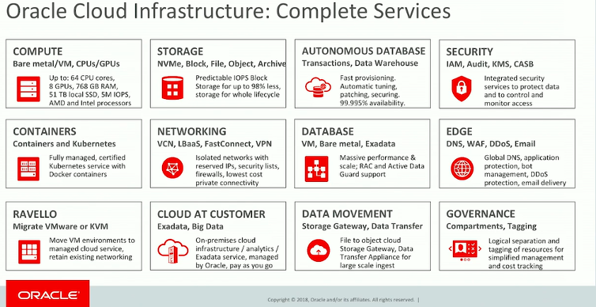
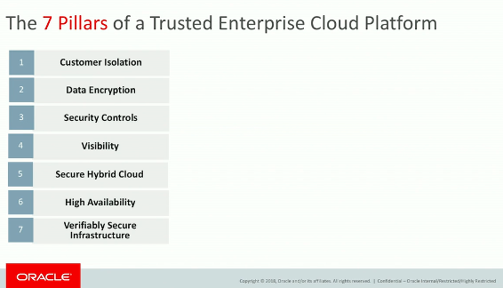
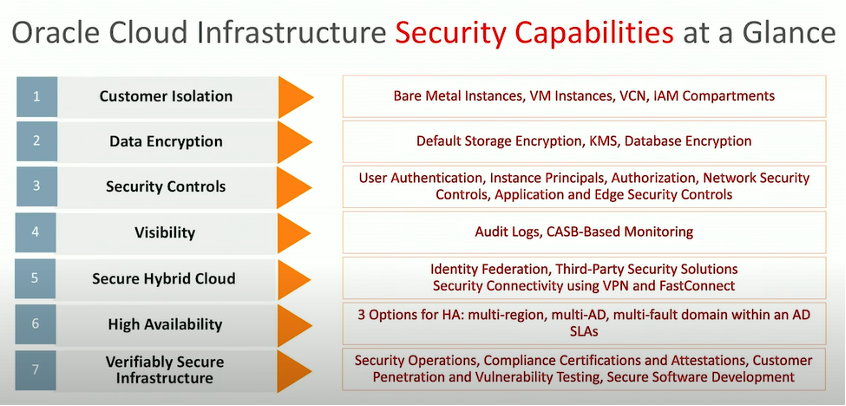
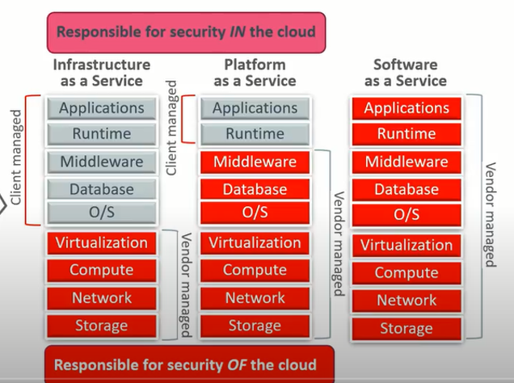
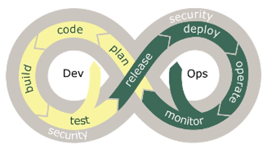
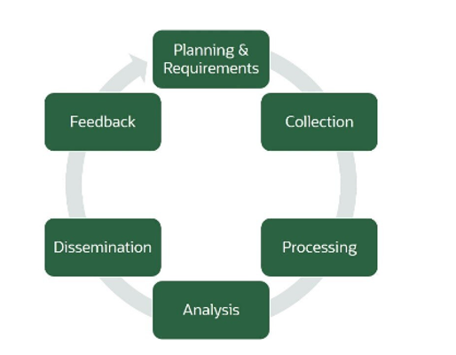

[The Oracle&reg; Cloud Security Practices team](https://www.oracle.com/corporate/security-practices/),
in their own words, "describe how Oracle protects the confidentiality, integrity, and
availability of customer data and systems that are hosted in the Oracle Cloud and/or
accessed when providing Cloud services. Today, 430,000 customers in 175 countries use
Oracle technologies to seize business opportunities and solve real, tangible challenges.

<!--more-->

### What is Oracle Cloud Security?

"Oracle, a global provider of enterprise cloud computing, is empowering businesses of all
sizes on their journey of digital transformation. Oracle Cloud provides leading-edge
capabilities in software as a service, platform as a service, infrastructure as a service,
and data as a service."

{{}}

*Image source: [Oracle Cloud Infrastructure presentation, slide 4](https://www.slideshare.net/MarketingArrowECS_CZ/oracle-cloud-infrastructure)*

#### How does Oracle help customers?

[The Oracle Cloud Security Practices documentation](https://www.oracle.com/corporate/security-practices/) continues, "Oracle helps customers develop strategic roadmaps and advance their journey to the cloud from any point: new cloud deployments, legacy environments, and hybrid implementations. Oracle's complete, integrated approach makes it easy for companies to get started in the cloud and even easier to expand as business grows. Oracle's application suites, platforms, and infrastructure leverage both the latest technologies and emerging ones—including artificial intelligence (AI), machine learning, blockchain, and Internet of Things (IoT)—in ways that create business differentiation and advantage for customers. 

"Oracle supports customers on every step of the digital journey, with consulting, financing,
support, and training services. Oracle's security practices are multidimensional and reflect
the various ways Oracle engages with its customers:

{{}}

*Image source: [Oracle Open World presentation, slide 8](https://slideplayer.com/slide/14287280/)

{{}}

*Image source: [Part 1 of 4 - Oracle IaaS and Seven Pillars of Trusted Enterprise Cloud Platform](https://blogs.oracle.com/cloud-infrastructure/oracle-iaas-and-seven-pillars-of-trusted-computing-platform-part-1-of-4)

- "Oracle has corporate security practices that encompass all the functions related to
  security, safety, and business continuity for Oracle's internal operations and its
  provision of services to customers. They include a suite of internal information security
  policies as well as different customer-facing security practices that apply to different
  service lines. 
- "Oracle Cloud Security Practices describe how Oracle protects the confidentiality,
  integrity, and availability of customer data and systems that are hosted in the Oracle
  Cloud and/or accessed when providing Cloud services.
- "With Oracle Software Security Assurance, Oracle's goals are to ensure that Oracle's
  products help customers meet their security requirements while providing for the most
  cost-effective ownership experience."

An [Oracle blog post by David Cross](https://blogs.oracle.com/cloudsecurity/how-threat-intelligence-complements-security-controls-in-oracle-saas-cloud)
adds, "Threat intelligence provides value: as a source of data in the buildout, deployment,
and monitoring of security controls. In this blog, we will describe threat intelligence,
its uses during the DevSecOps cycle, and how SaaS Cloud Security applies the threat
intelligence lifecycle in its operations."

{{}}

#### Why do we need cloud security?

An [Oracle Linux&reg; document](https://www.oracle.com/linux/technologies/rdbms-12c-oraclelinux.html)
recommends that you ensure data privacy, protect against insider threats, and enable
regulatory compliance with a comprehensive portfolio of security solutions, on-premises and
in the cloud. Simplify the challenges of identity and access management, even in a complex
hybrid IT environment.

#### What is a cloud security control center?

[Oracle](https://www.oracle.com/be-nl/database/security/products.html) recommends that you
"secure your cloud database with a single, unified database security control center that
identifies sensitive data and masks it, alerts on risky users and configurations, audits
critical database activities, and discovers suspicious attempts to access data."

### Threat Intelligence (TI)

[Cross](https://blogs.oracle.com/cloudsecurity/how-threat-intelligence-complements-security-controls-in-oracle-saas-cloud)
says, "Threat intelligence is the information that a security team can use to take the
required action against a threat." He continues, "Security teams such as Oracle SaaS Cloud
Security (SCS), use standards and automation to rapidly analyze, correlate, and validate TI
feeds."

#### Principles of Threat Intelligence

[Cross](https://blogs.oracle.com/cloudsecurity/how-threat-intelligence-complements-security-controls-in-oracle-saas-cloud)
goes on to describe the principles of TI: "One of the best ways to understand the value of
threat intelligence is to examine three commonly accepted principles in a computing
environment:

1. "**Evidence-based knowledge**: Good threat intelligence is not individual opinions or
   intuitions. It is based on information that has been purposefully collected and curated
   to provide factual details on specific events, activities, and behaviors. 
2. "**Asset risk**: Threat intelligence should always be correlated with an existing or
   emerging risk to the assets that you are protecting. For example, TI can point to a
   potential security event that is related to the theft of high-value data or an existing
   threat to the availability of critical resources.
3. "**Actionable**: Threat intelligence must be aligned with processes, people, and tools
   to analyze the threat and to link the information with specific actions that can block,
   prevent, or mitigate the threat. For example, when a SQL Injection (SQLI) attack occurs,
   a security response team can introduce a blocking signature in the Web Application
   Firewall (WAF) or perform a code change and patch a vulnerability."
 
#### Threat Intelligence and DevSecOps

[Cross's post](https://blogs.oracle.com/cloudsecurity/how-threat-intelligence-complements-security-controls-in-oracle-saas-cloud)
continues, "Threat intelligence is primarily used by security teams, whether pen testers,
security incident responders, or security architects, to defend and mitigate against
emerging threats during operate and monitor phases of the DevSecOps cycle. It's also a
valuable source of information for many roles in a DevSecOps culture and engineering model.

{{}}

*Image source: [How Threat Intelligence Complements Security Controls in Oracle SaaS Cloud](https://blogs.oracle.com/cloudsecurity/how-threat-intelligence-complements-security-controls-in-oracle-saas-cloud)*

"For example, developers and testers can use threat intelligence in the early planning
phase to ensure that they can holistically compose threat models and complete security
architecture reviews based on the environment and threats that their software might be
vulnerable to. In addition, in the build and test phases, they need to make sure their
software does not unnecessarily expose the product to other potential attacks or emerging
risks. Often, DevSecOps engineers use TI to not only block a potential attack, but also to
monitor for attacks.

"For security teams, TI is valuable in the planning phase as TI enables them to build and
implement proactive responses as opposed to focusing on reactive remediations. TI is a
natural complement and source of input to the Architectural Risk Analysis (ARA) that is
commonly performed in the code (design) phase of DevSecOps."

#### Threat Intelligence Goals for Oracle SaaS Cloud Security

[Cross](https://blogs.oracle.com/cloudsecurity/how-threat-intelligence-complements-security-controls-in-oracle-saas-cloud) goes on, "At a high-level, the SCS organization has three sustaining TI goals:

1. "Ensure we can accurately and consistently identify and assess threats against Oracle SaaS.
 
2. "Adjust the prioritization of security DevSecOps engineering activities and projects
   based on findings from our threat intelligence program.
 
3. "Collaborate and share our feeds, analysis, and insights with other security lines of
   business inside Oracle."

 
#### How Threat Intelligence Complements Security Controls in Oracle SaaS Cloud

[Cross](https://blogs.oracle.com/cloudsecurity/how-threat-intelligence-complements-security-controls-in-oracle-saas-cloud)
says, "Over the past few years, the SCS organization has significantly advanced and matured
our threat intelligence program so that we can align with the rapid adoption and growth of
cloud-based SaaS applications. At a high-level, the SCS organization has three sustaining
TI goals:

1) "Ensure we can accurately and consistently identify and assess threats against Oracle SaaS.
2) "Adjust the prioritization of security DevSecOps engineering activities and projects
   based on findings from our threat intelligence program. 
3) "Collaborate and share our feeds, analysis, and insights with other security lines of
   business inside Oracle."
 
#### Threat Intelligence lifecycle

About the TI lifecycle, [Cross](https://blogs.oracle.com/cloudsecurity/how-threat-intelligence-complements-security-controls-in-oracle-saas-cloud)
says, "It is not well-known outside of the security community, but threat intelligence has
a lifecycle. It is a continuous lifecycle, just like DevSecOps, that adapts and improves
over time based on results. 

{{}}

*Image source: [How Threat Intelligence Complements Security Controls in Oracle SaaS Cloud](https://blogs.oracle.com/cloudsecurity/how-threat-intelligence-complements-security-controls-in-oracle-saas-cloud)*

"**Planning**: The threat intelligence lifecycle that SCS uses starts with planning. During
this phase, we identify potential TI gaps that may exist and also align our needs with the
overall DevSecOps product goals across the broader SaaS Engineering lines of business. TI
can often provide a mitigation when auditing or monitoring gaps exist in a given component
or service. This mitigation can be more attractive than unnecessarily overloading a system
with expensive audit logging functions. The SCS organization performs and completes threat
modeling exercises for all SaaS properties. These exercises are open discussions with the
SaaS DevSecOps teams to systematically identify potential risks to the product, by examining
risks at strategic, operational, and tactical levels.

"**Collection**: After the project goals have been defined, we procure the latest information
from both internal and external sources as well as from various partnerships (see Threat
Intelligence Sources below). 

"**Processing**: Next, we categorize, organize, and filter the information that we have
collected, based on our objectives. We explicitly score and prioritize the data and develop
appropriate techniques on how it may be monitored or detected using our SIEM and alerting
technologies. 

"**Analysis**: After processing, we analyze the information and how a particular threat
might potentially impact our environment. This analysis can include threat-hunting activities,
which are the proactive search for signs of active or historical malicious activity in our
infrastructure or applications. SCS uses both structured and unstructured threat-hunting
approaches. Structured threat hunting is when we determine what we want to look for and then
detect if it is in place. Unstructured threat hunting is dependent on reviewing raw threat
intelligence and signals to identify anomalies that may not have been detected in the past. 

"After analysis, we share the intelligence that we found with various security and DevSecOps
organizations in Oracle for further correlation, reporting, and analysis. During this step
in the continuous cycle, we collect and incorporate feedback from all stakeholders and
incorporate these insights into the next planning cycle."

### Rackspace's Goals for Oracle SaaS Cloud Security

1) Our security best practices accurately and consistently identify and assess threats
   against Oracle SaaS.
2) Rackspace adjusts the prioritization of security DevSecOps engineering activities and
   projects based on our threat intelligence program findings. 
3) Rackspace collaborates and shares the feeds, analysis, and insights with other security
   lines of business inside Oracle.

### Conclusion

Cross's post concludes, As "threat intelligence is always in context, security incident
responders can use it to better understand an incident, complete forensic analysis, and
ensure adequate mitigation controls are in place. For the best results in Oracle SaaS,
the SCS organization uses the threat intelligence program results, insights, and analysis
to maximize benefits and protection for all SaaS customers."

<a class="cta teal" id="cta" href="https://www.rackspace.com/security">Learn more about our security services.</a>

Use the Feedback tab to make any comments or ask questions. You can also click
**Sales Chat** to [chat now](https://www.rackspace.com/) and start the conversation.
