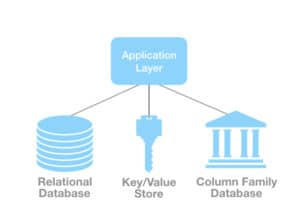

*Originally published on Apr 30, 2018, at ObjectRocket.com/blog*

Polyglot persistence refers to using different data storage technologies to handle varying data storage needs. It’s an offshoot
of polyglot programming&mdash;using different programming languages to build an application. Simply put, it’s an application that
uses more than one core database technology.

<!--more-->

{{}}

It’s important to use the right tool for the job and equally important to use the right database for the job. Each database
has strengths, weaknesses, and characteristics. There are literally [hundreds of databases](https://www.objectrocket.com/blog/uncategorized/what-is-polyglot-persistence/) out there, though, so it’s hard to keep up.

{{}}

### Manage your data storage needs

Monoglot&reg; was (and still is) fine for simple applications that use one type of workload. However, applications quickly become more complex.

A simple E-commerce platform uses the following tools:

* Session data to add items to a basket
* Search engine to search for products
* Recommendation engine, potential future purchases based on purchasing records
* Payment platform for geolocation services

Implementing polyglot persistence allows you to fuel applications with data from different storage types. You could
pull completed financial transactions from Oracle&reg; while tracking user information in
[MongoDB&reg;](https://www.objectrocket.com/managed-mongodb/) and letting [Redis&reg;](https://www.objectrocket.com/managed-redis/)
handle the cache.

### Implement polyglot persistence and consider options

Many complaints referencing the complexity of building out polyglot persistence stem from trying to force storage solutions into
projects for which they’re inadequate. That leads to the creation of numerous support processes and an ever-growing monster architecture.   

Careful planning eliminates 90% of potential issues. Consider your goals. Do you need an integral business function? Do you need
to start transitioning a large portion of the company's operations to this model?

#### Use the right data storage technology

Has your team created a polyglot persistence architecture before? It’s challenging to properly leverage the right data
solutions without experience designing this type of model. How do you know if you’re starting with the right project?

#### Data storage types

Organizations often end up using a number of different data sources to feed their applications. Let’s review some common
storage options:

**Transactional databases**, also known as Relational Database Management Systems (RDBMS), provide data integrity by organizing
information into tables with rows and columns. You retrieve data by using syntax statements called queries. Many large organizations
make heavy use of popular options like Microsoft&reg; SQL Server&reg; and Oracle&reg;. One drawback to transactional databases is
that they can be difficult to scale as storage needs grow. Also, searches slow as data gets more dense and complicated to access.

**Non-transactional databases** shift from the use of tabular RDBMS systems, allowing for increased scalability and faster searches.
They also pair well with search and analytic engines like Elasticsearch. People often use the term *NoSQL* to describe these databases. 

**Non-transactional storage types**:

Non-transactional storage types include the following options:

- **Key-value**: These databases use a key that points to the storage location of a piece of data. Some use hash-tables, while
  others like Redis hold pairings in memory for quick access.
- **Document**: These consist of key-value pairs compressed into a document that allows for structure by using an encoding like
  JSON or XML. Popular open-source versions include MongoDB and CouchDB&reg;.  
- **Column**: You place data into grouped columns instead of rows like in an RDBMS structure. Apache&reg; Cassandra and HBase&reg;
  use this model.
- **Graph**: These use graph structures, nodes, edges, and properties to organize and retrieve data. Neo4j&reg; is an example
  that’s growing in popularity.

Getting polyglot persistence right means knowing which data options work best for your application needs.

#### Questions to ask

##### Data structure questions

- Does your data have a natural structure? Is it unstructured?
- How is it connected to other data?
- How is it distributed?
- How much data are you dealing with?

###### Access pattern questions

- What is your read/write ratio?
- Is it uniform or random?
- Is reading or writing more important to your application?

##### Organization needs questions

- Do we need authentication? What type?
- Do we need encryption?
- Do we need backups?
- Do we need a disaster site?
- Do we need plugins?
- What level of monitoring is required?
- Which drivers are needed?
- Which languages should we use?
- Should we use third-party tools?

### Bring in the right help

Many companies would benefit from bringing in experts in polyglot architecture to help with these decisions. That way, you
avoid ending up with additional maintenance loads due to overly complex architecture. Some popular open-source database
vendors offer management services. But will they let you know if their own data source isn’t right for your needs?

It’s best to reach out to a company that understands the strengths and weaknesses of different data options to get you started
with polyglot persistence. Rackspace [ObjectRocket](https://www.objectrocket.com/services/) gives you a 360-degree view of a
variety of database options applicable to your business needs. We bring in DBAs and engineers best suited to take your big data
solutions to the next level.

<a class="cta red" id="cta" href="https://www.rackspace.com/data/dba-services">Learn more about Rackspace DBA Services.</a>

Use the Feedback tab to make any comments or ask questions. You can also click
**Sales Chat** to [chat now](https://www.rackspace.com/) and start the conversation.

View the [Rackspace Cloud Terms of Service](https://www.rackspace.com/cloud/legal/).
