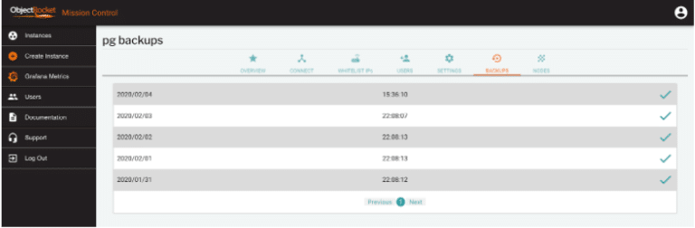
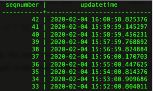
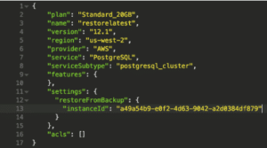
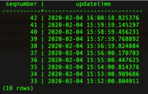
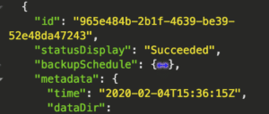
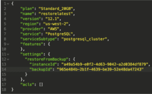
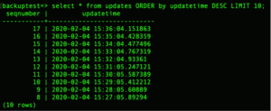
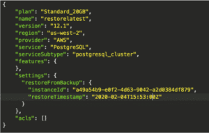
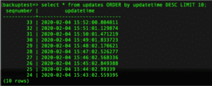

*Originally published on Feb 6, 2020, at ObjectRocket.com/blog*

Regular backups and the ability to restore them is a critical piece of database system administration. At Rackspace
ObjectRocket, we provide you with daily backups with two-week retention by default on all of our database products. 

<!--more-->

{{}}

Our PostgreSQL&reg; offering adds a bonus which includes *Write Ahead Log* (WAL) archiving and the ability to restore to any time
within our retention window. We generally call this Point-in-Time Recovery (PITR), and this post walks you through how it works on
our service.

### No-fuss backups

A major component is the fully-automated backup process. The cost of all instances includes daily backups,
and we retain two weeks' worth of backups at all times. You can view your backup times and their statuses in our
dashboard or by using the user interface (UI).

{{}}

### Multiple restore options

We offer several options to restore a backup:

+ Restore to the most recent stored WAL update.
+ Restore to a specific base backup.
+ Restore to a specific point in time.

In all cases, we restore your data to a new PostgreSQL instance. At this time, the instance storage must be greater than
or equal to the storage on the original instance. We call this a database fork.  Ideally, you should restore your data to
a new and separate database instance, so both the old and new instances stay active until you remove one.

**Note:** Restores are currently only exposed through our [API](https://docs.api.objectrocket.cloud/?__hstc=227540674.6c2da1a33c3f4e98dc8ac794308ed907.1602515328573.1603747752685.1603747850537.59&__hssc=227540674.1.1603747850537&__hsfp=3796701661#restore-a-postgresql-instance-from-backup). If you’re comfortable with the API, great. Otherwise, our support team can help you
through the process. We plan to add restores to the UI soon.

#### Restore to the latest time

Let's analyze a simple database that just stores a timestamp and a sequence every minute, which allows us to see the
backup location. Taking a quick look at our database, we see the last timestamp was at 16:00:58 (UTC).

{{}}

If we want to restore to the latest data in this database, we can do that by providing the instance *id* of our source
instance to a new instance create call.

{{}}

After we have restored the instance, we can connect and check the last timestamp.

{{}}

As you can see, all of the data is there, and we have a new Postgres instance, fully updated to the source Postgres instance.
You might want to use this scenario to create a test database from current data to experiment with a new feature without the
risk of affecting the original data.

#### Restore to a specific backup

The second option is to restore from a base backup. When listing backups, each has its own **id** that we can use to restore:

{{}}

In the preceding backup example, you see that it was taken at 15:36:15 (UTC). To restore to this exact backup, simply add the
backup id to the create call.

{{}}

After the instance finishes loading, we can see that the backup has data and timestamps from before the backup time of 15:36:15.

{{}}

#### Restore to a specific time

The last method is just to specify the time from which you’d like to restore. Accomplish this by providing the source
instance ID and the restore time:

{{}}

Here, we’d like to restore to 15:53:00. After our restore is complete, you can see that the data only exists up to that time.

{{}}

If you look back at the preceding images, you might see that we did have another timestamp at 15:53:00, but that timestamp
occurred at just over .8 seconds after 15:53:00, so the instance would not include it. You can get extremely granular with
**Point in Time recovery** to target a time and state in the database.

### What’s next?

All of that backup and restore functionality is there for you to use today. However, we constantly add more features and
capabilities. Let us know if you have any requests.

<a class="cta red" id="cta" href="https://www.rackspace.com/professional-services/data">Learn more about Rackspace Data Services.</a>

Use the Feedback tab to make any comments or ask questions. You can also click
**Sales Chat** to [chat now](https://www.rackspace.com/) and start the conversation.

Click here to view [The Rackspace Cloud Terms of Service](https://www.rackspace.com/cloud/legal/).
