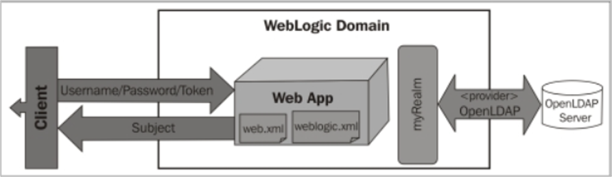
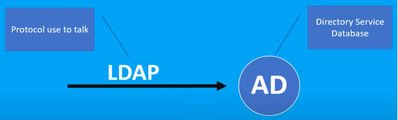
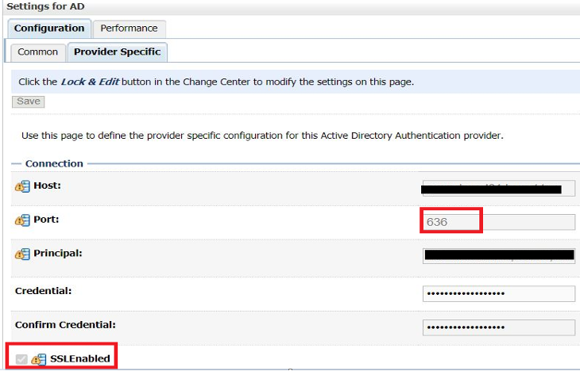
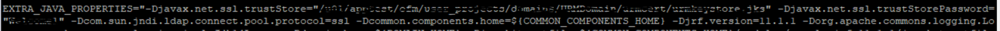
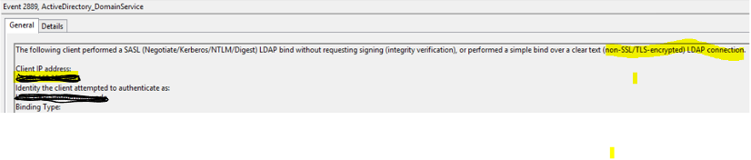

This post explains how to secure Microsoft&reg; Active Directory (AD) authentication by
using Secure Sockets Layer (SSL).

<!--more-->

As we all know, security on every layer is important. SSL implementation usually occurs on
the application layer, web layer, and network layer. This post describes how to enable
secure authentication on the provider layer. An authentication provider allows Oracle &reg;
WebLogic Server&reg; to establish trust by validating a user. 

### Lightweight Directory Access Protocol (LDAP)

LDAP is an open client-server protocol used with various directory services that store
credentials. Commonly, LDAP serves as a central place for authentication, meaning it stores
usernames and passwords.

- **Active Directory (AD)**: A directory server is like a database, but tends to contain
  more descriptive, attribute-based information. Generally, systems read the information
  in a directory much more often than they write to it.  
 
- **Secure Sockets Layer**: More commonly known as SSL, this is a cryptographic protocol.
  Nowadays, security is a major concern for every organization. SSL is essential for
  protecting websites and user authentication over both the Internet and intranet.
  
### How AD authentication works in WebLogic

As soon as a client logs into an application deployed on the WebLogic server, AD
authenticates the credentials through myRealm based on the configuration.  
     
{{}}
           
*Image source: [https://subscription.packtpub.com/book/networking_and_servers/9781849686969/8/ch08lvl1sec62/using-an-external-ldap-server](https://subscription.packtpub.com/book/networking_and_servers/9781849686969/8/ch08lvl1sec62/using-an-external-ldap-server)*

 
 
      
LDAP is the bridge that connects WebLogic with AD.
 
{{}}

 
 

Following are some of the many reasons for adding SSL to any environment: 

- To ensure secure communications, LDAP transactions must be encrypted using an SSL/TLS connection. 
- To secure unauthenticated user logins from the outside world.
- To exchange data in an encrypted format instead of clear text.
- To authenticate data transfer between servers, systems, applications, and users.
- To provide higher security and better management of important data.

### Prerequisites

- Install WebLogic and run it with non-secure AD connections.
- Be prepared to use `keytool`. The `keytool` command is a key and certificate management
  utility found in JAVA\_HOME: **JAVA\_HOME/jre/bin/keytool**.
- Install OpenSSL. OpenSSL is a software library for applications that secures
  communications over computer networks against eavesdropping or the need to identify the
  party at the other end. Find OpenSSL in **/usr/bin/openssl**.

### Step 1: Generate KeyStore and CSR

A CSR is a block of encoded text containing the public key included in the certificate.
The private key and CSR are usually created at the same time, making them a key pair. You
use the public key to encrypt and the corresponding private key to decrypt.

A KeyStore is the repository where you store private keys and certificates.

Use the following steps to generate the KeyStore and CSR:

#### 1A: Generate the KeyStore

Run the following commnd to generate the KeyStore:

    [user@host cert]$ keytool -genkey -alias AliasName -keyalg RSA -keysize 2048 -keypass ***** -keystore your_domain.jks -storepass ***** 

    What is your first and last name?
    <provide Server Name for which authentication is required>
    What is the name of your organizational unit?
    <provide Organization Short name>
    What is the name of your organization?
    <provide Organization full name>
    What is the name of your City or Locality?
    <provide City>
    What is the name of your State or Province?
    <provide State>
    What is the two-letter country code for this unit?
    <provide Country Code>

After the command finishes, it generates a file with **your_domain.jks**. 

##### Parameters

- **genkey**: The command to generate the key.
- **alias**: `IT` indicates the alias to be used in the future to refer to the KeyStore entry.
- **keyalg**: The algorithm used to generate the key. 
- **keysize**: The size in bits of the generated keys. 
- **keypass**:  Specifies a password for the private key.
- **keystore**: The name of the KeyStore file in which to store the generated key pair. The
command creates the file if it does not exist.
- **storepass**: Specifies the `keystore` password.
 
 #### 1B: Generate the CSR

A certificate signing request (CSR) is your own SSL Certificate. Generate on the same server
where you plan to install the certificate.  Use the following command to generate the
certificate request in a file named **your_domain.csr**.

    [user@host cert]$ keytool -certreq -v -alias AliasName -keyalg RSA -sigalg SHA256withRSA -file your_domain.csr -keypass ****  -storepass **** -keystore your_domain.jks

The KeyStore and CSR are ready now for further processing.

##### Parameters

- **certreq**: The command to request a certificate.
- **sigalg**: The `SHA256withRSA` signature is an efficient asymmetric encryption method
used in many secure APIs.
- **file**: The file's name to read from or write to (for a certificate or certificate request).

#### 1C: Request to Certificate authorities for  the Server/root/intermediate certificate.

A Certification Authority (CA)  issues digital certificates. The CA acts as a trusted
third party&mdash;trusted both by the subject (owner) of the certificate and by the party
relying upon the certificate.

You need to share servers public key when sharing CSR so authorities can generate public
certificates.

- **Root Certificate**: A root certificate is a digital certificate that belongs to the
  issuing CA, which closely guards the root certificate.
 
- **Intermediate Certificate**: Intermediate certificates act as middlemen between the
  protected root certificates and the server certificates issued out to the public. 
 
- **Server Certificate**: The server certificate is the one issued to a specific domain.

### Step 2: Receive the certificate from the Authority and import it to the KeyStore

Mostly, the Authority sends the certificate chain in the **P7B** file, which contains
certificates and chain certificates (Intermediate CAs). The system stores the **PKCS#7**
or **P7B** format in Base64 ASCII format with a file extension, **p7b**, such as the
following example:
 
    -----BEGIN CERTIFICATE-----
    MIIO8wYJjJpySj9EBbiP4p+AkWldrvTe5gGlY+JNbVPbRCPDDDZd+0n+BTEA
    -----END CERTIFICATE----
	 
#### 2A: Convert the file format
  
Convert **p7b** to **cer** format by using the following command and separate the server,
intermediate, and root certificates from  **your_domain.cer**:

    [user@host cert]$ openssl pkcs7 -print_certs -in your_domain.p7b -out your_domain.cer

Now see the contents of **your_domain.cer**. It has three sections (Server/Intermediate/Root):

    subject=/C=**/ST=**/L=**/O=***/OU=**/CN=hostname
    issuer=/DC=**/DC=**/CN=**-SUB-CA
    -----BEGIN CERTIFICATE-----
    -----END CERTIFICATE-----
    subject=/DC=**/DC=**/CN=***-SUB-CA
    issuer=/DC=**/DC=***CN=**-ROOT-CA
    -----BEGIN CERTIFICATE-----
    -----END CERTIFICATE-----
    subject=/DC=***/DC=**/CN=***-ROOT-CA
    issuer=/DC=**/DC=**/CN=**-ROOT-CA
    -----BEGIN CERTIFICATE-----
    -----END CERTIFICATE-----

#### 2B: Import certificates

Use the following commands to import the certificates in order to the KeyStore,
**AliasName_server/AliasName_intermediate/AliasName_Root**:
 
    [user@host cert]$ keytool -import -trustcacerts -alias AliasName_Root  -file root.cer -keystore your_domain.jks -storepass *****

    [user@host cert]$ keytool -import -trustcacerts -alias AliasName_intermediate -file intermediate.cer -keystore your_domain.jks -storepass ****

    [user@host cert]$ keytool -import -trustcacerts -alias Alias_Name -file urmserver.cer -keystore your_domain.jks -storepass ******
 
#### 2C: Validate the KeyStore

Use the following command to validate the KeyStore:

    [user@host cert]$ java utils.ValidateCertChain -jks Alias_Name our_domain.jks
     Cert[0]: CN=servercert,OU=***,O=****,L=****,ST=****,C=**
     Cert[1]: CN=Intermediate_CNAME,dc=***,dc=****
     Cert[2]: CN=Root_CNAME,dc=***,dc=***
     Certificate chain appears valid
 
### Step 3: Create OVD KeyStore and import CA certs

To secure connection to external systems, you need an OVD KeyStore. If you are configuring
authenticators and have configured an additional LDAP Authenticator to communicate over SSL,
put the corresponding LDAP server's root certificate in a different KeyStore used by the
Identity Virtualization Library (libOVD) functionality.

The libOVD adapter enables the Oracle Virtual Directory to present LDAP versions and AD
data as a subtree of the virtual directory by providing automatic real-time directory
structure and schema translation.

#### 3A: Set environment variables

Set the following environment variables:

1. Set MIDDLEWARE\_HOME to the appropriate Middleware home directory.
2. Set ORACLE\_HOME to **$MIDDLEWARE\_HOME/oracle\_common**.
3. Set WL\_HOME to **$MIDDLEWARE\_HOME/wlserver_10.3**.
4. Set JAVA\_HOME to appropriate jdk path **../jdk**.

Change directory to **$ORACLE_HOME/bin/**.

#### 3B: Run the libOVD command 

To create libOVD configuration files and layout the directory structure, run the following
command:

    [user@host cert]$ ./libovdconfig.sh -host HOSTNAME -port AdminServerPort -userName Adminloginusername -domainPath DOMAIN_HOME -createKeystore

    Enter AdminServer password: <provide the password of Weblogic console login>
    Enter OVD Keystore password: <provide the password of Weblogic console login>
    OVD config files already exist for context: <default>
    CSF credential already available for context: <default>
    Permission grant already available for context: <default>
    OVD MBeans already configured for context: <default>
    Successfully created OVD keystore.

The preceding command creates the KeyStore directory inside **$DOMAIN_HOME/config/fmwconfig/ovd/default**.

#### 3C: Import the root certificate

Run the following commands to import the **root/intermediate/server** certificates, which
you initially fetched to **$DOMAIN_HOME/config/fmwconfig/ovd/default/keystores/adapters.jks**:

    [user@host cert]$ keytool -import -trustcacerts -alias root -file root.cer -keystore adapters.jks -storepass ***
    [user@host cert]$ keytool -import -trustcacerts -alias intermediate -file Intermediate.cer -keystore adapters.jks -storepass ***
    [user@host cert]$ keytool -import -trustcacerts -alias urmdev -file host.cer -keystore adapters.jks -storepass ***

### Step 4: Secure the provider implementation

Use the following steps to secure the provider:

#### 4A: Select the provider

1. Go to **Home >Summary of Security Realms >myrealm > Providers > AD > Provider Specific**.
2. Click on the provider on which you want to secure authentication. Here, I used AD as an
   example.

#### 4B: Enable SSL

Click on the checkbox before **SSL Enabled** and make sure to use a secure provider port.
By default, `636` is a secure port. However, check with your AD provider's support team.

{{}}

 
 

### Step 5: Make Weblogic configuration changes from the backend

Use the following steps to update the Weblogic configuration:

#### 5A: Update Java properties

1. Go to **$DOMAIN_HOME/bin** and save a backup of **setDomainEnv.sh**.

2. Add the following to section **EXTRA_JAVA_PROPERTIES** in **setDomainEnv.sh** by using
   an editor such as `vi`:

        Djavax.net.ssl.trustStore="<Location of  your_domain.jks >" -Djavax.net.ssl.trustStorePassword="****" -Dcom.sun.jndi.ldap.connect.pool.protocol=ssl
 
   {{}}

 
 

#### 5B: Restart

Restart the Admin and Managed server by removing **tmp** and **cache**.

### Step 6: Validations

1. Validate the Admin and Managed server logs to confirm that no errors occurred.
2. Check with the AD support team for the latest connection. Connection details should be
   secure.

The following example is for non-secure authentications. However, after you implement SSL,
the connection should be secure.
  
{{}}

 
 

### Conclusion

By following the steps in this post, you can easily secure an AD connection for applications
deployed on Weblogic Server. The three major procedures (Enable SSL for AD, Additional SSL
parameters in **setDomainEnv.sh**, and LibOVD adaptor configurations) comprise this
implementation. 

<a class="cta purple" id="cta" href="https://www.rackspace.com/security">Learn more about our Security services.</a>

Use the Feedback tab to make any comments or ask questions. You can also click
**Sales Chat** to [chat now](https://www.rackspace.com/) and start the conversation.
