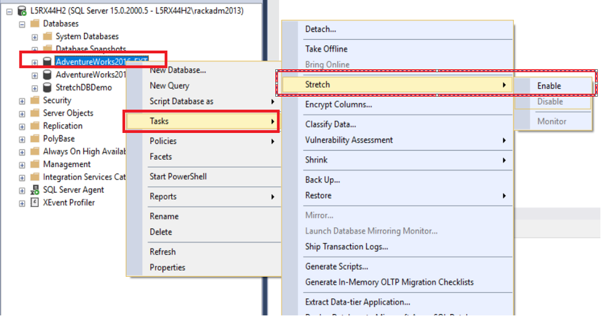
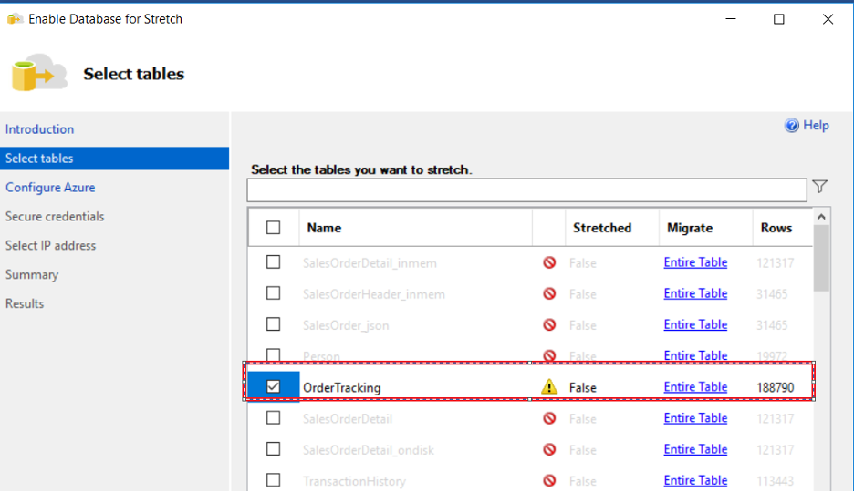
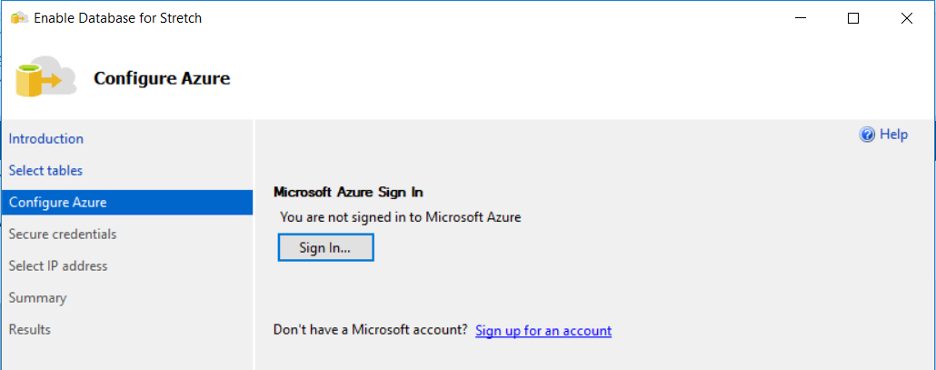
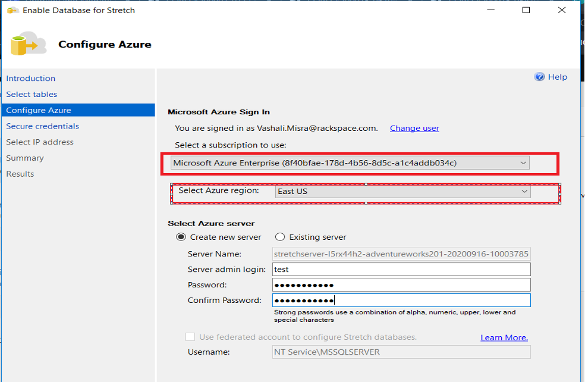
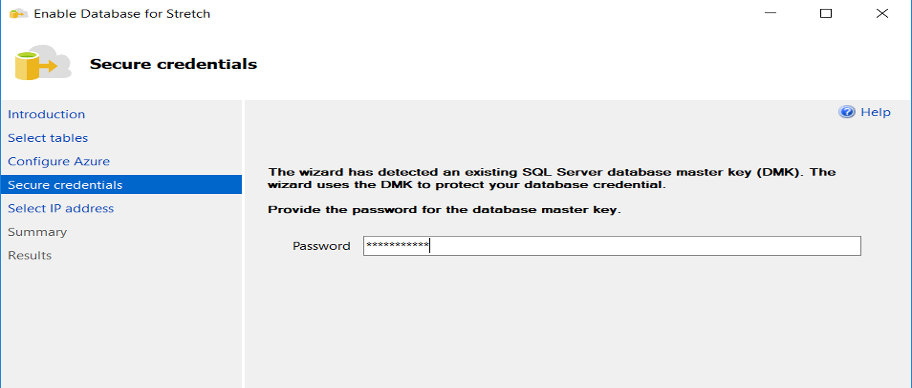
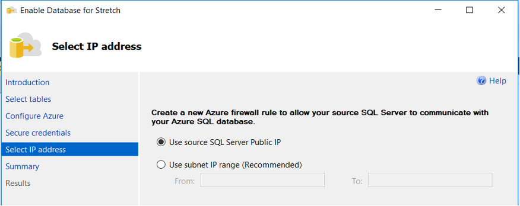
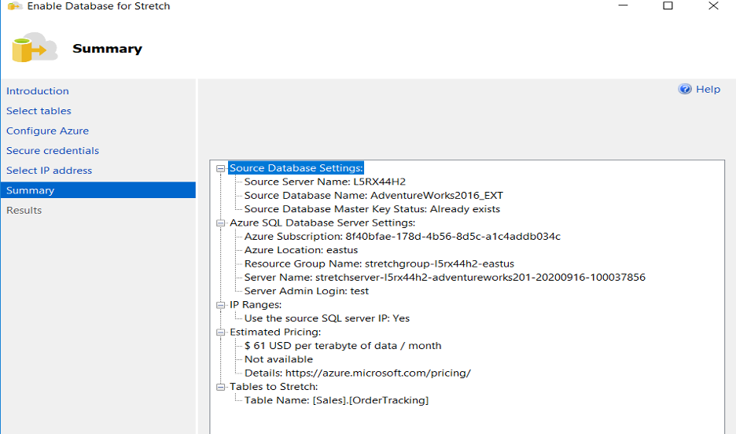
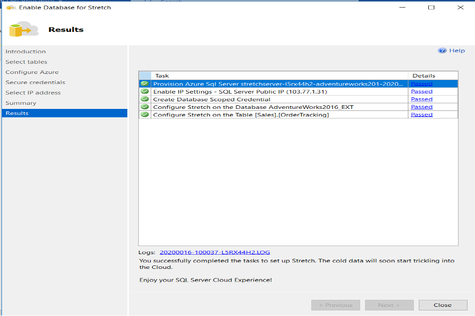
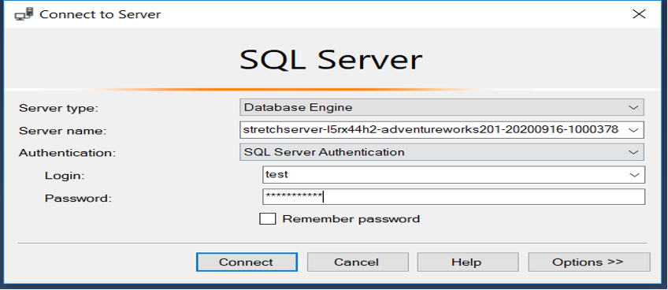
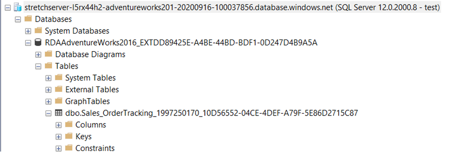

Hello, everyone. I am here with a very simple but great topic that helps improve our database
(DB) in a few ways&mdash;Stretch Database!! 

<!--more-->

So, let's get started.

### What is Stretch Database?

SQL 2016 introduced a feature that could help us stretch the data from on-premises to Azure
cloud.  This functionality, Stretch Database (or StretchDB), helps archive cold (infrequently
accessed) data from a local SQL Server&reg; to Azure&reg; while keeping warm (frequently
accessed) data on the local SQL Server. StretchDB is helpful in scenarios when we have lots
of historical data that is accessed rarely.

### Stretch DB is a boon

- Easy and hassle-free migration of cold data from on-premises to Azure SQL DB helps
  improve the performance of local queries, as they make use of warm data or local data most of the time
- No code needed for data migration, hence no extra overhead on local SQL Server 
- No need to change the application code to query the archived data
- Store archived data at a lower cost in Azure than locally
- Local DB backup, restore, and maintenance activities take much less time with archiving
  cold data because they now must play with only hot data

### Let's see how to use StretchDB

To demo StretchDB, we need:

- A local SQL Server
- An Azure subscription

I downloaded the **AdventureWorks2016_EXT.bak** DB backup and restored it on my local SQL
server for this demo. Download the file 
[here](https://docs.microsoft.com/en-us/sql/samples/adventureworks-install-configure?view=sql-server-ver15&tabs=ssms).

### Configure tables in StretchDB

1. Connect to your local SQL Server, right-click on
   **AdventureWorks2016_EXT**->**Tasks**->**Stretch**->**Enable**.

{{}}

 

2. Select the tables that are needed to be archived. The ones not supporting StretchDB
   display greyed out.

{{}}

 

3. When prompted, sign in to your Azure environment.

{{}}

 

4. After you sign in to your Azure account, select the subscription and region where you
   want to archive your data.

{{}}

 

5. Provide the password for DMK.

{{}}

 

6. Create an Azure firewall rule for communication.

{{}}

 

7. Review the summary and click **Finish**.

{{}}

 

8. On successful completion, the following screen displays. We can also check the generated
   logs for details.

{{}}

 
 
9. Now, let's verify the data migrated to Azure SQL DBs. Connect to Azure SQL DB from your
   local SSMS like any other SQL Server. Be sure to save the credentials you created for
   the Azure SQL DB in Step 4 because you'll use them for the connection.

{{}}

 

The following image shows the table we created:

{{}}

 
 
### Conclusion 
 
By following these very simple steps, we can gain performance improvement as well as cost
efficiency.

Let me know in the comments how you liked this post and if you want to see a second part
with more details.

<a class="cta teal" id="cta" href="https://www.rackspace.com/professional-services/data">Learn more about Rackspace Data Services.</a>

Use the Feedback tab to make any comments or ask questions. You can also click
**Sales Chat** to [chat now](https://www.rackspace.com/) and start the conversation.
