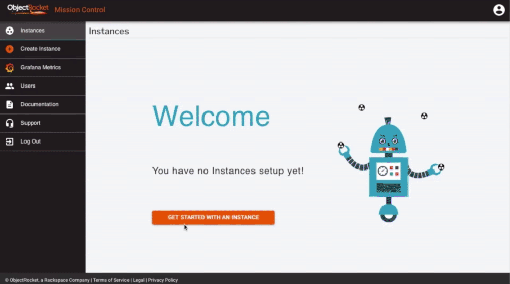

*Originally published on January 30, 2020, at ObjectRocket.com/blog*

{{}}

<!--more-->

We first made our PostgreSQL service available in 2019 and we're pleased to announce that PostgreSQL is Generally Available (GA). We’ve provided updates along the way and just like our other recent GA products (CockroachDB and Elasticsearch), we wanted to ensure its success. We’re excited to reach this milestone and to share it with you all.

### How do you eat an elephant? 

PostgreSQL is used in so many different environments that the number of capabilities we needed to include in a hosted service is daunting. We’ve been working at it for the past few months and here’s how the new service stacks up:

| Service | PostgreSQL |
| ------- | ---------- |
| Versions Supported| 11 - 12.3|
| Cloud Availability | AWS, GCP, and Azure| 
| High Availability| Optional with 1-2 replicas|
| Backups| 2-week retention with Point-in-Time-Recovery included|
| Extensions| Standard list available (activate with **create extension**) |
| Monitoring and Metrics| Grafana dashboards included |
|Support | 24x7 support, with free migrations, tuning, query analysis, and more|

### Available now for your production workloads

Create a PostgreSQL instance, it's simple and you can do it by logging into [Mission Control](https://app.objectrocket.cloud/?__hstc=227540674.6c2da1a33c3f4e98dc8ac794308ed907.1602515328573.1603988241226.1603990372194.73&__hssc=227540674.1.1603990372194&__hsfp=3796701661&_ga=2.19141296.921919633.1603746187-1358969005.1602515327) configuring an instance, and building. We rovide a 200 USD introductory credit for new accounts, which will cover various sizes and types of PostgreSQL, so you can try out the service risk-free.

{{}}

We’re always open to feedback, so if there’s a region, feature, or size that you don’t see in the UI, please contact Rackspace ObjectRocket [sales](https://www.rackspace.com/). We’re constantly updating the product and what you need is right around the corner.

<a class="cta blue" id="cta" href="https://www.rackspace.com/data/dba-services">Learn more about Rackspace DBA Services.</a> 

Use the Feedback tab to make any comments or ask questions. You can also click
**Sales Chat** to [chat now](https://www.rackspace.com/) and start the conversation.
