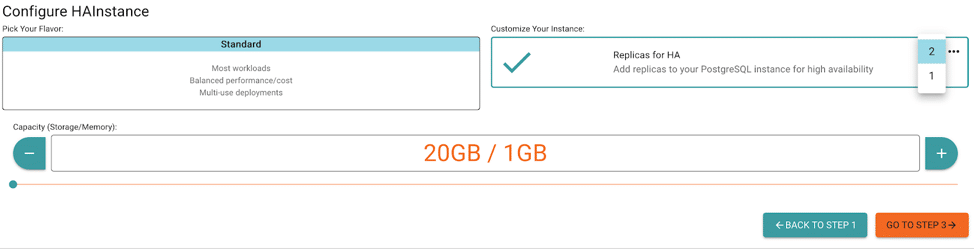

*Originally published on Dec 12, 2019, at ObjectRocket.com/blog*

The holidays are coming, and this season marks a one-year anniversary of an important milestone in the Rackspace ObjectRocket history.
Just in time for the 2019 holiday season, we introduced **High Availability** (HA) on the ObjectRocket PostgreSQL&reg; service. Every
datastore we offer on ObjectRocket is built for production workloads, requiring HA for all our clients.

<!--more-->

{{}}

### Why is HA important? 

If the term *HA* is unfamiliar to you, let’s do a quick review of why HA is important. First and foremost, the three main benefits of HA are:

+ Zero or greatly reduced downtime
+ Protection against data loss
+ Increased database performance

There are several methods for implementing HA across datastores and several technologies available. However, a key component to almost
any HA solution is a data replica. This means you only see one dataset or database, but behind the scenes, there are one or more exact
replicas (copies) of that data. If the main database, the *primary*, in most replication schemes, encounters an issue such as hardware
failure, software failure, or corruption, a replica can replace the master. That last point touches on the second main component of most
HA systems, an automated failover mechanism (promotion, or election, in other schemes). Replication ensures multiple available healthy
copies of the data. However, you should also be ready to:

1. Detect unexpected problems on the primary.
2. Select an appropriate replica to promote to primary.
3. Repair the failed primary and create a new replica (to replace the one that you promoted).

The final component, sometimes combined with the second, is a device to route requests to the right node. If you point your
application to the primary for writing data (best practice) and that primary fails, your application won't point to the newly
promoted primary. Once again, there are various ways to solve this, but the most popular is to use proxies or load balancers.
Point your application to the proxy or load balancer, and it determines the right place to send your traffic without pointing
your application directly to the database server.

To tie it all together, the automated failover system and proxy/load balancer work together when a failover occurs. When you
promote a new master, the proxy or load balancer directs traffic to the new master. Nothing changes in your application, and
besides a potential blip in responses during promotion, the application doesn’t even need to know a promotion has occurred.
This is a high-level overview of the process, which covers the fundamental components. Now let’s dive into the technologies
that we use for each of those components of our solution.

### The technologies we use

Now that we’ve reviewed the key components, let’s dive into how we’re providing each of the preceding components:

#### Replication

Postgres supports many replication schemes natively. You can currently configure one or two replicas, but we’ll be expanding
the options in the future. Another fine point of replication is the concept of *synchronous* and *asynchronous*
replication. With synchronous replication, the primary waits for each replica to confirm that a write finishes before
the primary considers the write complete. In asynchronous, the primary fires writes to replicas but doesn’t confirm their
completion before confirming the application or client write. The solution we use enables us to support both asynchronous
and synchronous replication. By default, we enable synchronous replication, and we configure the replication in our environment
to confirm that a write has been written to the Write-ahead Log (WAL) on the primary and to at least one replica. You can alter
the settings per either transaction or session.

#### Failover and promotion

There are several open-source and third-party tools out there to provide failover and promotion functionality, but
we chose **Patroni** because of the following superior characteristics:

+ **Native Kubernetes&reg; support:** We based our new platform on Kubernetes, so you can adopt a tool that just plugs
  into Kubernetes, instead of needing another state or consensus mechanism. This option is key.
+ **Active development and community:** The community around Patroni is extremely active and enables to collaborate and
  contribute our own additions as functionality grows. In addition, there are plenty of resources, from conference talks
  and documentation to an operator example from **Zalando**, to help us learn the technology.
+ **Simple Architecture:** Many of the other available tools require dedicated resources outside of the Postgres instances
  to handle load balancing and primary promotion. Patroni wraps around Postgres and uses native Kubernetes components to
  handle the other functions, so we didn't allocate additional resources to HA.

Though your mileage might vary, we’ve found Patroni to be an excellent easy to configure and maintain fit in our environment.
You basically tell Patroni which HA group a node is part of, and it does the rest. It configures replication, detects failed
primaries, promotes replicas, creates new replicas, and even works with Kubernetes on the last part of the process.

#### Request routing

Finally, Patroni and a native Kubernetes construct, called a *service*, represent the final piece of the puzzle. A service in
Kubernetes operates like a proxy that routes traffic based on labels on a group of containers (a pod). Patroni labels the active
primary with a *master* label, and Kubernetes takes care of routing database traffic only to the pods with the master label.
Remember this a high-level description, but in practice that’s how it works. This process can also be extended to provide a
secondary port that routes database read requests to the replicas (to reduce the load on the primary).

That’s a quick rundown of the technologies in place, but let us know if you’d like to hear more. We love to talk shop with our customers.

##### Try it out now!

The **Create an Instance** screen in **Mission Control** has a section under Step 2 called **Customize Your Instance**.  There
you can click the box to turn the arrow green, which adds HA replicas of your PostgreSQL instance. You can also select the number
of replicas (one or two) by clicking the ellipses (…) in the upper-right. 

{{}}

By default, we recommend two replicas, so that even during an outage you have redundancy, but you can select one.

<a class="cta purple" id="cta" href="https://www.rackspace.com/data/dba-services">Learn more about Rackspace DBA Services.</a>

Use the Feedback tab to make any comments or ask questions. You can also click **Sales Chat** to [chat now](https://www.rackspace.com/) and start the conversation.
