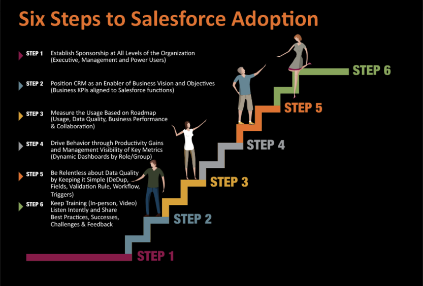

This post shares six key steps to Salesforce adoption that ensure strength in your
adoption by your team and help guarantee that your Salesforce&reg; adoption is
efficient and effective.
<!--more-->

{{}}

### 1. Sponsorship

In the initial stages of your project, it is imperative to establish a wide
support base throughout your organization. As a good practice, start at the
executive level, guaranteeing you receive top-quality assistance from the
top down. To ensure their support, you must help executives understand how
Salesforce helps grow their business, such as by increasing revenue and engagement
within your support team. Involving executives initially, and building a
business case around them, will establish credibility and success.

### 2. Enablement

Make the Salesforce platform an enabler of business visions and objectives. After
you have the executive-level buy-in, create a unique business case, focusing on
the entire lead-to-cash business process, including sales, marketing,
fulfillment, customer service/success, and finance. This focus provides a way to
enable your entire process within your environment.

### 3. Usage

Measure the usage based on the following roadmap: First, define an
implementation plan and then, focus on adoption. To do this, teams should focus
on defining the metrics around adoption, log in day-to-day versus just
pipelines in each of these areas. It is also important to focus on driving the
right levels of metrics around each specific domain to ensure usage is evolving.
Of course, metrics will differ depending on the department observed,
whether it is marketing seen through lead generation or sales seen through
opportunities.

### 4. Management

Drive behavior through productivity gains and management visibility of key
metrics. There are two aspects to these key metrics:

- Make the platform simple and accessible enough to make an individual able to
  use it.
- Keep the management involved in monitoring activity. Management should be
  monitoring key metrics as well as organizing their Salesforce dashboards to
  track these metrics.

### 5. Data management

Be relentless with data quality through data validation procedures and by
keeping it simple, setting up standards, and encouraging your team to follow
these procedures. Good data management practices can ensure high-quality data by eliminating the chance
for duplicate accounts and inaccurate information. Having data management procedures in place
allows better visibility, quality data, and accurate pipelines. Salesforce provides
many tools to help with data quality, and proper implementation helps provide
processes within your organization.

### 6. Training

Providing timely training, including sharing best practices, successes, challenges, and feedback
received, keeps your team ever-evolving and up to date. Examples of training methods could include
in-person seminars, how-to training videos, and lunch-and-learns. Providing regular and appropriate
training ensures that your business continues to improve user adoption.

### We can help

By increasing focus in the areas of sponsorship, enablement, usage, customer and data management, and training,
we can help make certain that your business reaches its full adoption potential. 

<a class="cta purple" id="cta" href="https://www.rackspace.com/salesforce">Learn more about Salesforce Customer Relationship Management (CRM)</a>

Visit [www.rackspace.com](https://www.rackspace.com) and click **Sales Chat**
to help achieve adoption within your business.

Use the Feedback tab to make any comments or ask questions.
