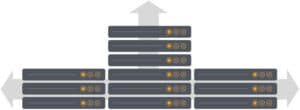

*Originally published on June 4, 2018, at ObjectRocket.com/blog*

We could define **scaling** as removing the scales from a fish. However, with databases, **scaling** refers to having the ability to expand to meet additional needs around storage, disk, RAM, CPUs, compute cycles, networking, or other resources.

<!--more-->

{{}}

### How do you know when it’s time to scale?

Today, it’s common to see the rapid growth of data and rapid adoption rates for applications. For example, when apps start to go viral and usage takes off. When this happens, you’ll outgrow your initial environment rapidly. That growth can happen due to physical data storage needs, performance hits, and degradation that would require more resources. Think CPU, RAM, networking, or a combination of all of those areas. You can either proactively plan for growth or you may choose to scale when you start seeing smaller performance hits.

#### Scaling proactively

At least two general patterns may take place when you proactively plan to scale:

+ You have a big marketing push coming up and you'll grow significantly in the number of customers and/or amount of data.
+ Your application or business tends to be cyclical (e.g., Christmas buying, New Years’ resolutions, etc.) and you will see an activity increase in activity or events that will lead to capturing and keeping a high volume of data.

Read our blog: [how to determine when it’s the right time to scale your MongoDB instances](https://www.objectrocket.com/blog/how-to/when-to-scale-mongodb-instances/).

#### Scaling reactively

You hit bottlenecks and you expect to continue to grow, therefore, you need to think about scaling.

Trouble signs include things like:

+ Increased query times for end-users
+ Increased login times
+ Requests and servers freezing up
+ Database complaints from developers
+ Slower server response times
+ Increased load on hosts
+ Out-of-memory errors
+ Unintended elections
+ Errors in the logs

When you start seeing these signs, it’s time to start scaling so you can keep up with demand and make sure you aren’t losing customers. 

You can scale **Vertically** (Up) or **Horizontally** (Out)

{{}}

#### Scaling Vertically

This is the proverbial Big Iron method: One big machine with lots of resources (CPU cores, higher CPU speeds, lots of RAM, storage).
The main benefits of vertical scaling include reduced architectural complexity and fewer hosts to maintain. This is helpful if you don’t have anyone to handle maintenance for you.

Several ways to scale vertically are available today. Some of those options include better commodity hardware, cheaper disks and storage, better storage options, cheaper memory, better software, and networking so you can more gracefully handle failovers and interruptions.

Scaling up is ideal for many applications and needs, and we recommend the **Replica Sets** we discuss in the following section. One thing to keep in mind with using larger replica sets is that there might be hidden costs to scaling vertically. If your environment continues to grow rapidly, you may have to constantly be moving to larger machines or have additional resources until you reach a point where that is no longer an option. You should also consider that upgrade cycles are less efficient on a single larger host versus a horizontally scaled environment. With continued growth, you have to decide whether to continue to scale up or if you feel that you might benefit from scaling horizontally.

#### Scaling Horizontally

Sharding is horizontal scaling. Sharding stores data across multiple nodes, distributing the load, and the processes across the hosts. Replication is handled via Master-Slave with the ability to add additional nodes as needed.

The ‘chunks’ of data are distributed by the Balancer across the disks on the nodes.

This increases read and write capacity by distributing read and write operations across a group of machines, instead of hammering one machine with writes or with reads. Luckily, there have been great improvements in balancer function over the last few releases. Scaling horizontally takes advantage of MongoDB&reg;’s built-in sharding ability and also benefits from the ability to use cheaper commodity hardware.

When you scale horizontally, you add resources with physical or virtual hosts.

+ Physical – lots of lower-cost commodity hardware
+ Virtual – add additional CPU cores or nodes via VMs or cloud
+ Networking – add load balancers, additional mongoS&reg; processes, etc.

Utilizing improved load balancing technologies (hardware and software) to shuttle traffic to where it needs to go via load balancers, etc.

#### How is Replica Set Scaling Implemented in MongoDB?

MongoDB can scale out horizontally via single large Replica Sets using one **Primary** and two **Secondaries** with heartbeat communication for up/down state with replication occurring to the secondaries via the operational logistics.

#### Horizontal Scaling: Replica Set or Sharding?

The trade-off you make in sharding comes with some increased overall complexity. But sharding also provides the benefit of simplifying maintenance by allowing for rolling upgrades and the ability to perform certain operations such as index builds in parallel at the same time across your shard/nodes.
Here are some comparisons between using larger Replica Sets vs. Sharded Clusters:

| **Replica Set** | **Sharding** |
| --------------- | ------------ |  
| Simple | Expertise needed |
| Lots of Reads across a wide data set (Don’t want to scatter gathers) | Lots of Writes/Updates (Want to go directly to exact shards for results) |
| Lots of data, lower activity rates | Lots of data, lots of activity |
| Need more “normal” resources – ex. just disks | Need more of all resources – Disks, RAM, CPU, write scopes |

### Why managed MongoDB from ObjectRocket?

Rackspace ObjectRocket means **expertise**. We have been managed [MongoDB](https://www.objectrocket.com/managed-mongodb/) at scale from the get-go. We offered support for larger replica sets. But we were one of the first providers to offer support for larger sharded MongoDB clusters. Our engineers and DBAs have the experience and have overcome very complex obstacles, obstacles that are commonly unheard of for other providers.

Some of our largest customers in the marketing technology vertical (mobile analytics, media, email campaigns, mobile advertising fraud detection, and digital media) often hit bugs that no one else will see or know how to fix. Billions of messages and documents from a variety of customers. Thousands of large and small campaigns, our platform hosts them all. 

The service we provide includes: 

+ Infrastructure
+ Storage
+ IOPS
+ Network
+ The best hands-on support, hands-down. The right response 24×7.

[View plans and pricing](https://www.objectrocket.com/pricing/)

We aim to provide cloud solutions that offer fully robust setups and not provision your **secondaries** on virtual volumes thus avoiding performance issues that may arise if an election occurs and your **primary** ends up on the less robust hosts provisioned only for secondaries. That’s it for scaling. Tune in to a future blog that will cover how to determine when to [scale your MongoDB instances](https://www.objectrocket.com/blog/how-to/when-to-scale-mongodb-instances/), sharding tips, selecting the best shard keys, and more.

<a class="cta purple" id="cta" href="https://www.rackspace.com/data/dba-services">Learn more about Rackspace DBA Services.</a>

Use the Feedback tab to make any comments or ask questions. You can also click
**Sales Chat** to [chat now](https://www.rackspace.com/) and start the conversation.
