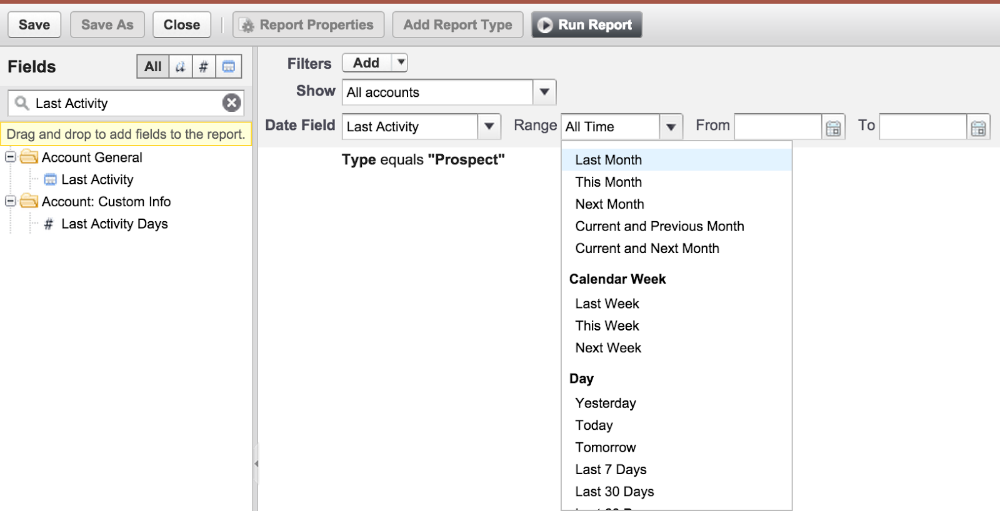
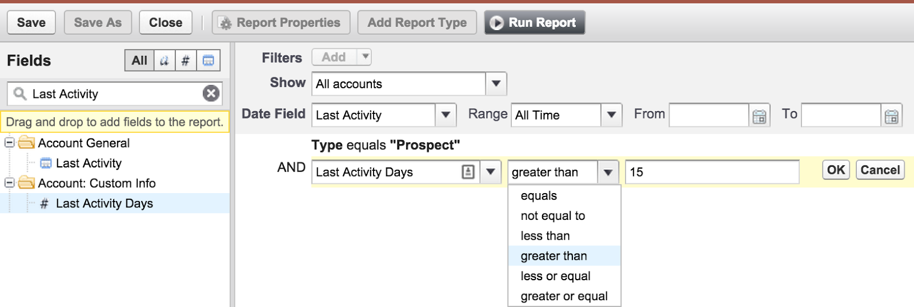

Replace with short intro sentence or two.

<!--more-->

Every day, people successfully navigate their way through the day using multiple
processes to complete daily tasks. The simple task of arriving at the office and
returning home involves a very thorough set of subconscious processes to ensure
that we don’t get lost or forget our house keys at the office.
When it comes to business operations, process is critical. For example,
manufacturing a product requires a specific sequence of steps to
ensure a successful outcome.

A company’s sales activity is no exception, process is important. Consider a
simple example of selling a product to a customer who walks into a retail store:

1. Greet the customer upon entry to the store.
2. Ask the customer about the reason for their visit.
3. If a specific product is mentioned, offer additional information or
   assistance.
4. When prepared to purchase, ask the customer if they found everything they
   need.
5. Offer the customer a discount if they sign up for a rewards program.
6. Complete the purchase and extend appreciation for their business.

For a retail corporation, it is important that each step is completed to ensure
a consistent customer experience. To enforce these steps, the company will
likely provide training as well as a sales handbook to all associates; however,
for many organizations, their *sales handbook* needs to be more fluid, powerful
and provide metrics.

Using Salesforce, the sales processes can be automated, tracked and reported in
order to enforce critical sales processes. Below are 3 ways you can leverage
Salesforce to create an electronic handbook that is always up-to-date and
will help establish and improve process-based sales strategies.

### Tip #1: Utilize tasks

Using tasks, organizations can let Salesforce worry about reminding the team
about the next steps in the process. Tasks can be created and assigned to any
user within Salesforce manually or configured automatically using
**Workflows**.

The earlier retail sales example outlined a set of tasks to be completed during
a sales transaction. Companies should outline the specific set of tasks their
sales team should follow and use **Tasks** in Salesforce to reinforce those
processes.

As shown in the example below, tasks are easy to create from any object,
including opportunities.

{{}}

Alternatively, Salesforce can be configured to automatically create a set of
tasks based on a set of business rules. In the example below, we are creating a
task when an account has not had any activity for 15 days or more.

{{}}

### Tip #2: Generate reports on past activities

In Salesforce, reports provide an excellent way to produce visualizations and
metrics. Reports can provide insight on how the sales process is progressing,
pivoting metrics across prospects, industry segments, sales representatives,
etc.

An important aspect of understanding the status of the sales process, is
determining whether prospective customers aren’t receiving the required
attention. In the example below, a standard field, **Last Activity Date**
is used to find accounts where the last sales activity was logged within a
specific time range.

{{}}

In the example below, a custom formula field, **Last Activity Days** is used to
determine the number of days since the last activity.

{{}}

With just a couple minutes of time to create the custom field, reports can be
created or customized to reveal accounts or other objects without recent sales activity.

### Tip #3: Configure Opportunity Stages

Using a more structured method to measure the progress of an opportunity with a
prospective customer can help reinforce sales processes. One way to do this is
to have opportunity stages correlate strongly with the progressive steps in a
structured sales process. Below is an example.

{{}}

In Salesforce, the **Opportunity object** is critical in tracking and assessing the
value of a prospective customer. The stage of an opportunity is an important
aspect, which can enable several key functions:

1. Weight the pipeline based on sales stage.
2. Enable reporting on the number and types of opportunities by stage.
3. Identify trends/patterns of which stage requires the most time.

If you need help configuring Salesforce to establish and/or improve your sales
process to help drive more sales, **contact us** to
[schedule](https://www.rackspace.com/) a business process review with one of our
engineers
