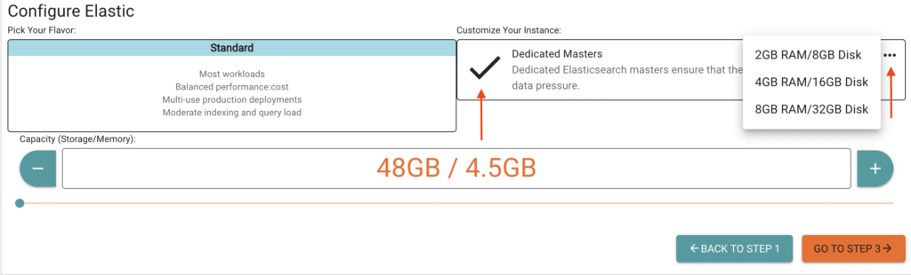

*Originally published on Dec 16, 2019, at ObjectRocket.com/blog*

Hooray, yet more features on our ObjectRocket Elasticsearch offerings!

We’ve had great success with the Elasticsearch&reg; product on Rackspace ObjectRocket, and are excited about having dedicated master nodes! For those in need of larger, more reliable clusters, separating the master role responsibilities and assigning them to a dedicated node increases stability across your entire cluster.

<!--more-->

{{}}

### What’s a dedicated master node?

A master node is responsible for cluster management tasks, such as creating and deleting an index, keeping track of all nodes, and sharding (horizontal allocation). Dedicating one node to take care of the cluster management work means that this dedicated master can focus on its work, and allow the data nodes to do the heavy lifting of searches, indexing, and data-specific work.

For much smaller clusters, one can get away with configuring a node to have both master and data roles. However, because the master node is key for stability and smooth operations of the entire cluster, we recommend using a dedicated master node, especially for larger clusters. Following best practices for master nodes, we always create three master nodes for a new instance and choose to add master nodes. Having an odd number of master nodes enables one node to act as a tie-breaker, and avoids cases of **split-brain** which can cause loss of data integrity. You always get three master nodes, and the number of data nodes you create is based on the capacity (storage/memory) that you select when creating the cluster.

#### How to configure dedicated masters?

At Rackspace ObjectRocket, we always strive to make spinning up new databases with the features you want as easy as possible. No need to configure your cluster manually; everything can be done through [Mission Control](https://auth.objectrocket.cloud/login?state=g6Fo2SBOSTlHMWJScTlBSGlieTlTTFhIRVd2RVBBVEV3Y29nQqN0aWTZIDhHdXJJbWhxTTdSeDh6Q2hjN3FMZmVndTZYOU5UbTIxo2NpZNkgVFpENzVQcm55b1pBSUNtSjNSYjJHMEw4VkM0bzBib2M&client=TZD75PrnyoZAICmJ3Rb2G0L8VC4o0boc&protocol=oauth2&response_type=token%20id_token&nonce=a6b4042d-9e2a-42cb-8793-3c5c0575b5a2&scope=openid%20email%20name&redirect_uri=https%3A%2F%2Fapp.objectrocket.cloud%2Fsession-callback&audience=https%3A%2F%2Fapi.objectrocket.cloud&_ga=2.20012347.223325436.1604418088-1358969005.1602515327&__hsfp=3796701661&__hstc=227540674.6c2da1a33c3f4e98dc8ac794308ed907.1602515328573.1604508534085.1604513908066.87&__hssc=227540674.1.1604513908066), our User Interface (UI), within a few minutes.
You can select the option to configure dedicated master nodes when creating a new instance in our **mission control**. You can also specify the size of the dedicated master nodes by clicking on the **ellipses** (…) icon in the upper right of the UI. This is done in Step 2 of creating a new instance, as shown in the image below.

{{}}

Our dedicated master nodes come in three different sizes:

+ 2GB RAM / 8GB Disk
+ 4GB RAM / 16GB Disk
+ 8GB RAM / 32GB Disk

Generally speaking, if the data nodes (your storage nodes) in your cluster are 8Gb to 32GB in size, you should choose 2GB RAM master nodes. With bigger storage nodes, between 64GB and 128Gb, you should choose the 4GB RAM master node. For clusters with data nodes over 128GB, go for the 8GB RAM master nodes.
If you have any questions about sizing a dedicated master node or any other Elasticsearch&reg; questions, please [reach out to us](https://auth.objectrocket.cloud/login?state=g6Fo2SBOSTlHMWJScTlBSGlieTlTTFhIRVd2RVBBVEV3Y29nQqN0aWTZIDhHdXJJbWhxTTdSeDh6Q2hjN3FMZmVndTZYOU5UbTIxo2NpZNkgVFpENzVQcm55b1pBSUNtSjNSYjJHMEw4VkM0bzBib2M&client=TZD75PrnyoZAICmJ3Rb2G0L8VC4o0boc&protocol=oauth2&response_type=token%20id_token&nonce=a6b4042d-9e2a-42cb-8793-3c5c0575b5a2&scope=openid%20email%20name&redirect_uri=https%3A%2F%2Fapp.objectrocket.cloud%2Fsession-callback&audience=https%3A%2F%2Fapi.objectrocket.cloud&_ga=2.20012347.223325436.1604418088-1358969005.1602515327&__hsfp=3796701661&__hstc=227540674.6c2da1a33c3f4e98dc8ac794308ed907.1602515328573.1604508534085.1604513908066.87&__hssc=227540674.1.1604513908066) and we will help you.

#### What’s next?

Dedicated master nodes are currently only available for new instances. We’re always improving our products here at Rackspace ObjectRocket to give our customers the very best offerings and services. Please feel free to reach out to us if you have any questions or feature suggestions not only for Elasticsearch but for any of our products! Last but not least, if you have any databases you’d like us to support, we’d be more than happy to hear about it as well.

<a class="cta teal" id="cta" href="https://www.rackspace.com/data/dba-services">Learn more about Rackspace DBA Services.</a>

Use the Feedback tab to make any comments or ask questions. You can also click
**Sales Chat** to [chat now](https://www.rackspace.com/) and start the conversation.
