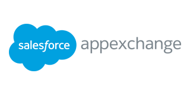
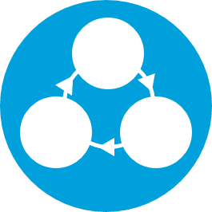
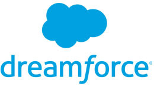

These are some of the capabilities and solutions achievable with Salesforce&reg;.

<!--more-->

{{}}

Salesforce is much more than a Customer Relationship Management (CRM) system. It
is an enterprise-wide software solution that allows you to run many aspects of
your business, increase your company’s ROI, and improve efficiency within your
organization. You can customize it to meet the demands of any business,
regardless of your business model. Take a look into the Salesforce Ecosystem.
 

### Salesforce capabilities and AppExchange

{{}}
You can run your Sales, Marketing, Customer Service and Support,
Business Intelligence, Accounting, Project Planning/Tracking, and more initiatives on the
Salesforce platform. The [AppExchange](https://appexchange.salesforce.com/) has
exponentially grown to over 3,000 certified apps! They give you access to
business apps, components, consultants, and partners so you can customize
Salesforce to fit your business needs. Some prevalent apps include the following:

- E-signature apps, such as [HelloSign](http://www.hellosign.com/),
  [DocuSign](https://www.docusign.com/), and [Adobe Sign](https://acrobat.adobe.com/us/en/sign.html) (formerly EchoSign))
- Email analytics and workflow apps such as Salesforce IQ, 
- Geo-mapping aps, such as [Map Anything](http://mapanything.com/)
- Marketing analytics
- Accounting and ERP integration, and more. 

Rackspace can help you with implementation, new enhancements, ongoing projects, and recurring Salesforce maintenance. 
 
 
 
 

### Training and Evolution

{{}}
Salesforce can evolve with your business. Salesforce Preferred Partners such as
Rackspace, can offer custom training options based on your business needs to
allow for advanced projects, improve system utilization, and allow you to
explore new capabilities and tools. We start by understanding your business
process first, and then apply the right technology. 

### Salesforce Local and Partner Events

{{}}

In addition to the annual Salesforce user conference Dreamforce, there are also
hundreds of [local and partner events](http://www.salesforce.com/events/). 
These events are an excellent way to
increase adoption, answer your pressing business challenges, and allow the
opportunity to network with Salesforce experts and customers about their
Salesforce journeys. Frequent Salesforce Partner events give you
the most bang for your Salesforce investment buck.
 

### We can help

Contact us today to learn more about the Salesforce Ecosystem and how
RelationEdge will help you get the most value from Salesforce.

<a class="cta purple" id="cta" href="https://www.rackspace.com/salesforce">Learn more about Salesforce Customer Relationship Management (CRM)</a>

Use the Feedback tab to make any comments or ask questions. You can also click
**Chat** to [chat now](https://www.rackspace.com/) and start the conversation.
