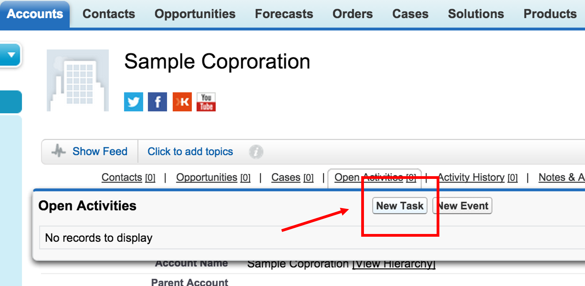
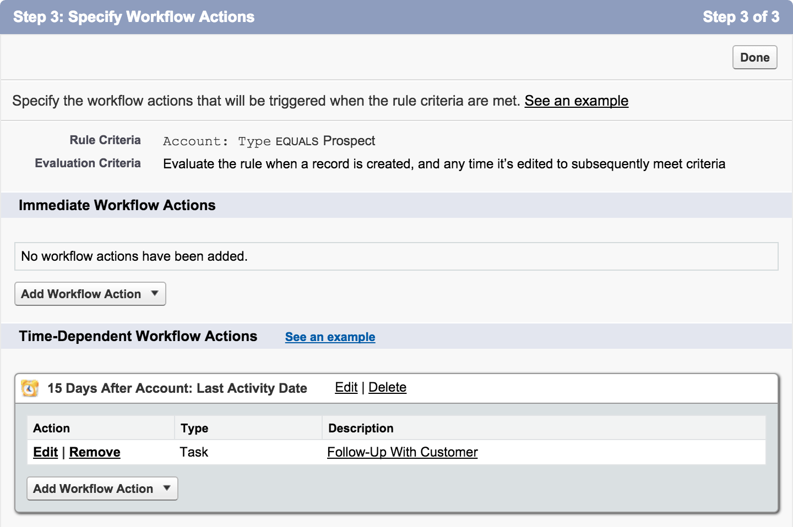
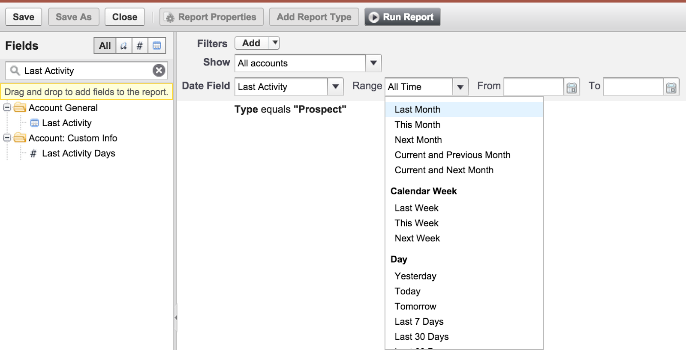
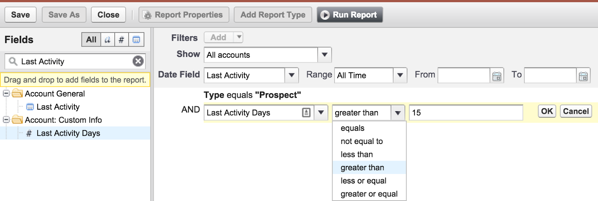
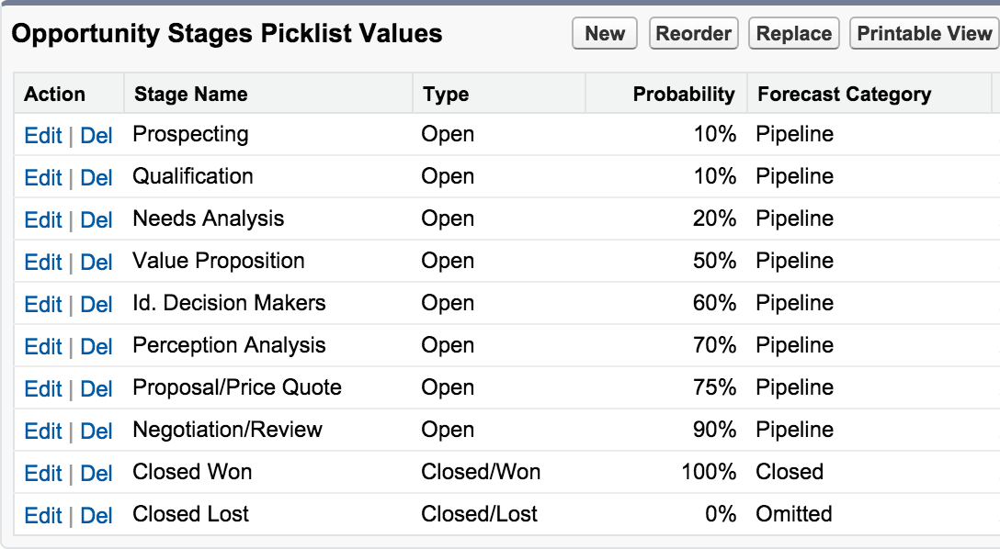

Business operations are critical and require a specific sequence of steps to
ensure a successful outcome. Training, following a sales handbook, and configuring
Salesforce&reg; metrics are some of the strategies that can make your sales process
more dynamic.

<!--more-->

### Introduction

Every day, people successfully navigate their way through the day using multiple
processes to complete their daily tasks. The simple task of arriving at the office and
returning home involves a very thorough set of subconscious processes to ensure
that we don’t get lost or forget our house keys at the office.
When it comes to business operations, process is critical. For example,
manufacturing a product requires a specific sequence of steps to
ensure a successful outcome.

A company’s sales activity is no exception&mdash;process is important. Consider a
simple example of selling a product to a customer who walks into a retail store:

1. Greet the customer upon entry to the store.
2. Ask the customer about the reason for their visit.
3. If the customer mentions a specific product, offer additional information or
   assistance.
4. When prepared to purchase, ask the customer if they found everything they
   need.
5. Offer the customer a discount if they sign up for a rewards program.
6. Complete the purchase and extend appreciation for their business.

For a retail corporation, it is important to complete each step to ensure
a consistent customer experience. To enforce these steps, the company
likely provides training and a sales handbook to all associates. However,
for many organizations, their *sales handbook* needs to be more fluid and powerful.
It should also provide metrics.

Salesforce can automate, track, and report the sales processes to enforce critical sales
processes. The following three tips let you leverage Salesforce to create an electronic
handbook that is always up-to-date and establishes and improves process-based sales strategies.

### Tip #1: Use tasks

By using tasks, organizations can let Salesforce worry about reminding the team
about the next steps in the process. You can create tasks and assigned them to any
user within Salesforce manually or automatically by using **Workflows**.

The previous retail sales example outlined a set of tasks for an employee to complete
during a sales transaction. Companies should outline the specific set of tasks their
sales team should follow and use **Tasks** in Salesforce to reinforce those
processes.

The following example demonstrates that tasks are easy to create from any object,
including opportunities:

{{}}

Alternatively, you can configure Salesforce to automatically create a set of
tasks based on a set of business rules. In the following example, we create a
task when an account has not had any activity for 15 days or more:

{{}}

### Tip #2: Generate reports on past activities

In Salesforce, reports provide an excellent way to produce visualizations and
metrics. Reports can provide insight into how the sales process is progressing and
pivot metrics across prospects, industry segments, sales representatives,
and so on.

When you consider the status of the sales process, you should determine
whether prospective customers are receiving the required
attention. In the following example, you can use the standard field, **Last Activity Date**,
to find accounts where the last sales activity was logged within a
specific time range:

{{}}

In the following example, use the custom formula field, **Last Activity Days**, to
determine the number of days since the last activity:

{{}}

By taking just a couple minutes to create a custom field, you can create or cutomize
reports to reveal accounts or other objects without recent sales activity.

### Tip #3: Configure opportunity stages

By using a more structured method to measure the progress of an opportunity with a
prospective customer, you can reinforce sales processes. One way to do this is
to have opportunity stages correlate strongly with the progressive steps in a
structured sales process, as shown in the following example:

{{}}

In Salesforce, the **Opportunity object** is critical in tracking and assessing the
value of a prospective customer. The stage of an opportunity, an important
aspect, can enable several key functions:

1. Weight the pipeline based on the sales stage.
2. Enable reporting on the number and types of opportunities by stage.
3. Identify trends or patterns that indicate which stage requires the most time.

<a class="cta teal" id="cta" href="https://www.rackspace.com/salesforce">Learn more about Salesforce Customer Relationship Management (CRM)</a>

If you need help configuring Salesforce to establish or improve your sales
process to help drive more sales, visit [www.rackspace.com](https://www.rackspace.com) and click **Sales Chat**
to schedule a business process review with one of our engineers.

Use the Feedback tab to make any comments or ask questions.
