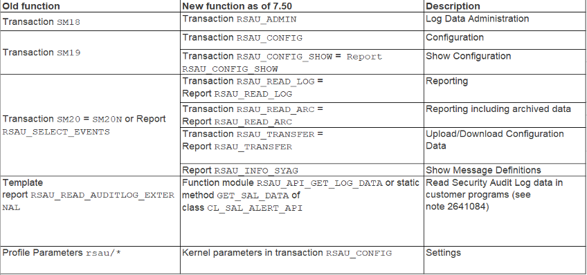
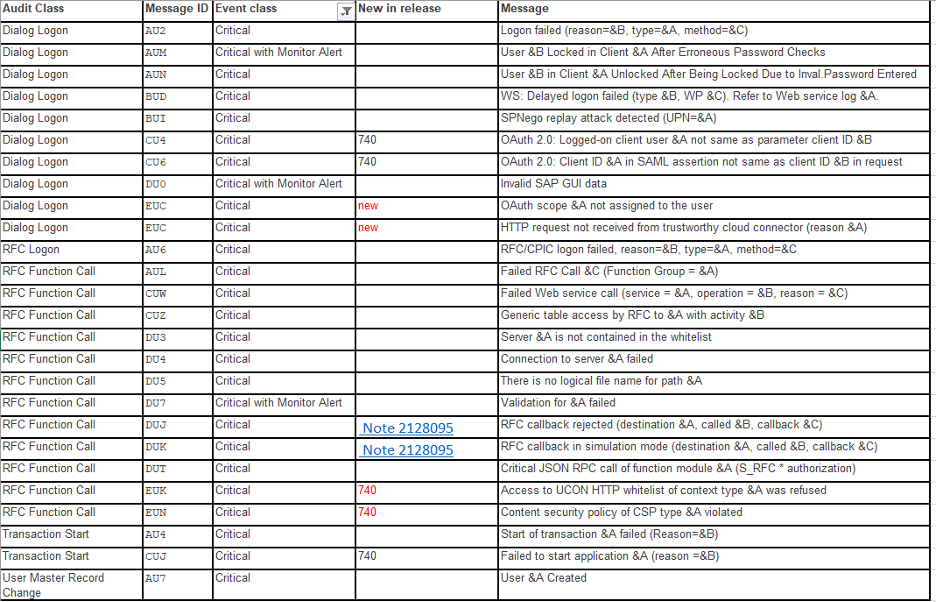

This post introduces SAP&reg; Security Audit Log.

<!--more-->

### Overview

According to
[SAP](https://help.sap.com/doc/saphelp_nw73ehp1/7.31.19/en-US/c7/69bcb7f36611d3a6510000e835363f/frameset.htm):
The Security Audit Log records "security-related system information such as changes to
user master records or unsuccessful login attempts. This log is a tool designed for
auditors who need to take a detailed look at what occurs in the AS ABAP system. By
activating the audit log, [the SAP system keeps a record] of those activities that you
specify for your audit. [Customers] can then access this information for evaluation in the
form of an audit analysis report.

"The Security Audit Log provides for a long-term data access. The audit files are retained
until you explicitly delete them. Currently, the Security Audit Log does not support the
automatic archiving of the log files; however, you can manually archive them at any time. 

"You can record the following information in the Security Audit Log:

- Successful and unsuccessful dialog login attempts
- Successful and unsuccessful RFC login attempts
- RFC calls to function modules
- Changes to user master records
- Successful and unsuccessful transaction starts
- Changes to the audit configuration"

According to [Enterprise Threat Monitor](https://www.enterprise-threat-monitor.com/sap-log-analysis/):
"SAP security audit log is the main location for the traces of events triggered by the
system or by applications, which are related to security. [It is in the form of a table.] 
Based on the configuration which event types must be recorded, it saves the data to the
disk on the SAP application server instance." Specify the audit files location by setting
the profile parameter, **rsau/local/file**, in the SAP system.

A [SAP blog](https://blogs.sap.com/2016/05/17/sap-security-audit-logs-which-event-types-should-i-enable-there-are-90-of-them/)
adds: "Since security audit logs are stored on the file system and not the database, they
[do not impact performance]. The main consideration of the operations teams is the storage
requirements. Based on the activated event types (audit classes), the data volume [can vary]."

### Configuration of Security Audit log

There are two configuration options in the security audit log:

- Set Profile parameters
- Use appropriate filter configuration using SM19 or RSAU_CONFIG

#### 1. Profile parameters 

Set profile parameters based on your release.

A) For releases earlier than 740: In the default profile, **default.pfl**, of the system,
   set the following profile parameters:

   - rsau\/enable=1
   - rsau\/user\_selection=1
   - rsau\/selection_slots=10 (or higher)
   - rsau\/integrity=1 (if available - see SAP Notes 2033317 and 1810913)

B) For releases 740 to 751: Call transaction SM19. Activate the Security 
Audit Log by performing the following steps:

   1. Select the **Security Audit active** checkbox on the **Kernel Parameters** tab. 
   2. Activate both **Generic User Selection** and **Integrity Protection Format**. 
   3. Set the number of selection filters to at least 10. 

C) For releases 752 and later: Call transaction RSAU_CONFIG. Activate the Security Audit
   Log by performing the following steps:

   1. Select the **Static security audit active** checkbox under
      **Security Audit Log Configuration -> Parameters** in the tree. 
   2. Activate both **Generic User Selection** and **Integrity protection format active**. 
   3. Set the **Number of Filters per Profile** to 10, which is the minimum requirement. 

**Note:** When you use the Kernel parameters in the Security Audit Log configuration (step
1B or 1C), existing settings with the same name in the system's profile are ignored. For
more information, see
[SAP Note 539404](https://sapsecuritystuff.files.wordpress.com/2017/05/sap-note-539404_faq-for-audit-logs.pdf),
answer 1a.

#### 2. Setting up appropriate filter configurations 

To set up filters, perform the following steps:

1. Call transaction **SM19** or **RSAU_CONFIG**. Create a new profile. 

2. Create the following filters:

   - All clients (`*`), user `SAP#*`: Record all events. The character `#` serves to mask
     `*` as non-wildcard.
   - All clients (`*`), user `<your emergency user IDs>*`: Record all events.
   - Client 066, all users (`*`): Record all events.
   - All clients (`*`), all users (`*`): Record all events except AUW, AU5, AUK, CUV, DUR,
     and EUE (deactivate via **Detailed Display**).

3. Save and activate the profile.

4. Finally, check the configuration. If you have made changes to the profile parameters or
   the static profile, restart the system to make them effective. Until you can restart the
   system: Convert the static profile to a dynamic profile and activate it.

### Analysis of Security Audit log

Call transaction **SM20/SM20N**, or its equivalent transaction depending on your SAP
Netweaver version (see the following table), and give the required selection criteria as
input. Click **Reread Audit log** to get the configured audit log for your system. 

**Table: Old and New functions of Transactions and reports related to the Security Audit Log** 

{{}}

*Table Source: [https://blogs.sap.com/2014/12/11/analysis-and-recommended-settings-of-the-security-audit-log-sm19-sm20/#jive_content_id_Recommended_Settings_for_the_Security_Audit_Log_SM19__SM20](https://blogs.sap.com/2014/12/11/analysis-and-recommended-settings-of-the-security-audit-log-sm19-sm20/#jive_content_id_Recommended_Settings_for_the_Security_Audit_Log_SM19__SM20 )*

According to a
[SAP blog post](https://blogs.sap.com/2014/12/11/analysis-and-recommended-settings-of-the-security-audit-log-sm19-sm20/):
"You can view the long text of the Security Audit Log event messages using transaction
**SE92** (or in transaction **SE61** if you choose the document class SL (Syslog). Using
note [1970644](https://launchpad.support.sap.com/#/notes/1970644), you can get report
**RSAU\_INFO\_SYAG** which shows all the events of the Security Audit Log including the
current status of activation. The detail view allows you to create a HTML-based event
definition print list including the full documentation."

It primarily depends on customer requirements to enable all successful and non-successful
events for all clients and users. The
[SAP post](https://blogs.sap.com/2014/12/11/analysis-and-recommended-settings-of-the-security-audit-log-sm19-sm20/)
continues: "There is no performance impact, not in time nor in space, if you log
unsuccessful (=critical) events as these events happens rarely. As soon as you start logging
successful events you might look to space&mdash;the growing size of the audit
files&mdash;but still not to time, as the Security Audit Log is optimized for speed."

SAP offers functionality to email Security Audit Logs with the help of reports
**RSAU\_SELECT\_EVENTS** or **RSAU\_READ\_LOG**. Schedule any of these reports as a background
job to receive the audit log from the SAP system.

The following table gives an overview of the critical events messages store in the audit
log for different audit classes.

**Table: Critical events of Dialog, Transaction, RFC, and User audit classes** 

{{}}

*Table source: (https://blogs.sap.com/2014/12/11/analysis-and-recommended-settings-of-the-security-audit-log-sm19-sm20/#jive_content_id_Recommended_Settings_for_the_Security_Audit_Log_SM19__SM20)[https://blogs.sap.com/2014/12/11/analysis-and-recommended-settings-of-the-security-audit-log-sm19-sm20/#jive_content_id_Recommended_Settings_for_the_Security_Audit_Log_SM19__SM20]*

### Conclusion

Switching on Security Audit log for all the clients and users is a crucial step in security
as it provides detailed information on the audit reports. Its benefits far outweigh its
costs and provide long term data access. I strongly recommended that you enable Security
Audit log, especially in production environments.

<a class="cta teal" id="cta" href="https://www.rackspace.com/sap">Learn more about our SAP services.</a>

Use the Feedback tab to make any comments or ask questions. You can also click
**Sales Chat** to [chat now](https://www.rackspace.com/) and start the conversation.
