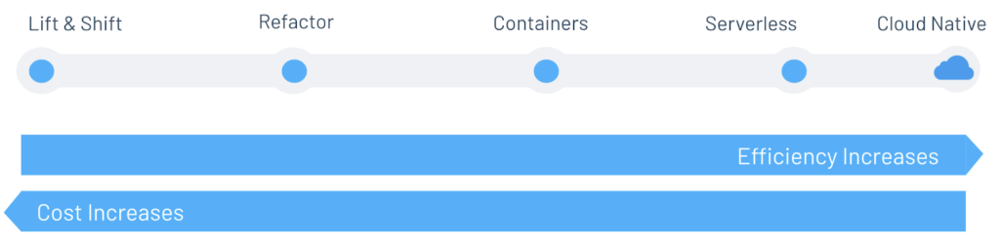
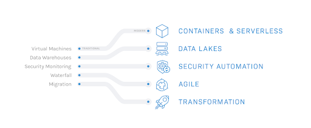

*Originally published on August 8, 2020 at Onica.com/blog*

Cloud computing has been one of the more prominent technological phenomena in
recent years, seeing companies across geographies and industries turning to
cloud services to access a range of features and capabilities that augment
their products, simplify management, improve ROI, reduce capital
expenditure, and significantly improve scalability to meet rapidly growing
demand.

<!--more-->

In a company’s quest to unlock these benefits, organizations are embarking on
their own cloud migration journeys. As each journey is unique it’s important
to realize that cloud adoption isn’t a one-size-fits-all solution. Realizing
the benefits of cloud computing will depend on each organization’s unique
business model, timeline, and other dependencies portrayed by their legacy
software and applications. Companies must carefully consider their objectives
when adopting the cloud: what migration path will help you fulfill your
goals and what considerations lie beyond technological adoption?

### There is more than one path to cloud adoption

After considering the viability of the cloud for your business objectives, the
next step involves assessing the various paths of cloud migration that differ
in speed, comprehensiveness, and outcomes. As we explore the spectrum of
cloud adoption approaches, we’ve identified several distinct approaches that
organizations tend to follow — each with their own benefits and tradeoffs.

{{}}

- **Life and shift**: Copy and paste legacy workloads and processes to the
  cloud. This approach will get you to the cloud quickly but comes with very
  few actual cloud benefits.

- **Refactor**: Identify "low hanging fruit" to modernize with minimal effort.
  Easily replace legacy infrastructure with cloud PaaS services.

- **Containers**: Modernize server management and configuration and automate
  application deployment with no rewrite required.

- **Serverless**: Manage code only, no servers required. With this fully
  managed approach, you pay for only what you consume, not what you
  provision.

While the lift-and-shift approach may sound like the path of least
resistance, this method yields much fewer benefits of the cloud and carries
forward much of the same fragility and static nature found in the data
center. On the other end of the spectrum, companies may choose to go fully
cloud-native and use infrastructure technology such as serverless computing
or containers, refactoring their applications to work effectively on these
environments. This approach may require more upfront considerations but will
yield significant improvements in scalability, reliability, portability,
efficiency, and ROI in the long run.

As these approaches veer towards cloud native infrastructures, they tend to
require an upfront investment of increased time and effort to manage the
initial complexity, however, the payoff is realized in the long-term benefits
that offer a well structured migration that is future-proof and offers
access to greater sets of advantages derived from the cloud.

### The benefits of cloud native

{{}}

If your business can greatly benefit from the cloud’s unique capabilities,
going cloud native and adopting technologies such as Containers and Serverless
computing to host your applications can yield the greatest value. Your
organization’s data, now stored on data lakes, can not only be fed to your
applications and workloads, it can also be fed into machine learning and data
analytics algorithms to derive insights that can help you improve business
processes and discover untapped opportunities. Furthermore, cloud native
approaches enhance tasks such as security monitoring and application
development, streamlining and accelerating them through automation and agile
development workflows.

Going cloud native allows you to leverage event driven architectures so that
you only pay when events are triggered, minimizing expenditure on idle
resources. The pace of innovation is also significantly improved through
accelerated iteration releases and new feature development. By representing
services and infrastructure as code, environments become repeatable and can
be launched in minutes; development teams can therefore spin up environments
concurrently and perform tests without having to wait for procurement, allowing
them to quickly verify, package and send new application versions into
production.

### Evolving beyond technology

Adopting a cloud native strategy means that changes must be implemented beyond
just the technology. Organizational changes across people and processes are
necessary for an effective and prudent migration.

A company’s teams must be organized to follow an agile approach, removing
blockages and hurdles wherever possible. Teams may also need to take
application ownership from development to production and new skill sets may
need to be acquired to develop effectively on the cloud. Processes such as
agile delivery, DevOps culture, CI/CD, and rapid iteration in weekly sprints
must be employed to avoid creating process bottlenecks when trying to
achieve the full pace of delivery afforded by the cloud. Finally, automation
must be implemented, utilizing pipelines such as Migration-as-code and
Infrastructure-as-code, as well as automating application testing to maximize
the acceleration of innovation and time to production.

### What's next?

The next step is to choose a strategy to move your workloads and applications
effectively, minimizing disruption and maximizing realized benefits. These
can range from developing a cloud foundation for proof-of-concepts to
deploying existing applications into best practice defined landing zones.
Using migrations as code pipelines, large scale migrations of many applications
can be undertaken in a controlled but expedited manner. For all-new
applications and development, greenfield application development allows you
to leverage all the powerful and unique cloud native features such as
continuous scalability, and flexibility to event driven architectures upon
which you only have to pay for the resources you utilize, realizing savings
when workloads are idle.

To learn about these strategies in detail, or gain more insights into how you
can implement an optimal cloud migration for your business, watch our
[Modern Cloud Adoption Webinar](https://onica.com/videos/modern-cloud-adoption-reimagine-your-journey-to-the-cloud/)
where we will dive deeper into the various paths to cloud adoption and discuss
tools and accelerators developed by AWS, such as the Pre-Migration Cost
Assessment or the AWS Cloud Adoption Framework that can help guide you through
your migration effort. If you’re ready to begin your journey to the cloud and
would like to know how Onica can help,
[get in touch](https://onica.com/contact/) with our
[cloud adoption](https://onica.com/services/cloud-adoption/) experts today!
