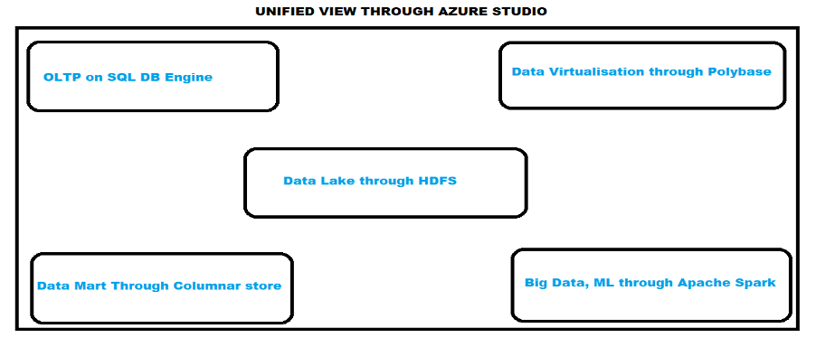

In 2006, British mathematician Clive Robert Humby marked the words: "Data is the new Oil." 
Since then, IT leaders have repeatedly heard this, resonated with the idea, and augmented
it at every step.

<!--more-->

Clive further added, "Data is valuable, but if unrefined, it cannot really be used. The way
Oil has to be changed into gas, plastic, chemicals, etc. to create a valuable entity that
drives profitable activity; so, data must be broken down and analyzed for it to have value."  

IT leaders could not agree more and have strived to find multiple versatile techniques
to extract meaningful information from data.

### The SQL Server data platform

Towards that end, SQL Server&reg; has massively expanded and is no longer just a 
*database engine* but a *data platform*.

Following are some of the best things about SQL 2019:

- **Intelligence over any data**: SQL Server 2019 has gone beyond playing with relational
  data and can now handle structured and unstructured data, using the power of modern Big Data
  clusters with enhanced data virtualization (Polybase).
- **Choice of language and platform**: SQL Server is no longer platform-dependent and can
  now run on Windows, Linux, and containers. Also, SQL has in-built integration with Python,
  R, and so on.
- **Industry-leading performance**: SQL Server offers advanced scalability, performance,
  and availability for mission-critical, smart applications, Datawarehouse, and Data Lakes.
- **Advanced security features**: SQL Server has been reported as the least assailable over
  the last nine years in the National Institute of Standards and Technology (NIST)
  vulnerabilities database.
- **Insights in minutes and rich reports**: Use SQL Server Reporting Services in
  conjunction with Power BI reports producing valuable interactive reports.

With data stretching the boundaries, applications running on near real-time data, and crucial
query-performance requirements, we need not just a DB engine but a smart data platform. Today,
organizations must play with a broad set of data to let the business run seamlessly. They
use data from different sources&mdash;from relational databases, such as SQL and ORACLE, to
massive data warehouses and data marts, to Big Data. Having versatile data sources can be
challenging as each data source has a different architecture, storage mechanism resulting
in the need to have various skillsets and specialty expertise.

### A unified data platform

SQL Server 2019 brings all this under one cover in the form of a *unified data platform*.
SQL Server 2019 yields a more enriched SQL DB engine, provides scalability with built-in support
for Big Data (Apache&reg; Spark, Data Lake), grants data virtualization technology, and
offers built-in machine learning, Python, and R capabilities.

SQL Server 2019 presents a unified data platform by using:

- SQL DB Engine for OLTP
- Data virtualization through Polybase
- Data Mart through columnar store
- Data Lake through HDFS
- Big Data, ML, streaming through Apache Spark

Another critical part is the management and monitoring of these inter-related pieces. You
can achieve this by using command-line tools, APIs, portals, and Dynamic Management Views
(DMV). Microsoft&reg; also provides us with Azure&reg; Data Studio (ADS), which gives us a
unified view. Azure Data Studio offers a modern editor experience with IntelliSense, code
snippets, source control integration, an integrated terminal, built-in charting of query
result sets, and customizable dashboards.

{{}}

With SQL Server 2019 at hand, organizations can use not just the SQL relational DB
engine but also a tremendous volume of Big Data on a centralized, scalable platform.
Furthermore, by using PolyBase to virtualize the data stores, form data lakes, build
scalable data marts and SQL Server 2019, and use Big Data clusters to produce intelligent
applications, any organization can become more successful.

### Conclusion

I know this is a broad topic and a single post is not enough, so I will provide deep dives
into the individual SQL 2019 aspects in my future posts. Stay tuned!

<a class="cta red" id="cta" href="https://www.rackspace.com/data">Learn more about our Data services.</a>

Use the Feedback tab to make any comments or ask questions. You can also click
**Sales Chat** to [chat now](https://www.rackspace.com/) and start the conversation.
