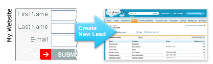
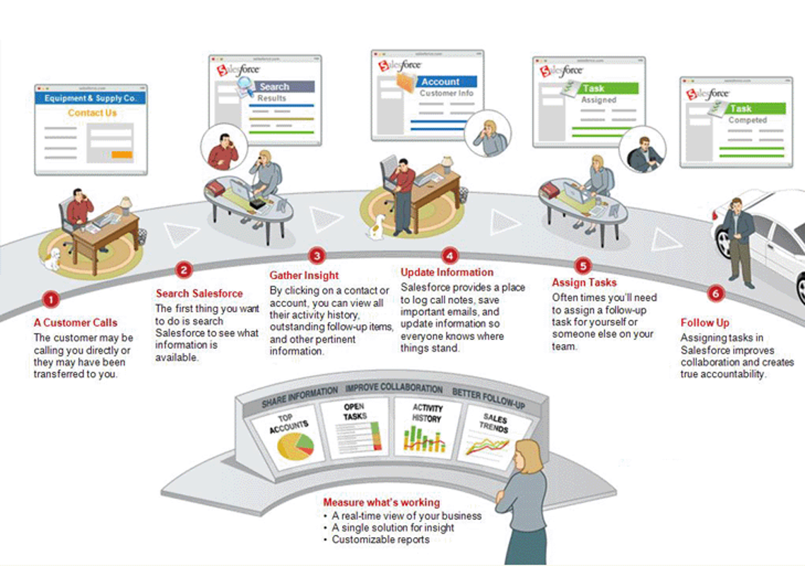

Replace with short intro sentence or two.

<!--more-->

Did you know that Salesforce can actually help you drive sales? Sales teams are often only
using Salesforce as a glorified Rolodex when they could be leveraging so much more. Improve
your sales using Salesforce in the following ways:

### 1) Set up web-to-lead

{{}} With just a few clicks,
you can generate HTML code that you can embed in your website. When
a potential customer submits the form, Salesforce automatically creates a Lead. If you have
set up *lead assignment rules*, they can instantly notify your sales team of the new lead.
The sooner you call leads, the more likely you are to win deals. You can also track and
report on all incoming Leads, not just the ones your team enters into the system.

### 2) Keep track of your sales process

Do you have defined steps in your sales process? Do you know which steps get skipped or
where your sales reps get stuck? By setting up sales stages and probabilities that match
your process, you can create trending reports to see movement through your pipeline and
coach individual reps when deals get stuck.

{{}}

### 3) Help your sales manager be *in the know*

{{}} By leveraging reports
and dashboards, your sales manager can quickly see where deals are
in the pipeline, what has closed, and what is about to close. In addition, by setting up
Big Deal Alerts, your sales manager can be notified of large opportunities when they reach
critical stages. Instead of spending time asking reps what is in their pipeline, sales
meetings can focus on moving deals to the next step, overcoming objections, and closing
strategies.

### 4) Better coordination across teams

{{}} Ever had multiple
sales reps call the same customer in the same week without any coordination?
Would you even know? If you have been contacted by the same company several times, you know
this does not increase your desire to buy from them. That is why it is important to make
sure the right person is working each Lead.

Additionally, have you called on a customer only to find out they have an open issue with
Customer Service? Check Salesforce first, then call. Your customers will be much more
impressed if you ask if they are satisfied with how an issue is being handled instead of
pitching a new product or service.

### 5) Keep sales moving with automated tasks

Have you ever lost a sale because you didn’t remember to follow up with a customer? Set up
automated tasks to ensure timely follow up throughout the sales process. You can set up
tasks based on the sales stage, time elapsed, opportunity type, and so on. These tasks help
your reps manage their day and make sure they are talking to their customers regularly and
not letting deals fall through the cracks.

### We can help

Salesforce can be a tool that not only manages your important contacts but allows you to
manage your sales process actively, drive sales, and ensure your sales reps are working
efficiently. We can help you configure these features and review your current business
processes to identify ways you may be able to use Salesforce to drive more sales for your
business. Contact us today to schedule a business process review.

<a class="cta blue" id="cta" href="https://www.rackspace.com/salesforce">Learn more about Salesforce Customer Relationship Management (CRM)</a>

Use the Feedback tab to make any comments or ask questions. You can also click
**Sales Chat** to [chat now](https://www.rackspace.com/) and start the conversation.
