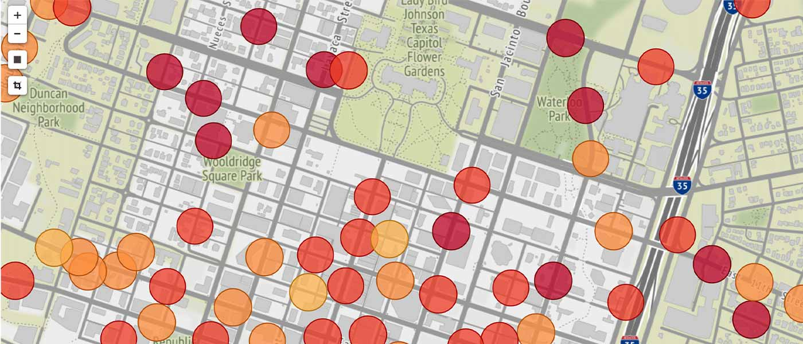
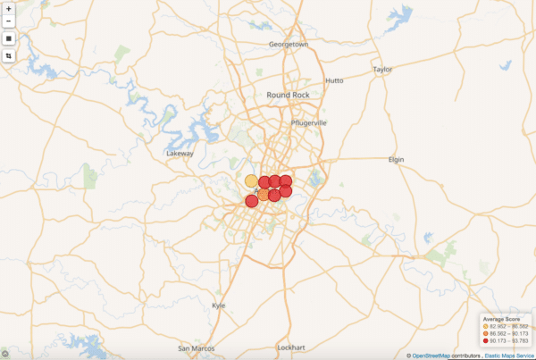
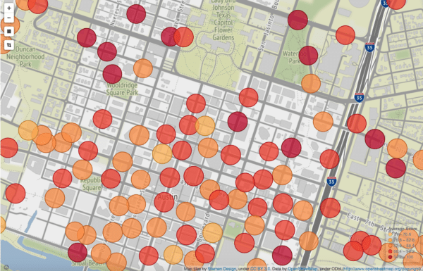
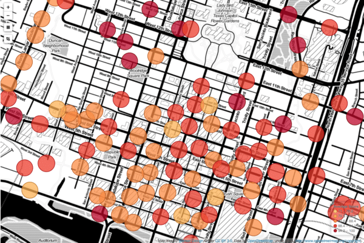
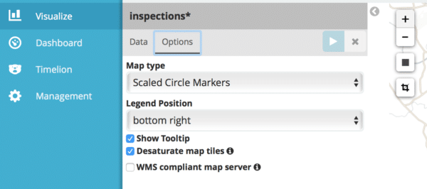
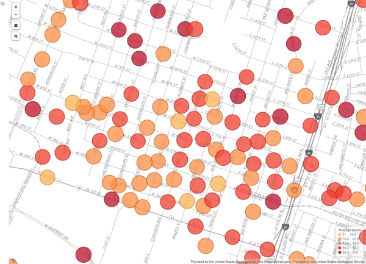

*Originally published in Feb 2018, at ObjectRocket.com/blog*

Out of the box, [Kibana&reg;](https://www.objectrocket.com/resource/why-use-kibana-for-data-visualization/)includes the ability to display geo-data on maps provided by **Elastic’s tile service**. This article provides a great introduction to what Kibana can do! 

<!--more-->

{{}}

Kibana includes the ability to display geo-data on maps provided by Elastic’s tile service. However, the maximum zoom level is limited if you don’t have an X-Pack license. For example, the maximum zoom for Rackspace ObjectRocket’s home base of Austin, Texas looks somethong similar to this: 

{{}}

The good news is that it’s easy enough to configure Kibana to use another tile service or WMS compliant mapping server.

### Why Use a Different Mapping Service?

The Elastic tile service is a great benefit to all users, but there may be times you want to diverge from the default service. These are some of those additional features:

+ Zoom further to street-level data
+ Add new layers or provide a different map style
+ View a fully custom map, like the inside of a building, for example.

What these all boil down to is finding a server that provides the data you want and then configuring Kibana to use that server.

Unfortunately, Kibana can cause a bit of confusion because it can leverage two completely different types of map services. We’ll introduce those before we jump into how to use them. 

By default, Kibana draws maps from a Tile Map Service, or [TMS](https://en.wikipedia.org/wiki/Tile_Map_Service). Tile services chop up maps into square tiles that you can access by their coordinates and zoom level. This is what **Elastic** provides with their service and its global configuration resides inside the `kibana.yml`configuration file.  An alternate way to display maps in Kibana is to use a WMS-compliant Map Service, or [WMS](https://en.wikipedia.org/wiki/Web_Map_Service). A web map service operates using a different protocol and generates maps from data in a GIS database. This can be set from within the **Kibana UI**.

#### Using third-party map services

There are a number of [commercial map services](https://www.mapbox.com) out there, as well as free data sources for creating maps like [OpenStreetMap](https://www.openstreetmap.org/#map=5/38.007/-95.844). For testing purposes, there are free tile services based on OpenStreetMap, like [Stamen](http://maps.stamen.com/#terrain/12/37.7707/-122.3781), that you can test with. On the WMS side, there are also some free map servers for testing, like the [National Map](https://www.usgs.gov/core-science-systems/national-geospatial-program/national-map) in the US. Finally, there are options for setting up your own mapping service, which we’ll cover later.

#### Setting up Kibana to use a different tile service

By default, mapping for Kibana is based off of a tile service. [Stamen](http://maps.stamen.com/#watercolor/12/37.7707/-122.3781), it is one of our favorite free to test services and offers a number of sharp map styles, so we’ll test with that. You’ll need access to your `kibana.yml`file to make this change, so if you’re on a hosted service, like [Rackspace ObjectRocket](https://www.objectrocket.com/managed-elasticsearch/) for Elasticsearch, you can use a local [kibana](https://docs.objectrocket.com/elastic_local_kibana.html?_ga=2.86619996.579553409.1604936705-1358969005.1602515327) install to test it out first. Once you’ve located the `kibana.yml` file, add the following entries:

    tilemap.url: "https://stamen-tiles.a.ssl.fastly.net/terrain/{z}/{x}/{y}.jpg"
    tilemap.options.maxZoom: 20
    tilemap.options.attribution: 'Map tiles by [Stamen Design](http://stamen.com), under [CC BY 3.0](http://creativecommons.org/licenses/by/3.0). Data by [OpenStreetMap](http://openstreetmap.org), under ODbL(http://www.openstreetmap.org/copyright).'

The first setting is the url for the tile service and follows the usual format that standard tile services use.

    endpoint/{z}/{x}/{y}.jpg/png

Note that Stamen has a number of cool styles, like ‘toner’ and ‘watercolor’, that you can use by replacing ‘terrain’ in the url. The second setting is the maximum number of zoom settings. Some services don’t advertise this, so it will just require a little trial and error. Finally, and very importantly is properly attributing the maps to the creator. The attribution markdown will be displayed in the lower right corner of the map visualization.

Once that’s set and you restart Kibana, you’ll now see that you can zoom a lot further and get some pretty cool stylized maps. Compare the picture below to the one above:

{{}}

{{}}

#### Connecting to a WMS Map from Kibana

The configuration is a little different for a WMS map and must be set within Kibana itself, rather than from the configuration file. For this example, I’ll use the United States Geological Services’ Nationalmap, specifically transportation maps so we can play with the different layers available. First, you’ll need to load up a coordinate map visualization in Kibana and then click the “options” button. From there, you’re going to select “WMS compliant map server.”

{{}}

Once you select that, a bunch of new settings will display. You’ll need to fill in the URL for the WMS server, which layers to use, which version of the WMS standard the server is running, image type to load, and what styles to use. These settings are described in the [Kibana documentation](https://www.elastic.co/guide/en/kibana/current/tilemap.html#_options).

This is a bit more complicated than the tile service which just takes a few coordinates, but luckily the map service we’ll use has some tools built in. First of all, if you go to the Nationalmap page, it will give you a nice description page of the map and its features. This page describes the map and all of its layers. If you want more details about the maps capabilities, click on the little `WMS` link at the top, and you’ll see some detailed XML of the server’s capabilities, like version, image formats supported and more. Based on this information and the WMS link, we’ll use the following settings for this map:

+ WMS url: https://www.usgs.gov/core-science-systems/national-geospatial-program/national-map
+ WMS layers:0,1,2,3,4,5,6,7,8,9,10,11,12,13,14,15,16,17,18,19,20,21,22,23,24,25,26,27,28,29,30,31,32,33,34,35,36
+ WMS version: 1.3.0
+ WMS format: image/png
+ WMS attribution: Provided by the United States Geological Service (Nationalmap.gov)
+ Styles: blank

One note about the layers. It looks like the map we’re using has a hierarchy of layers, but there’s no shorthand I can find for calling all of them out so just list out the individual layers. If you have that all set up, you should now be able to see a view like this:

{{}}

The WMS settings can also be set as a default for all visualizations in the Kibana Advanced Settings screen.

#### Setting up your own map or tile server

On a final note, once you want to take this into production, running your own tile/map server may be the way to go. You can do fully custom maps, like an [NHL rink](https://www.elastic.co/blog/kibana-and-a-custom-tile-server-for-nhl-data), or create street maps or topographical maps from something like OpenStreetMap and apply your own layers. There are great open source tools like geoserver, which is mentioned in the Elastic blog, or [TileCache](http://tilecache.org) that all provide tutorials and detailed docs on how to get started. Also, [OpenStreepMap](https://www.openstreetmap.org/#map=5/38.007/-95.844) provides tons of information in their wiki to help you get started along with the site [SWITCH2OSM](https://switch2osm.org) that provides resources to get started on serving OpenStreetMap data. Interested in what Elasticsearch can do for your app? We offer fully managed and hosted Elasticsearch instances complete with DBA experts that can help you get the most from [Elasticsearch and Kibana](https://www.objectrocket.com/managed-elasticsearch/) without tying up your development resources. [Contact us](https://www.objectrocket.com/contact/) for a consultation.

The following line shows how to add an image.  If you have no image, remove it.
If you have an image, add it to the post directory and replace the image name in the following line.

### Conclusion

<a class="cta purple" id="cta" href="https://www.rackspace.com/sap">Learn more about our SAP services.</a>

Use the Feedback tab to make any comments or ask questions. You can also click
**Sales Chat** to [chat now](https://www.rackspace.com/) and start the conversation.
