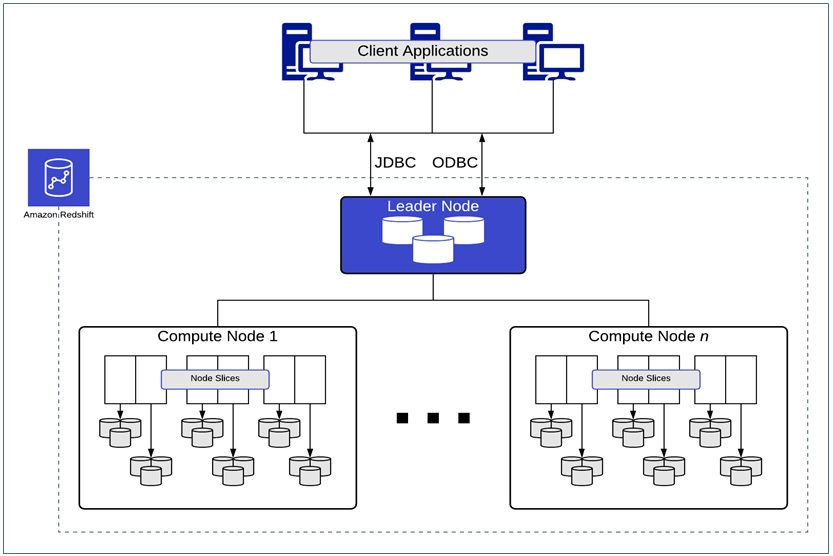

*Originally published on June 17, 2020 at Onica.com/blog*

Organizations across a plethora of industries look to use data analytics
for operations and other functions critical to success. However, as
data volumes grow, management and value-extraction can become increasingly complex.
<!--more-->

### Amazon Redshift

Amazon Redshift is a powerful data warehouse service from Amazon Web Services&reg; (AWS)
that simplifies data management and analytics. Let’s take a look at Amazon Redshift
and some best practices you can implement to optimize data querying performance.

### Data lakes vs. Data warehouse

Before digging into Amazon Redshift, it's important to know the differences
between data lakes and warehouses. A data lake, like Amazon S3, is a
centralized data repository that stores structured and unstructured data,
at any scale and from many sources, without altering the data.
Data warehouses on the other hand, store data in a reconciled state
optimized to perform ongoing analytics and only loads the data needed
for analytics from data lakes.

Amazon Redshift takes storage for data analytics one level further,
amalgamating the qualities of data lakes and warehouses into a
“lake house” approach. It allows the querying of large exabyte-scale
data lakes while remaining cost-effective, minimizing data redundancy,
and minimizing maintenance overhead and operational costs.

### Amazon Redshift architecture

To rapidly process complex queries on big data sets,
Amazon Redshift architecture supports massively parallel processing (MPP)
that distributes the job across many compute nodes for concurrent processing.

These nodes are grouped into clusters. Each cluster consists of three types of nodes:

**Leader Node** manages connections, acts as the SQL endpoint, and coordinates parallel SQL processing.

**Compute Nodes** composed of “slices,” execute queries in parallel on data stored in a
columnar format, in 1 MB immutable blocks. An Amazon Redshift cluster can contain between 1 and 128
compute nodes, portioned into slides that contain the table data and act as a local processing zone.

**Amazon Redshift Spectrum Nodes** execute queries against an Amazon S3 data lake.

{{}}

### Optimizing query performance

Extracting optimal querying performance can be mainly attributed to bringing the
physical layout of data in the cluster in congruence with your query patterns.
If Amazon Redshift is not performing optimally, leverage the following changes.

#### Reconfiguring workload management (WLM)

Often left in its default setting, tuning WLM can improve performance.
This can be automated or done manually. When automated,
Amazon Redshift manages memory usage and concurrency based on cluster resource usage.
It allows you to set up eight priority-designated queues. When
done manually, you can adjust the number of concurrent queries,
memory allocation, and targets.

You can also optimize querying performance through some WLM configuration parameters.

**Query monitoring** rules that can help you manage expensive or runaway queries.

**Short query** acceleration that helps you prioritize short-running queries over longer-running queries by
using machine learning algorithms to predict querying execution time.

**Concurrency scaling** helps you add multiple transient clusters in seconds,
to speed up concurrent read queries.

### WLM best practices

Some WLM tuning best practices include:

- Creating different WLM queries for different types of workloads.
- Limiting maximum total concurrency for the main cluster to 15 or less, to maximize throughput.
- Enabling concurrency scaling.
- Minimizing the number of resources in a queue.

### Refining data distribution

The rows of a table are automatically distributed by Amazon
Redshift across node slices, based on the following distribution styles:

- `AUTO` – Starts with ALL and switches to EVEN as the table grows.
- `ALL` – Consists of small, frequently joined and infrequently modified tables placed on the first slice of each compute node.
- `EVEN` – Consists of large, standalone fact tables that are not
   frequently joined or aggregated in a round-robin distribution across the slices.
- `KEY` – Consists of frequently joined, fact tables or large dimension tables.
   In this style, a column value is hashed and the same hash value is placed on the same slice.

Using the right distribution patterns can maximize the performance
of `JOIN`, `GROUP BY` and `INSERT INTO SELECT` operations.

### Refining data sorting

Sort keys define the physical order of data on a disk.
Table Columns used in `WHERE` clause predicates are a good choice
for sort keys and commonly use date or time-related columns.
Use Zone maps, stored in memory and generated automatically,
to define the value extremes for each block of data.
Effectively using sort keys and zone maps together can help
you restrict scans to the minimum required number of blocks.

The following diagram illustrates how table sorting focuses
scanning targets for time-based queries, thereby
improving query performance.

{{}}

### Optimal query performance best practices

Utilizing the aforementioned Amazon Redshift changes can
help improve querying performance and improve cost and resource
efficiency. Here are some more best practices you can implement
for further performance improvement:

- Using `SORT` keys on columns often used in `WHERE` clause filters
- Using `DISTKEY` on columns that are often used in `JOIN` predicates
- Compressing all columns except the first sort key column
- Partitioning data in the data lake based upon query filters such as access pattern

To explore some more best practices, take a deeper dive into the
Amazon Redshift changes and see an example of an in-depth query
analysis, read the
[AWS Partner Network (APN) Blog](https://aws.amazon.com/blogs/apn/best-practices-from-onica-for-optimizing-query-performance-on-amazon-redshift/?utm_content=131837700&utm_medium=social&utm_source=linkedin&hss_channel=lcp-25057969).

If you are embarking on a data journey and are looking to leverage
AWS services to quickly, reliably, and cost effectively develop your
data platform, contact our [Data Engineering & Analytics](https://onica.com/services/data-engineering-analytics/)
team today.

<a class="cta purple" id="cta" href="https://www.rackspace.com/onica">Learn more about Data services.</a>

Use the Feedback tab to make any comments or ask questions. You can also click
**Sales Chat** to [chat now](https://www.rackspace.com/) and start the conversation.
