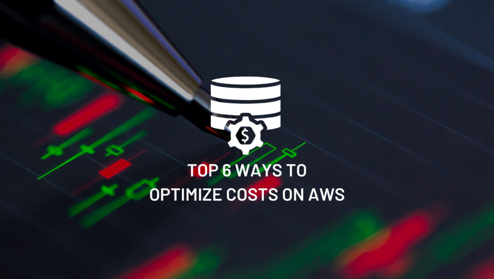

*Originally published in April 2020, at Onica.com/blog*

The cloud holds the possibility of dramatically lower infrastructure costs, faster development and innovation cycles, and increased talent efficiency. Yet, according to [Gartner](https://www.gartner.com/en), most businesses are estimated to overspend in the cloud — by up to 70%.

<!--more-->

{{}}

Amazon Web Services (AWS) Cloud Cost Optimization is not just a story about quick wins and tips and tricks (although there are plenty of those, and some key ones are below!) — at root, cost optimization is about organization and technology strategy working in harmony to leverage the strengths of the Cloud.

### 1. Improve transparency with the right reporting tools

Optimizing your cloud costs requires you to understand the sources and structure behind your monthly bills. AWS offers a large and ever-evolving group of services that are billed by the hour with prices that are unique to individual services, operations, or regions. A good cost dashboard solves most of the issues that billing presents.

AWS provides a good cost dashboard in **AWS Cost Explorer**. To level up your optimization through deeper analysis, Rackspace Onica recommends CloudHealth – a best-in-class platform that helps you view and track your expenses while offering recommendations and solutions to improve cost management. Click [here](https://insights.onica.com/onica-cloud-optimizer-service-two-week-free-trial) to see how you can access CloudHealth and get started today.

### 2. Keep an eye on your cost trends

As you adopt cloud technologies and monitor their costs over time, certain cost trends start to emerge. These trends are indicators of cloud architecture patterns that can lead to cost concerns. Being aware of such patterns beforehand can help you avoid long term cost consequences. We call one common pattern The Shark’s Fin:

{{}}

This pattern could suggest spikes in downstream consumer demand, or perhaps out-of-control resources driving up costs followed by periods of manual cost reduction efforts. In any case, it’s important not only to scrutinize your trends but investigate and understand the causes.

You can learn more about common cost patterns and what they mean by downloading our [Cost Optimization ebook](https://insights.onica.com/cost-optimization-2020).

### 3. Simplify costs and governance with accounts and tags

Delineating your costs by applications, owners, environments, and other dimensions is fundamental to managing your Cloud costs and governance. Determining when to use account separation and how to apply an effective (and enforceable!) tagging strategy is key. Your strategy should give you the information you need to show back or charge back costs across projects, help match product KPIs (like user growth or revenue) against AWS metrics, or even generally help you keep track of who’s doing what — and how much it costs.

### 4. Match consumption with demand

The flexibility and scalability of the cloud allow you to provision resources closely in line with your downstream needs. This is in contrast to on-prem environments where you invest in resources for maximal usage and often find periods of minimal utilization despite the cost. When “rightsizing” your resources to match demand, it is important to consider horizontal and vertical over scaling as well as run-time on unused or old resources. By tracking your utilization and turning off old instances, you can save significantly on costs incurred from wasted resources. [Click here](https://insights.onica.com/onica-cloud-optimizer-service-two-week-free-trial) to learn how you can leverage the CloudHealth platform which provides automated tools to identify waste and start saving today.

### 5. Use financial instruments where appropriate

For more persistent workloads, Savings Plans or Reserved Instances offer discounted AWS spend in exchange for committed use. The new Savings Plans feature offers dramatically more flexibility than reserved instances on EC2 without sacrificing on discount rates. Reserved Instances, meanwhile, are still the tool of choice for AWS Relational Database Service RDS, Redshift, ElastiCache, Elasticsearch, and some other services.

Utilizing these tools to the fullest without overcommitting requires understanding both the nature of your workloads and the nature of the Financial Instruments.

### 6. Invest in cloud-native technology

New technologies like AWS Lambda, Amazon SQS, and more allow you to set up cost-efficient workloads that utilize cloud resources most efficiently, matching consumption to demand. Serverless computing allows you to pay nominal fees only while you’re using resources, and scaling back when capacity is not necessary. Leveraging autoscaling, serverless, and managed services is key to leveraging the cost efficiency potential of AWS.

With these six tips, you’re well on your way to putting your IT budget to more efficient, innovative use. If you’re looking for a more comprehensive look at our key tips, download our [Six Steps to Mastering Cloud Optimization on AWS ebook](https://insights.onica.com/cost-optimization-2020) today!

If you’re ready to get started with implementing measures that can help you minimize cloud spend, get in touch with our Cloud Cost Optimization team today!

<a class="cta red" id="cta" href="https://www.rackspace.com/professional-services/data">Learn more about Rackspace Data Services.</a>

Click here to view [The Rackspace Cloud Terms of Service](https://www.rackspace.com/cloud/legal/).

Use the Feedback tab to make any comments or ask questions. You can also click
**Sales Chat** to [chat now](https://www.rackspace.com/) and start the conversation.
