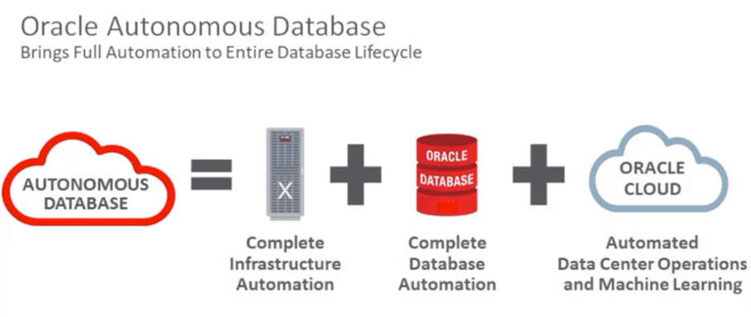
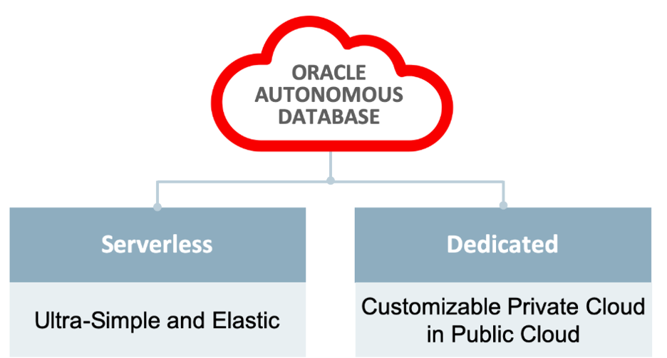
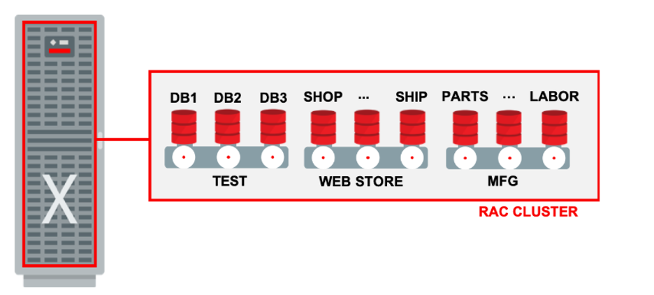

This post presents information from a variety of sources regarding Oracle&reg; Autonomous
Database Dedicated and Exadata&reg; cloud infrastructure.

<!--more-->

### Introduction

According to the [Oracle Autonomous Database Technical Overview](https://www.oracle.com/a/ocom/docs/database/oracle-autonomous-database-strategy-wp.pdf):
"Oracle Autonomous Database combines the flexibility of cloud with the power of machine
learning to deliver data management as a service." The document later adds, "The Oracle
Autonomous Database includes the full set of products found in Oracle Exadata, and the
Exadata Cloud Service, but all [the] components are operated autonomously." To put this
into perspective, Oracle Autonomous Database is built on the following components:

- Oracle Cloud Infrastructure
- Exadata Servers & Storage
- InfiniBand Networking
- Exadata Storage Server Software
- Oracle Virtual Machine
- Oracle Grid Infrastructure
- Oracle Real Application Clusters
- Oracle Database Enterprise Edition

*List source: [Oracle Autonomous Database Technical Overview](https://www.oracle.com/a/ocom/docs/database/oracle-autonomous-database-strategy-wp.pdf)*

{{}}

*Image Source: [https://docs.cloud.oracle.com/](https://blogs.oracle.com/infrastructure/exadata-powers-the-oracle-autonomous-database)*

According to [Oracle Autonomous Database Technical Overview](hhttps://www.oracle.com/pl/a/ocom/docs/database/oracle-autonomous-database-technical-overview.pdf),
"All the above components are managed automatically in the Autonomous Database, including
initial configuration, changes in response to scale up/down demands, and during service
deletion. This section outlines how customers can view management actions that have been
taken by Oracle or are scheduled to be executed. This section also outlines the management
control that customers have over the service." 

According to [Oracle Autonomous Database for Dummies](https://www.oracle.com/a/ocom/docs/dc/em/oracle-autonomous-database-for-dummies-oracle-2nd-special-edition.pdf?elqTrackId=31040cd684444bb7a701725254b656fa&elqaid=78881&elqat=2):
"Oracle Autonomous Database offers two deployment choices&mdash;Serverless or Dedicated."

{{}}

*Image Source: [https://blogs.oracle.com/database/autonomous-database-dedicated-exadata-cloud-infrastructure-v2](https://blogs.oracle.com/database/autonomous-database-dedicated-exadata-cloud-infrastructure-v2)*

In her [blog post](https://blogs.oracle.com/database/autonomous-database-dedicated-exadata-cloud-infrastructure-v2),
Maria Colgan shares the following details:

**Autonomous Database Serverless**: "Oracle automates all the aspects of the infrastructure and
database management for customers including provisioning, configuring, monitoring, backing
up and tuning. Users simply select what type of database they want (Data Warehouse or
Transaction Processing), which region in the Oracle Cloud they want the database deployed,
and the base compute and storage resources. Oracle automatically takes care of everything
else for them. Once provisioned, the database can be instantly scaled either through the
UI, APIs, or automatically based on the customers workload fully online."

**Autonomous Database Dedicated**: "Allows customers to implement a Private Database Cloud
running on dedicated Exadata Infrastructure within the Oracle Public Cloud. Making it an
ideal platform to consolidate multiple databases regardless of their workload type or size
or to offer database as a service within an enterprise. Dedicated infrastructure provides
complete isolation from other tenants and provides an opportunity to customize operational
policies, such as software update schedules, availability, and density, to match your
business requirements.

"With Autonomous Database Dedicated, customers get their own Exadata infrastructure in the
Oracle Cloud. The customers administrator specifies the size, region, and availability domain
where they want their dedicated Exadata infrastructure provisioned. They also get to determine
the update or patching schedule if they wish. Oracle automatically manages all the patching
activity but with Autonomous Database Dedicated service, customers have the option to
customize the patching schedule. You can specify which month every quarter you want, which
week in that month, which day in that week and which patching window within that day. You
can also dynamically change the scheduled patching date and time for a specific database
if the originally scheduled time becomes inconvenient. 

"Once the Autonomous Exadata Infrastructure is provisioned, the administrator can then
partition the system into the desired number of clusters and or Container Databases (CDB).
Each CDB can have a different update strategy, backup retention, availability, and density.
By default, only one CDB is necessary, and all user created database will be created within
that container and inherit its update strategy, backup retention, etc."

{{}}

*Image Source: [https://blogs.oracle.com/database/autonomous-database-dedicated-exadata-cloud-infrastructure-v2](https://blogs.oracle.com/database/autonomous-database-dedicated-exadata-cloud-infrastructure-v2)*

Colgan continues: "Alternatively, the administrator can create separate CDBs for different
lines of business or for different use cases. For example, one Container Database could be
created as the TEST system to keep the test workload separate from the production database.
The TEST CDB would always be patched to the latest Release Update (RU) and would not have
a standby database. While the WEB STORE CDB would contain production databases and would
have a remote standby. It would also take a less aggressive patching strategy by using Release
Update Revisions (RUR). The MANUFACTURING CDB would also house production database but since
they belong to a different line of business, they will go into separate CDBs."
 
### Why Autonomous Database Dedicated?

In [Autonomous Database - Dedicated Exadata Cloud Infrastructure](https://blogs.oracle.com/database/autonomous-database-dedicated-exadata-cloud-infrastructure-v2),
Colgan offers the following answers to this question:

#### Complete Isolation 

"With Autonomous Database Dedicated (ADD), the level of security and performance isolated
can be easily tailored for each workload.

"You get Exadata Infrastructure fully dedicated for your use. The network path is through
a virtual cloud network (VCN) and subnet defined by the Exadata infrastructure hosting the
database. 

"By default, this subnet is defined as private, meaning that there is no public Internet
access to the databases. This ensures only your company can access your Exadata Infrastructure
and your databases."

#### Customizable Operational Polices

"Oracle automatically provisions, configures, manages, and monitors the Autonomous Database
for you. But you have the opportunity with Autonomous Database Dedicated to customize
the operational polices to best suit your business needs. 

"You can customize the software update / patching policy. For example, you can choose to
deploy new software versions on your development and test databases first before you deploy
it on the production.

"Another possible level of customization is customizing the availability polices for
different Container Databases (CDBs). For each CDB you can specify the level of availability
and disaster recovery you need. You can also define the backup retention policy."

### Conclusion

[Colgan](https://www.oracle.com/pl/a/ocom/docs/database/oracle-autonomous-database-technical-overview.pdf)
concludes: "Oracle Autonomous Database is built on the Oracle Cloud Infrastructure, which
keeps systems constantly updated with the latest fixes and security patches, giving developers
immediate access to the latest innovations in the Oracle database. Autonomous Database is
built on Oracle's Exadata Database Machine which delivers the high performance and
cost-effective operation customers required for the most demanding and mission-critical
applications." And a
[Neosoft blog post, Here's everything you need to know about Oracle Autonomous Database Cloud](https://netsoftmate.com/blog/oracle-autonomous-database-cloud/)
adds, "Users that want to rethink their IT strategy and care about things like patching
schedules, software versions, workload isolation, and want to be involved in" selecting
these should opt for the Dedicated option. 

<a class="cta purple" id="cta" href="https://www.rackspace.com/data">Learn more about our Data services.</a>

Use the Feedback tab to make any comments or ask questions. You can also click
**Sales Chat** to [chat now](https://www.rackspace.com/) and start the conversation.
