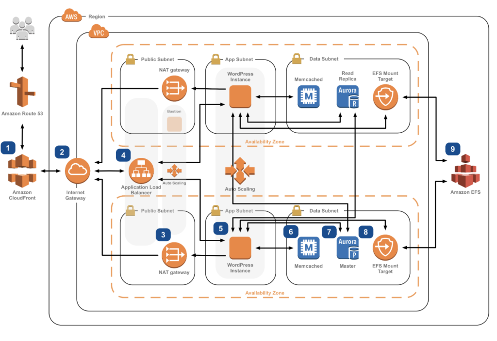
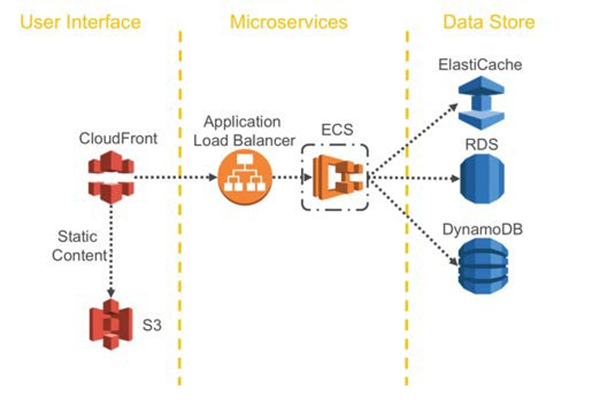
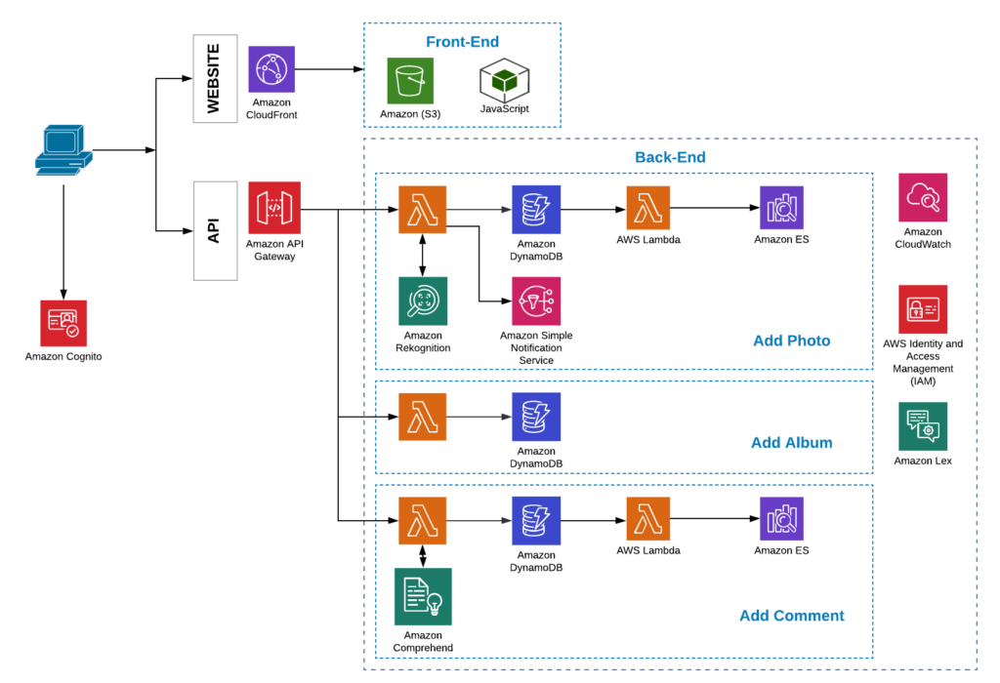

*Originally published on November 1, 2019 at Onica.com/blog*

Replace with short intro sentence or two.

<!--more-->

*Disclaimer: I’m a Lead Solutions Architect at Onica, an APN Premier Consulting Partner, and for the purpose of this blog, I played the parts of both the imaginary business owner and the service provider.*

Imagine a scenario where you have worked for high tech companies over the
last 20 years, dealt with IT and cloud infrastructure issues for the last 5
years, and you love designing and deploying elegant solutions on AWS cloud. To
add to this, you are a woman who loves creating elaborate nail polish
designs. The next logical step in this situation seems obvious – combine the
two passions and create a website that will run in the cloud and feature my
nail polish designs. In an ideal world, I would be running my own nail polish
salon business and would commission such a site from an external service
provider (I would be too busy creating beautiful designs), and would expect
it to help me with my business challenges, while adhering to the principles
of well architected cloud design.

To ensure my business continuity and profitability, the solution should be:

- Highly available
- Scalable
- Run on web and mobile platforms
- Cost effective in terms of development, maintenance and infrastructure
- Able to support different types of users, such as designers, customers, visitors
- Provide actionable insights from the data generated by my customers
- Automate routine work related to site maintenance
- Easily updatable
- Easily extendable globally

The site should be relatively simple. The designers will upload the images they
want to showcase, the customers will comment on the designs and their comments
will be visible to the site admins only. The automation of business processes
combined with user input analytics will be our business differentiator.

Based on the wish list above, the service provider has come up with multiple
options. Let’s dive into each one to see how it stacks up against my
requirements for the solution.

### Design option 1: LAMP stack

The initial AWS infrastructure design that our service provider came up with
had all the components of the LAMP (Linux, Apache, MySQL, PHP ) stack in it:

The backend component will be running on Linux VMs and implemented in PHP
(or in Python using Flask or Django), the nail designs metadata will be stored
on MySQL running on Amazon RDS, and the actual images will be stored on
Amazon EFS that is mounted by the application servers. Traffic to the
application servers is to be sent via Application Load Balancer that has
health checks defined, so that it will forward customers traffic only to
functional instances. The use of Auto Scaling group will ensure scalability,
high availability and elasticity of the infrastructure. The use of private
and public subnets, combined with tight security groups, plus AWS Shield DDoS
filtering will serve as a virtual firewall for the VMs, preventing malicious
traffic from obtaining direct access to the VMs and data.

{{}}

The design looked very good, but before giving it a go, I decided to check
how well it lends itself to my technical and business requirements.
The mapping is below:

| Requirement | Available | Comments |
| --- | --- | --- |
| Support for Sign Up, Sign In, Sign Out | No | Requires a custom solution |
| Web and mobile support | No | Requires different versions for web and mobile. No support for conflict resolution and offline functionality |
| Persistent data | Yes | Amazon EFS Performance and cost will be a challenge, scalability is ok |
| Encryption of data at rest and in transit | Yes | Certificates on ALB Encryption of EBS volumes and Amazon EFS |
| High availability | Yes | Multi-AZ deployment of Amazon EC2, Amazon EFS, and Amazon RDS; ASG and ALB with health checks |
| Fine grained access control to the images | No | Will be implemented as part of the application running on Amazon EC2 |
| Minimum to zero maintenance | No | Amazon EC2 instances, instance limits, vertical scaling if image processing is involved |
| Low development and app lifecycle cost | No | A lot of business and user management logic should be implemented; monolith approach with long lifecycle |
| Infrastructure cost | ~$400/month | |

Needless to say, I asked my service provider to come up with a better solution
before moving to the implementation stage. I had never budgeted $400 a month
for infrastructure costs, nor was I prepared to have an IT department that
will handle maintenance of the VMs hosting my site. In addition, scaling is
slow, it takes time to bring up new instances, install packages and perform
configuration, and there is no analytics in this proposal, meaning I have no
edge against my competitors.

### Design option 2: Containers

The second proposal was quick to follow. My service provider assured me that
most businesses, from small to enterprise-level are going with microservices
and containerization nowadays, and my application can easily be developed
using the microservices approach. Moreover, the new design is addressing
my concerns of a long application lifecycle and high infrastructure cost
by potentially splitting the application into multiple components, and moving
image storage from expensive AWS EFS to very cost efficient AWS S3 object
storage. Moreover, lightweight containers will scale faster and better
address peak traffic on my site. Just think of the Christmas
holidays – everyone will be looking for a fresh new manicure at the same time.

The client-side code, assets, and nail design images are hosted on AWS S3, the
website backend logic is running on AWS ECS, and images metadata along with
other persistent data is stored in DynamoDB. This design leveraged AWS
managed services and is aligned with the modern approach to application
development.

{{}}

My site running in containers sounded like a great idea, and I was positive
we hit gold this time. Prepared to see my requirements fully covered, I went
into the mapping exercise again to visualize the benefits of containerization
for websites like mine, that have little logic and are mainly built around
user authentication and content hosting.

| Requirement | Available | Comments |
| --- | --- | --- |
| Support for Sign Up, Sign In, Sign Out | No | Requires a custom solution |
| Web and mobile support | No | Requires different versions for web and mobile. No support for conflict resolution and offline functionality |
| Persistent data | Yes | Amazon S3, Amazon DynamoDB, and Amazon Elasticsearch Service |
| Encryption of data at rest and in transit | Yes | Certificates on ALB Encryption of EBS volumes and EFS |
| High availability | Yes | Multi-AZ deployment of Amazon ECS |
| Fine grained access control to the images | No | Will be implemented as part of the application running in containers on Amazon ECS |
| Minimum to zero maintenance | No | Amazon EC2 instances and containers maintenance, high ramp up cost and expensive professionals to deal with a containerized site |
| Low development and app lifecycle cost | No | Will need to hire professionals to implement FE, BE, and infrastructure |
| Infrastructure cost | ~$200/month | |

The result of this requirements mapping was unexpectedly disappointing.
Containerization did not look like the best approach in my case. The main
arguments against it are different compared to the VMs approach, but the
outcome remains the same. I have to continue looking for a better solution.

### Design option 3: Serverless with AWS API gateway

The serverless approach to modern web and mobile applications design has
become a standard for cloud-based solutions. The low operational overhead
and the relatively short ramp up time (compare the time to learn a
serverless framework to the time needed to understand k8s architecture,
networking, servicemesh, monitoring tools, containers) make this approach
highly attractive for small businesses. In addition, high development
speed combined with a cost effective application of a “pay as you go” model
and a full abstraction of the infrastructure layer makes this approach a go
to solution whenever applicable.

Considering the above, it came as no surprise that the next proposed design
capitalized on the serverless approach to modern application development in
AWS. Thanks to this approach, many of my requirements were satisfied right away:

- No servers to maintain
- High availability and elasticity built in
- Pay for value, not for the idle capacity
- Scale with use

{{}}

The backend logic running in containers fronted by load balancer (AWS ALB) is
replaced by a combination of AWS API Gateway and Lambda, used to access
metadata and user generated content in Amazon DynamoDB. This change provided
substantial cost benefits and eliminated the main concern of the containers
approach, namely infrastructure maintenance complexity and high ramp up
bar. It came with additional advantages:

- AWS API Gateway integration with Amazon Cognito user pools allowed the use of
  AWS managed service for users authentication and authorization
- Modern application lifecycle with multiple environments is available in AWS API Gateway
- Monitoring and logging provided by AWS Cloudwatch
- Latency improvements thanks to the caching mechanism in AWS API Gateway

The requirements mapping based on serverless approach with AWS API Gateway
and Lambda is below.

| Requirement | Available | Comments |
| --- | --- | --- |
| Support for Sign Up, Sign In, Sign Out | Yes | Amazon Cognito integrated with AWS API Gateway |
| Web and mobile support | No | Requires different versions for web and mobile. No support for conflict resolution and offline functionality |
| Persistent data | Yes | Amazon S3, Amazon DynamoDB, and Amazon Elasticsearch Service |
| Encryption of data at rest and in transit | Yes | Certificates on ALB Encryption of EBS volumes and EFS |
| High availability | Yes | Through the use of AWS managed services |
| Fine grained access control to the images | Yes | Amazon Cognito Identify Federation, Groups, and RBAC |
| Minimum to zero maintenance | Yes\* | Servers not used in the application infrastructure designs. \*Amazon Elasticsearch Service used for analytics, requires VMs maintenance |
| Low development and app lifecycle cost | Yes\* | \*FE and BE are treated as different parts of application |
| Infrastructure cost | ~$50/month | |

This approach looked perfect and satisfied both my technical and business
requirements, all at a cost of $50 a month. As a bonus, it includes analytics
with an Amazon Elasticsearch Service cluster, automatic sentiment analysis of
customers responses to my designs with AWS Comprehend, and auto-moderation of
uploaded images using Amazon Rekognition. Amazon SNS is used to send
notifications on attempts of inappropriate content upload. I considered going
into the implementation stage with this option.

### Design option 4: Serverless with AWS Amplify and AWS AppSync

It turns out that I was not completed satisfied with Design Option 3, so I
asked for another version of the design that will utilize the latest AWS
services: AWS Amplify and AWS AppSync. The reasoning behind my request was
mostly my curiosity towards a solution that can support multi-platform
backends and provides an ecosystem for integrated FrontEnd and BackEnd
development.

Capabilities of AWS AppSync such as its support for multiple data sources
in the same query, integration with anything in the universe through the
use of AWS Lambda, it’s native support of subscriptions and real time updates
and conflict resolutions, along with integration with Amazon Cognito for
fine grained access control to data sources were too tempting. Implementing
AWS AppSync resolvers might be a daunting task. Luckily, AWS Amplify
auto-generates the resolvers used by AWS AppSync to access data sources
such as Amazon DynamoDB and Amazon Elasticsearch Service in my case. In fact,
most of the infrastructure pieces needed by my application are supported by
AWS Amplify components already (authentication, hosting for my static
website, object storage, Amazon DynamoDB tables and Amazon Elasticsearch
Service for analytics, all glued together with AWS Lambda and event-driven
architecture). I was inclined to ask my service provider to give this new
approach a try. They came up with the design below.

{{}}

In the new design, the combination of AWS API Gateway and AWS Lambda used for
persistent data access was replaced with AWS AppSync, thus eliminating a few
AWS Lambda functions from the design above.

The design remained mostly unchanged but my service provider was able to dot
the i’s and cross the t’s in my list of the requirements at no extra cost. It
felt as if I have nothing to nitpick on anymore and had to accept their
work, the requirements matrix looked fully covered.

| Requirement | Available | Comments |
| --- | --- | --- |
| Support for Sign Up, Sign In, Sign Out | Yes | Amazon Cognito integrated with AWS API Gateway |
| Web and mobile support | Yes | AWS AppSync support for web and mobile applications |
| Persistent data | Yes | Amazon S3, Amazon DynamoDB, and Amazon Elasticsearch Service |
| Encryption of data at rest and in transit | Yes | Certificates on ALB Encryption of EBS volumes and EFS |
| High availability | Yes | Through the use of AWS managed services |
| Fine grained access control to the images | Yes | Amazon Cognito Identify Federation, Groups, and RBAC |
| Minimum to zero maintenance | Yes\* | Servers not used in the application infrastructure designs. \*Amazon Elasticsearch Service used for analytics, requires VMs maintenance |
| Low development and app lifecycle cost | Yes | FE and BE development through AWS Amplify ecosystem |
| Infrastructure cost | ~$50/month | |

### Conclusion

Designing a simple web application on AWS can be done in many different ways
and the list above is not exhaustive (think AWS Fargate and AWS Amplify with
AWS API Gateway for example). The ever changing landscape of AWS services
and their capabilities encourages us to review the designs that were
considered industry standards just a couple of years ago. We should
therefore carefully pick the right approach from the many that are currently
available, test it out, and be ready to get back to the drawing board if the
chosen path does not live up to the expectations.

In a future post, I will dive into this website’s data flows that utilize
AWS ML services (Amazon Comprehend and Amazon Rekognition) to offload the
mundane tasks of site moderation and user comments review to AWS managed
services. I will also show how the processed user-generated content can be
used to drive actionable insights using Amazon Elasticsearch Service
dashboards.

<a class="cta red" id="cta" href="https://www.rackspace.com/onica">Learn more about Onica services.</a>

Use the Feedback tab to make any comments or ask questions. You can also click
**Sales Chat** to [chat now](https://www.rackspace.com/) and start the conversation.
