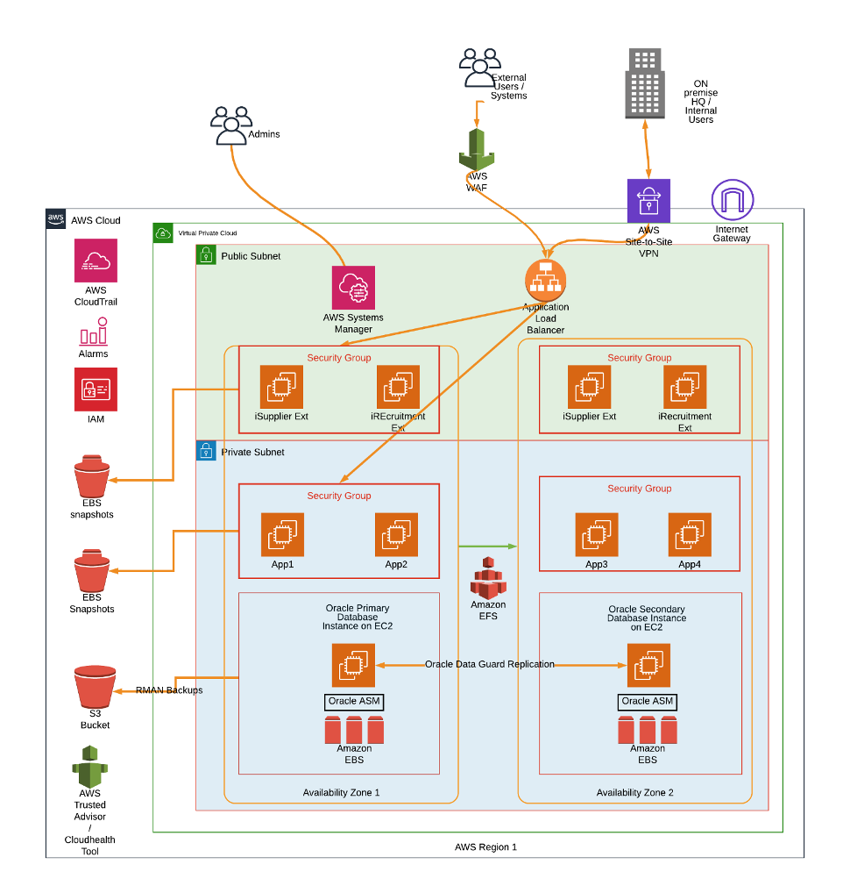

Most enterprises consider Enterprise Resource Planning (ERP) systems mission-critical, and
there is a growing appetite for cloud adoption during greenfield, upgrade, and migration
projects. Through my experience of managing Oracle&reg; E-Business Suite&reg; (EBS) projects
on both traditional on-premise and public cloud environments, I've learned that AWS&reg;
offers considerable advantages over on-premise platforms.

<!--more-->

### Why AWS?

Following are some AWS use cases for EBS projects:

- Migrating existing on-premise production environments
- Performing greenfield implementation of new production environments
- Implementing disaster recovery on the cloud
- Running development, test, demonstration, proof of concept, and training environments
- Using temporary environments for migrations, testing upgrades, and performance testing

Enterprises continue to invest in enhancements to EBS, but they are tired of the high cost
involved and the slow speed at which they can deliver these projects. A single EBS production
system generally requires you to install and support multiple Oracle application and
database environments. 

These multiple environments then support functional setup, development, system and
user-acceptance testing, data migration and data conversion, training, performance testing,
and pre-production quality assurance. The cost and management effort associated with these
multiple environments can mount up quickly. 

Hosting EBS on the AWS Cloud can be a very cost-effective solution for your environments
because of its inherent flexibility. By shutting down instances outside working hours, you
can save on costs because you pay for the EC2 instances only when they are running. 

Also, AWS instance scheduling can significantly reduce the cost of your multiple
non-production environments by up to 71%. This savings estimate comes from an example 29%
monthly uptime, from 8 am to 6 pm, Monday to Friday, 21 workdays per month, 10 hrs per day. 
 
### EBS on AWS: Sample architecture and features

The diagram in the following image shows how you can set up EBS on AWS. This model deploys
the application and database instances in multiple availability zones for high availability.

{{}}

*Figure 1. Oracle E-Business deployment across two availability zones*

#### High availability and elastic load balancing

You can use *elastic load balancing* to distribute user traffic to multiple application
instances deployed in separate availability zones. You can then add or remove application
instances from your load balancer configuration without disrupting data flow. Elastic load
balancing detects which instances are healthy and available. If an application instance
fails, the load balancer routes traffic to the remaining healthy instances. In the event
of an availability zone failure, the load balancer routes traffic to the remaining application
tier instances in the secondary availability zone.

The Oracle database is deployed on two EC2 instances in different availability zones. Oracle
Data Guard&reg; replication is configured between the primary database in availability zone
1 and a standby database in availability zone 2. If the primary database instance fails,
the system promotes the standby database to be the primary, and the application instances
connect to the new primary.

#### Scalability 

With AWS, you can vertically scale the application and database tiers up or down by
changing the EC2 instance type and then restarting so that the  changes take effect. This
operation should take only a few minutes. The storage volumes remain attached to the
instance, and data migration is not required.

You can horizontally scale out the application tier by adding and configuring additional
application instances. You can launch a new EC2 instance in a few minutes, but you'll need
to do some additional configuration work to ensure that the application configuration files
are correct and the new application instance registers with the database. 

You can automate horizontal scaling of the application tier by using custom-written DBA
shell scripts. However, this requires a significant level of technical effort and skill. A
simpler alternative might be to use standby instances to meet extra capacity needs. You can
preinstall additional application instances and configure them with EBS on standby EC2
instances. Keep these instances shut down until you need the extra capacity. You pay for
minimal storage costs, but you don't pay for shut-down EC2 instances. 

#### Storage and backups

The application and database instances use Elastic Block Storage volumes for persistent
block storage. EBS has two types of solid-state drive (SSD) volumes: 

- Provisioned IOPS SSD for latency-sensitive application and database workloads
- General-purpose SSD that balances performance and cost

You can use general-purpose SSD volumes for boot volumes, the EBS application tier file
system, and logs. They offer single-digit millisecond latencies and deliver a consistent
baseline performance of three IOPS/GB up to a maximum of 10,000 IOPS per storage volume.

Provisioned IOPS volumes provide the best performing EBS storage option, so you can use
them with Oracle Automatic Storage Management (ASM) for storing the database data and log
files. You can provision up to 20,000 IOPS per volume with single-digit millisecond
latencies, and they deliver the provisioned IOPS 99.9% of the time.

You can use Oracle ASM to stripe the data across multiple EBS volumes for higher IOPS and
to scale the database storage without downtime.

Amazon Simple Storage Service (S3) provides scalable, highly durable, low-cost storage, and
it works for storing database backups. Use Oracle Recovery Manager (RMAN) to back up the
database and then copy the RMAN backup file to Amazon S3. Or use the Oracle Secure Backup
(OSB) Cloud Module to back up your database directly to S3 for storage.

Amazon Elastic File System (EFS) is an NFS-compatible shared file system, which you can use
to provide a common data source if the Oracle instances require file sharing. 

### Benefits of AWS for EBS

Following are some benefits of using AWS for EBS:

#### Agility and speed

Traditional on-premise deployments involve a long procurement process requiring large
capital spend upfront and multiple approvals. You can provision new infrastructure and EBS
environments in minutes in AWS with no upfront cost or commitment. 

#### Cost savings for non-production environments

Shut down non-production environments when you are not using them to save costs. 

#### Flexible environment provisioning

With on-premise environments, you usually have a limited set of environments to work with.
Provisioning additional environments takes a long time or may not even be possible. By using
AWS, you can create as many new environments as you need in minutes. 

You can use a different environment for each major project so that each team can work
independently without interfering with each other. The teams can then merge their work in a
common integration environment at the appropriate time. When the project finishes, you can
terminate these environments and stop paying for them.

#### Flexible environment sizing and scalability

With on-premise deployment, environments for initial phases are sometimes oversized or
undersized, and infrastructure teams cannot cope with growth in later project phases. With
AWS, you can scale your instances up or down any time, paying for the capacity you use and
for its duration of use. 

#### Ability to test application performance 

The typical performance testing environment for an EBS project is a full-sized replica of
the production environment because load testing needs to run on a representative environment.
You use this highly spec-ed environment only during testing, and it is a costly CapEx
investment with a traditional on-premise approach. 

You should conduct performance tests before any major change to an EBS environment. Because
of high costs, some customers only performance test their application during the initial
phase using the to-be-deployed production infrastructure. They might never performance test
later releases due to the expense and lack of a necessary performance-testing environment. 

A performance test environment can be created easily and quickly for just the performance-test
cycle duration and used only when needed on AWS Cloud. You can save on costs again by only
paying for the capacity you use while you use it. 

### Conclusion

AWS can be a very cost-effective, scalable, secure, and flexible platform for deploying EBS.
Rackspace Technology can help you design, build, and maintain a highly available EBS system
on AWS to meet your business requirements. We can help you address the following key project
requirements:
 
- Architecture and migration services
- Application and database upgrades
- System implementation and integration
- Design of cost-effective environments mapped to your business requirements and budget
- Environment planning, automation, cost optimization, Disaster Recovery testing
- Environment sizing, build, configuration, testing
- Security, compliance, and identity management
- Backup and recovery planning and testing
- Performance testing and tuning, proactive monitoring
- Information life-cycle management
- Identity and access management and single sign-on

Learn more about our credentials and the services we provide!

<a class="cta purple" id="cta" href="https://www.rackspace.com/en-gb/oracle">Learn more about our Oracle services.</a>
<a class="cta red" id="cta" href="https://www.rackspace.com/en-gb/managed-aws">Learn more about our Managed AWS services.</a>
<a class="cta blue" id="cta" href="https://www.rackspace.com/en-gb/cloud/public/service-blocks">Learn more about Service Blocks.</a>
<a class="cta teal" id="cta" href="https://www.rackspace.com/en-gb/cloud/multi-cloud">Learn more about the Rackspace multi-cloud.</a>

Use the Feedback tab to make any comments or ask questions. You can also click
**Sales Chat** to [chat now](https://www.rackspace.com/) and start the conversation.
